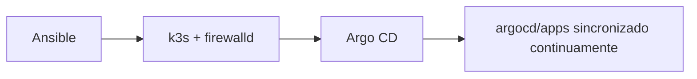
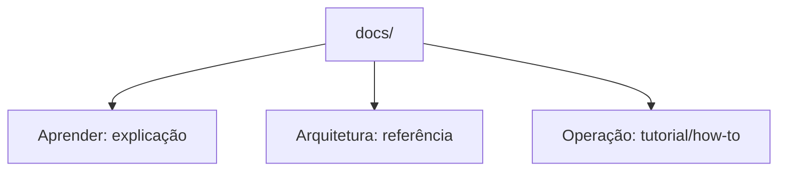

# infrastructure

Bootstrap declarativo e setup GitOps de um cluster k3s de node único.



A documentação completa (checklist, roles do Ansible, segredos, foundation, e o passo a passo do bootstrap) está em **[ladesa-ro.github.io/infrastructure](https://ladesa-ro.github.io/infrastructure/)**, gerada a partir de `docs/` com MkDocs + Material.



Pra editar a documentação localmente:

```bash
docker run --rm -it -p 8000:8000 -v "$PWD":/docs squidfunk/mkdocs-material:9.7.7
```
