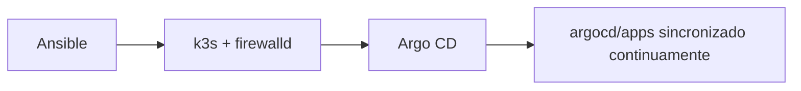
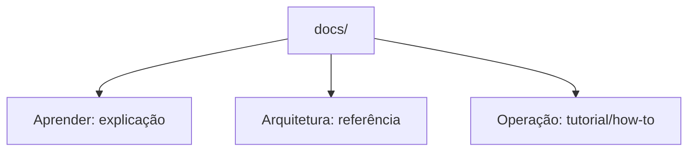

# infrastructure

[![Quality][action-quality-src]][action-quality-href]
[![Security][action-security-src]][action-security-href]
[![Docs][action-docs-src]][action-docs-href]

Bootstrap declarativo e setup GitOps de um cluster k3s de node único.



A documentação completa (checklist, roles do Ansible, segredos, foundation, e o passo a passo do bootstrap) está em **[ladesa-ro.github.io/infrastructure](https://ladesa-ro.github.io/infrastructure/)**, gerada a partir de `docs/` com MkDocs + Material.



Pra editar a documentação localmente:

```bash
docker run --rm -it -p 8000:8000 -v "$PWD":/docs squidfunk/mkdocs-material:9.7.7
```

## Licença

[MIT](LICENSE)

[action-quality-src]: https://img.shields.io/github/actions/workflow/status/ladesa-ro/infrastructure/quality.yml?style=flat&logo=github&logoColor=white&label=Quality&branch=main&labelColor=18181B
[action-quality-href]: https://github.com/ladesa-ro/infrastructure/actions/workflows/quality.yml?query=branch%3Amain
[action-security-src]: https://img.shields.io/github/actions/workflow/status/ladesa-ro/infrastructure/security.yml?style=flat&logo=github&logoColor=white&label=Security&branch=main&labelColor=18181B
[action-security-href]: https://github.com/ladesa-ro/infrastructure/actions/workflows/security.yml?query=branch%3Amain
[action-docs-src]: https://img.shields.io/github/actions/workflow/status/ladesa-ro/infrastructure/docs.yml?style=flat&logo=github&logoColor=white&label=Docs&branch=main&labelColor=18181B
[action-docs-href]: https://github.com/ladesa-ro/infrastructure/actions/workflows/docs.yml?query=branch%3Amain
