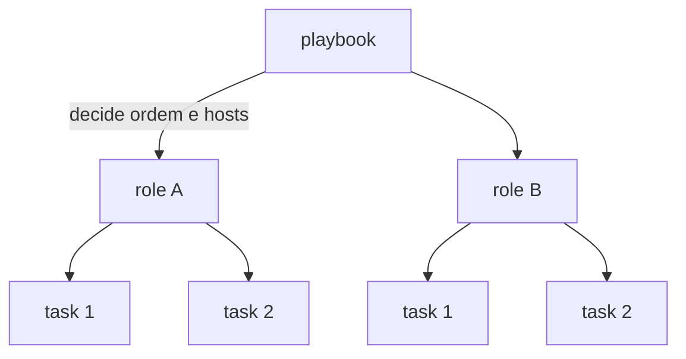
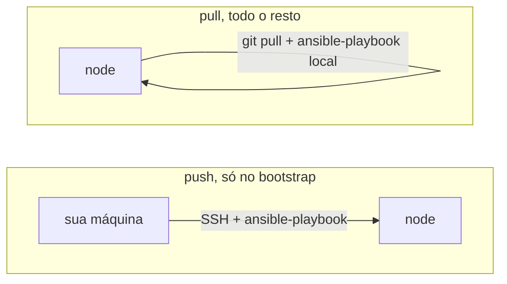
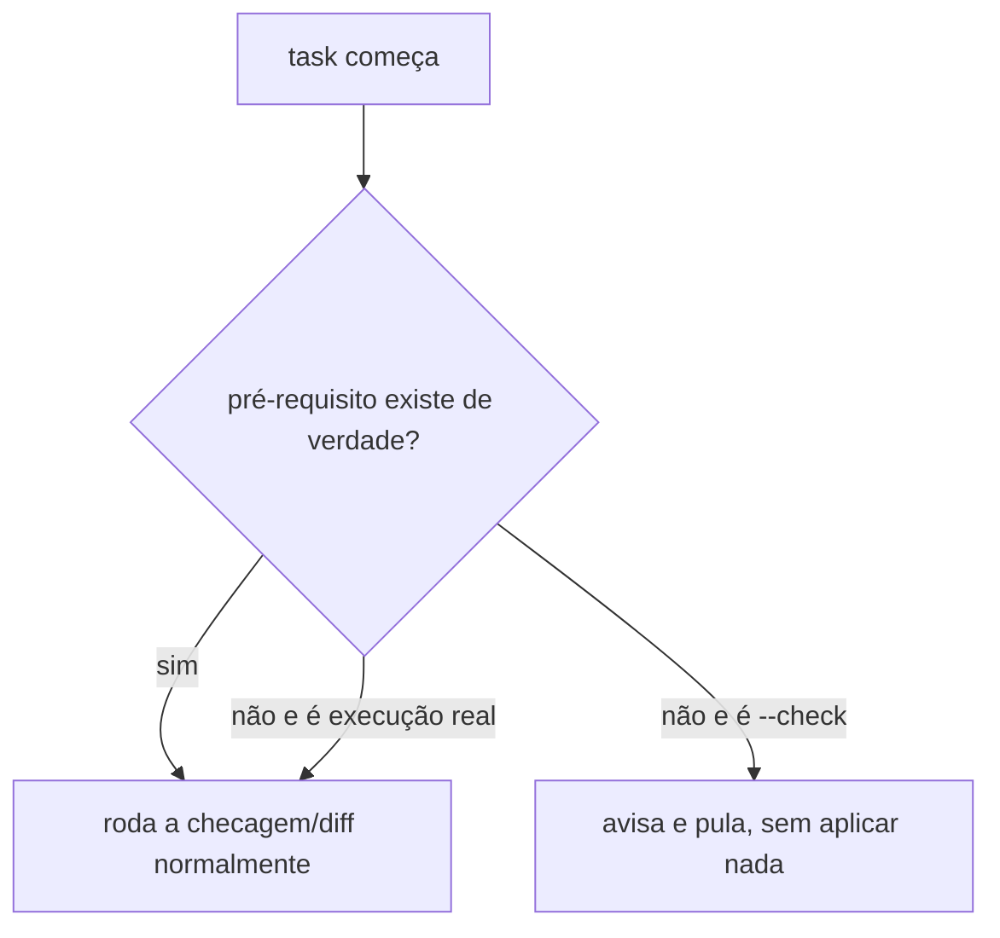
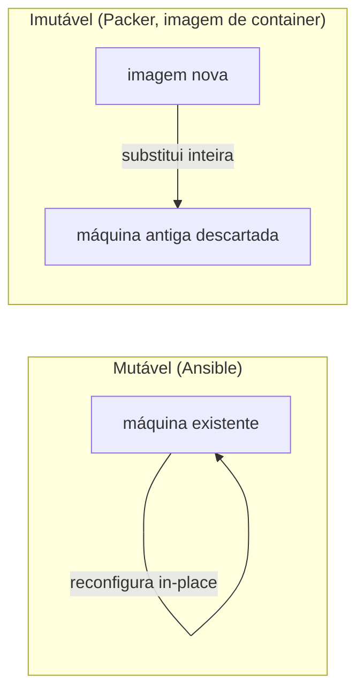

# Ansible

**TLDR**: descreve o estado desejado de uma máquina em YAML e aplica via SSH, sem agente no destino; `--check` mostra o que vai mudar antes de mudar de verdade; `ansible-pull` faz o próprio host se reconfigurar sozinho, periodicamente.

| Termo | Vá pra |
|---|---|
| Push vs. pull | [`ansible-pull` vs. push](#ansible-pull-vs-push) |
| Rodar de novo sem quebrar nada | [Idempotência na prática](#idempotencia-na-pratica) |
| Ver o que vai mudar antes de mudar | [Modo `--check`](#modo-check) |
| Por que nunca burlar o `--check` | [Por que nunca forçar mutação real sob `--check`](#por-que-nunca-forcar-mutacao-real-sob-check) |
| Rodar só um pedaço | [Tags](#tags) |
| Cifrar segredo em arquivo | [Ansible Vault](#ansible-vault) |

Ansible descreve o estado desejado de uma máquina (pacotes instalados, arquivos de configuração, serviços ativos) em YAML, e aplica isso via SSH, sem precisar de agente instalado no destino. Cada unidade de trabalho é uma **task**; um conjunto ordenado de tasks reutilizável é um **role**; um **playbook** decide quais roles rodam, em que ordem, contra quais hosts.

## `ansible-pull` vs. push

O jeito mais comum de usar Ansible é **push**: uma máquina de controle roda `ansible-playbook` contra um ou mais hosts remotos, via SSH, rodado da sua própria máquina.

`ansible-pull` inverte isso: o **próprio node** clona o repositório e roda o playbook localmente (`ansible_connection: local`), sem depender de nenhuma máquina de controle estar online. Um timer do systemd, disparado periodicamente, é o jeito mais comum de agendar isso, o que permite manter um host no estado declarado sem ninguém precisar rodar `ansible-playbook` na mão depois do bootstrap inicial.

## Idempotência na prática

Uma task idempotente, rodada de novo sem nenhuma mudança real necessária, não faz nada e reporta isso (`ok`, não `changed`). É o que permite o `ansible-pull` rodar a cada ciclo sem risco: se nada mudou no repositório nem no node, a execução é um no-op. O papel do role é sempre **comparar** o estado atual com o desejado antes de agir, nunca aplicar às cegas (ver, por exemplo, como [`argocd-bootstrap`](../arquitetura/roles/argocd-bootstrap.md) lê o release Helm já instalado antes de decidir se roda `helm upgrade`).

## Modo `--check`

`--check` simula a execução sem aplicar mudança nenhuma, e é o que torna possível revisar o que vai acontecer antes de acontecer de verdade. Mas nem todo módulo se comporta igual sob `--check`:

- `command`, `shell`: pulados inteiramente (aparecem como `skipping`), porque o Ansible não tem como saber o que aconteceria sem executar de verdade.
- `get_url`, `template`, `copy` (de origem local): simulam, relatam `changed` sem tocar o destino.
- `stat`, `assert`: sempre refletem o estado real, `--check` não muda o comportamento deles.
- `copy` com `remote_src: true` (copiar um arquivo que já está no node): tenta validar que a origem existe, mesmo sob `--check`. Se a origem só existiria depois de outra task que foi simulada (não real), isso quebra: um bug de classe comum na primeira execução de um role contra um host que ainda não tem nada instalado, corrigido pulando essas tasks específicas sob `--check` em vez de forçar execução real.

## Por que nunca forçar mutação real sob `--check`

Existe um atalho tentador: adicionar `check_mode: false` numa task pra ela sempre rodar de verdade, mesmo sob `--check`, evitando esse tipo de inconsistência. O problema é que isso quebra a garantia central do `--check`, dar uma prévia segura antes de aplicar numa VM de produção, já que uma task que aplica de verdade sob `--check` engana quem está revisando o preview sem avisar. Uma solução mais robusta é um "gate": uma checagem que confere se o pré-requisito pra uma verificação significativa já existe de verdade, e se não existir, pula aquele pedaço com uma mensagem clara em vez de falhar ou de aplicar mudança sem querer.

## Tags

Cada role pode ter sua própria tag, o que permite rodar só um pedaço com `--tags` ou pular um pedaço com `--skip-tags`. É comum reservar uma tag pra mudança de maior risco (mexer em firewall, por exemplo), pulada por padrão da execução automática e só disparada manualmente, com supervisão direta.

## Ansible Vault

`ansible-vault` cifra arquivos com uma senha simétrica, guardada fora do git (ver [Segredos](../arquitetura/segredos.md) e [Estado fora do git](../operacao/estado-fora-do-git.md)). Um arquivo cifrado começa com `$ANSIBLE_VAULT;1.1;AES256` e só é decriptado no momento de uso, com `--vault-password-file` apontando pra senha.

## Pra ir além

Ansible é uma ferramenta de [configuration management](https://en.wikipedia.org/wiki/Configuration_management): agentless (só precisa de SSH e Python no destino), imperativa por dentro mas usada de forma declarativa (as tasks descrevem um estado, não um script). Outras ferramentas na mesma categoria, mais antigas e geralmente exigindo um agente instalado no destino: [Puppet](https://en.wikipedia.org/wiki/Puppet_(software)), Chef, e Salt (o projeto que era conhecido como SaltStack antes de passar por VMware e hoje Broadcom, mas segue open source). Cada uma tem sua própria linguagem de descrição de estado e seu próprio jeito de lidar com [idempotência](https://en.wikipedia.org/wiki/Idempotence).

Configuration management (o que o Ansible faz) é uma camada diferente de infrastructure provisioning (criar a VM em si, a rede, o disco): [Terraform](https://en.wikipedia.org/wiki/Terraform_(software)), OpenTofu e Pulumi são as ferramentas mais comuns nessa outra camada. Muitos setups combinam as duas, provisionamento primeiro, depois configuração; outros, como um servidor que já existia antes da automação chegar, pulam a camada de provisionamento inteiramente e começam direto pela configuração. Crossplane inverte a lógica de novo: em vez de uma ferramenta externa provisionar recursos cloud, o próprio cluster Kubernetes ganha CRDs que representam esses recursos, e o Argo CD (ver [Argo CD](argocd.md)) poderia sincronizá-los do mesmo jeito que sincroniza qualquer outro manifesto, GitOps aplicado até na camada de provisionamento, não só na de aplicação.

Pra times maiores, existe uma camada de orquestração e UI sobre o Ansible puro, hoje chamada Ansible Automation Platform (o antigo Ansible Tower foi descontinuado e virou "automation controller", um componente dentro dessa plataforma maior), ou sua versão open source, AWX. Um setup baseado só em `ansible-pull` cumpre o mesmo papel de "rodar sozinho" sem precisar dessa camada extra.

Vale também conhecer o debate mutable vs. immutable infrastructure: a abordagem do Ansible é mutável, a mesma máquina é reconfigurada repetidamente, in-place. A antítese, imutável, reconstrói a imagem inteira a cada mudança e substitui a máquina, em vez de editá-la; Packer é a ferramenta mais citada nessa categoria pra imagem de VM (AMI da AWS, disco de VMware, e outros formatos, todos a partir da mesma definição), e a versão mais comum disso hoje é simplesmente a imagem de container em si, reconstruída a cada mudança de Dockerfile, o mesmo princípio aplicado numa unidade menor. Cada abordagem tem trade-offs diferentes de velocidade, auditabilidade e complexidade operacional.

## Cheatsheet

| Comando/conceito | O que faz |
|---|---|
| `ansible-playbook site.yml --check` | Simula, mostra o que mudaria, não aplica |
| `ansible-playbook site.yml --tags X` | Roda só a tag `X` |
| `ansible-playbook site.yml --skip-tags X` | Roda tudo, exceto a tag `X` |
| `ansible-pull -U <repo>` | O próprio host clona e aplica o playbook localmente |
| `ansible-vault encrypt <arquivo>` | Cifra um arquivo com senha simétrica |
| `--vault-password-file <arquivo>` | Aponta pra senha na hora de decifrar |
| `ok` no resultado de uma task | Idempotente, nada mudou |
| `changed` no resultado de uma task | Aplicou uma mudança real |

Onde aprofundar: a documentação oficial em [docs.ansible.com](https://docs.ansible.com) cobre todo módulo em detalhe, mas é referência, não material de aprendizado sequencial. Pra isso, *Ansible for DevOps*, de Jeff Geerling ([ansiblefordevops.com](https://www.ansiblefordevops.com)), é o livro mais citado da comunidade, escrito por alguém que administra Ansible em produção desde 2013 e mantém o livro atualizado continuamente.
