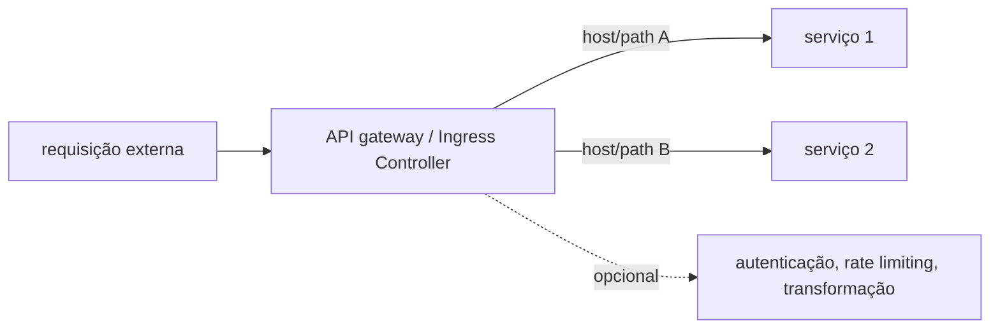
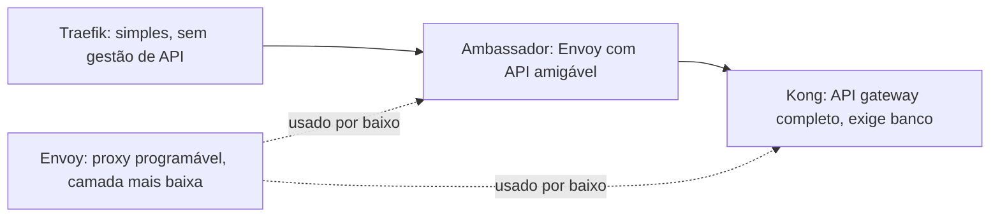

# API gateway

Um API gateway é o ponto único por onde requisição externa entra num conjunto de serviços, responsável por rotear pra o serviço certo, e opcionalmente aplicar autenticação, limite de taxa (rate limiting), transformação de requisição/resposta, e agregação de várias chamadas numa só. Um Ingress Controller resolve um pedaço menor do mesmo problema: rotear requisição HTTP externa pro Service certo dentro de um cluster Kubernetes, baseado em host/path.

## Onde a linha entre as duas categorias fica borrada

Na prática, "Ingress Controller" e "API gateway" hoje descrevem um espectro, não duas caixas separadas. Traefik é deliberadamente simples: descoberta automática de serviço, configuração mínima, sem banco de dados próprio pra administrar, mas sem gestão de API avançada (autenticação centralizada, transformação de payload). Kong é o oposto: um API gateway completo, construído sobre o [Nginx](servidores-web.md), com um ecossistema grande de plugins, mas que exige um banco (PostgreSQL ou Cassandra) só pra ele funcionar, mais peça operacional pra manter no ar. Envoy é a camada mais baixa de todas, um proxy programável que tanto Kong quanto vários service meshes (ver [Service mesh](service-mesh.md)) usam por baixo; Ambassador é uma distribuição do Envoy com API de gateway mais amigável em cima.

## Pra ir além

A antítese de um gateway/ingress centralizado é cada serviço expor sua própria porta, tratada individualmente por regra de firewall (ver [firewalld](firewalld.md)) ou por um load balancer externo simples, sem roteamento por host/path nenhum. Funciona pra poucos serviços, mas não escala: cada serviço novo vira uma regra nova espalhada em outro lugar, em vez de uma entrada nova centralizada.

Onde aprofundar: a comparação oficial mantida pelo projeto Apache APISIX (um concorrente direto de Kong/Traefik, não citado acima) em [apisix.apache.org](https://apisix.apache.org/learning-center/open-source-api-gateway-comparison/) é uma das poucas comparações lado a lado que cobre arquitetura, não só feature checklist.
