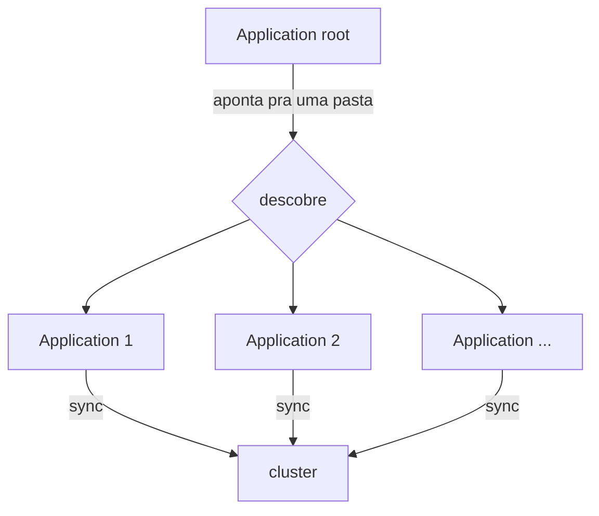
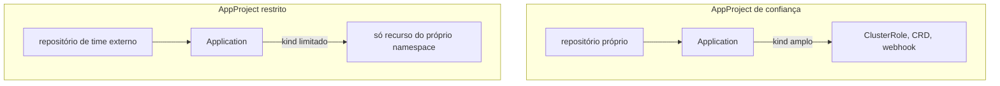
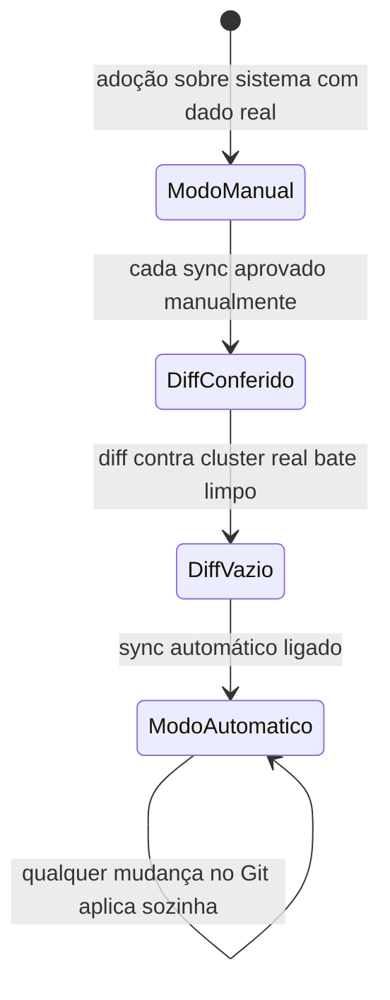
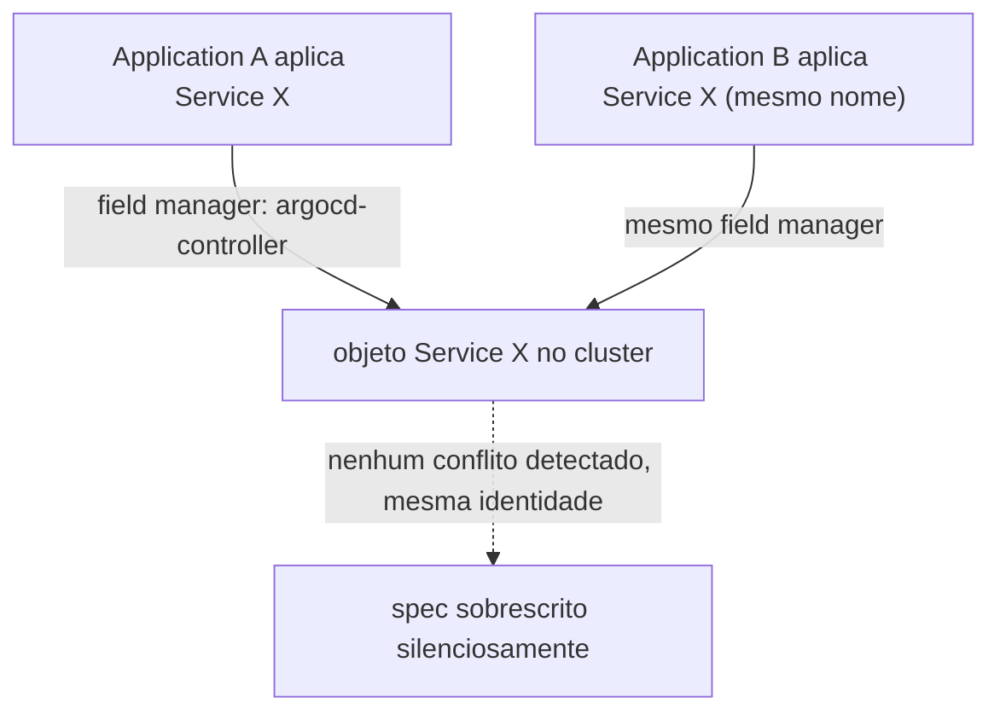
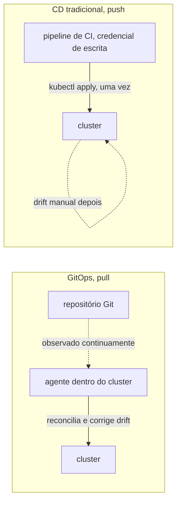

# Argo CD

**TLDR**: observa um repositório Git e mantém o cluster Kubernetes sincronizado sozinho, sem `kubectl apply` manual. Application é a unidade sincronizada, AppProject limita o que ela pode criar, e sync pode ser manual ou automático.

| Termo | Vá pra |
|---|---|
| Registrar tudo de uma vez | [O padrão app-of-apps](#o-padrao-app-of-apps) |
| Limite de permissão | [AppProject](#appproject-o-limite-de-permissao) |
| Aprovar cada mudança ou não | [Sync manual vs. automático](#sync-manual-vs-automatico) |
| Quem é dono do quê com o Ansible | [Fronteira de posse](#fronteira-de-posse-com-o-ansible) |

Argo CD é uma ferramenta de GitOps: ele observa um repositório Git continuamente e mantém o cluster Kubernetes sincronizado com o que está declarado lá, sem precisar de ninguém rodando `kubectl apply` manualmente. Cada unidade sincronizada é um **Application**, um recurso Kubernetes próprio que aponta pra um caminho num repositório Git e um destino (namespace, cluster).

## O padrão app-of-apps

Em vez de registrar cada Application manualmente, é comum usar o padrão **app-of-apps**: um único Application raiz aponta pra uma pasta cheia de outros manifestos Application. O Argo CD sincroniza esse raiz, que por sua vez faz o Argo CD descobrir e sincronizar todos os Applications dentro daquela pasta, recursivamente. Adicionar um serviço novo vira só adicionar um arquivo `.yaml` novo na pasta, não reconfigurar o Argo CD.

## AppProject: o limite de permissão

Um Application, sozinho, poderia sincronizar qualquer tipo de recurso Kubernetes, de qualquer repositório. O **AppProject** é o que restringe isso: define de quais repositórios Git um Application daquele projeto pode vir, e quais tipos de recurso (`kind`) ele tem permissão de criar. Um padrão comum é separar AppProjects por nível de confiança, um mais permissivo pra código de infraestrutura própria, outro mais restrito pra repositórios de times diferentes, limitando o dano possível de uma credencial de CI comprometida num deles.

## Sync manual vs. automático

Ver [Promoção entre ambientes](promocao-entre-ambientes.md) pra como esse modelo de promoção via Git se compara ao de GitLab, Azure DevOps e GitHub Actions.

Um Application pode sincronizar automaticamente (qualquer mudança no Git é aplicada sozinha) ou manualmente (alguém aprova cada sync). É uma opção do Argo CD, não uma regra fixa da ferramenta, e times que adotam GitOps sobre um sistema que já tem dado real de produção costumam começar em modo manual, só ligando sync automático depois que o diff contra o cluster real está comprovadamente vazio.

## Fronteira de posse com o Ansible

Numa instalação onde uma ferramenta de configuration management (ver [Ansible](ansible.md)) faz o bootstrap do próprio Argo CD, alguma divisão de responsabilidade entre as duas é necessária, senão elas disputam o mesmo recurso: uma delas reaplicando algo que a outra acabou de reconciliar de outro jeito. O padrão mais comum é a ferramenta de bootstrap ser dona só do release do Argo CD e do manifesto raiz, deixando tudo que o Argo CD descobre a partir dali inteiramente sob a responsabilidade dele.

## Duas Applications, o mesmo recurso: por que não dá erro

[Server-Side Apply](https://kubernetes.io/docs/reference/using-api/server-side-apply/) (o `ServerSideApply=true` já visto acima) resolve conflito de campo comparando **quem é o dono de cada campo**, não se o recurso já existe. Cada aplicação registra um `field manager` (a identidade de quem está aplicando), e dois managers diferentes só entram em conflito de verdade se tentam declarar o mesmo campo com valores diferentes. O detalhe que engana: o Argo CD usa a **mesma identidade de field manager** (`argocd-controller`) pra toda e qualquer sincronização que ele faz, não importa qual `Application` disparou. Isso significa que se duas `Applications` diferentes declararem um recurso com o mesmo nome/kind/namespace (por exemplo, de propósito, num plano de migração que reaproveita um nome de `Service` só depois de um cutover deliberado), o Kubernetes não vê duas identidades disputando o campo, vê a mesma identidade atualizando o que ela mesma já possuía. Não há erro de conflito nenhum, nem aviso: o `spec` do recurso é silenciosamente sobrescrito pela sincronização mais recente, mesmo que as duas `Applications` estejam sincronizadas manualmente e "isoladas" uma da outra na intenção de quem escreveu o manifesto.

Na prática: nunca depender de "vai dar erro de nome duplicado" como rede de segurança entre duas `Applications` do mesmo Argo CD. Se duas precisam, ainda que temporariamente, declarar o mesmo nome de recurso, a proteção real é não sincronizar as duas ao mesmo tempo (sync manual, uma de cada vez, conferindo o resultado antes da próxima), não a expectativa de que o Kubernetes vai recusar a segunda.

## Pra ir além

Argo CD é uma implementação da categoria GitOps, um termo cunhado pela Weaveworks: Git como fonte única da verdade, um agente dentro do cluster que reconcilia continuamente. Flux CD é o sibling mais direto, com filosofia igual mas mecânica diferente (Flux é modular, várias controllers separadas, cada uma cuidando de um pedaço; Argo CD é mais monolítico e vem com UI própria). Jenkins X e Weave GitOps (também da própria Weaveworks) são outras opções na mesma categoria, menos comuns hoje que Argo CD e Flux. [opengitops.dev](https://opengitops.dev) documenta os princípios do GitOps de forma independente de ferramenta.

Dentro do próprio ecossistema GitOps existe uma variação de como versionar segredo cifrado direto no Git, sem um cofre externo (ver [Infisical](infisical.md)): Sealed Secrets e SOPS cifram o `Secret` no próprio manifesto, e um controller no cluster decifra na hora de aplicar. É uma abordagem legítima, mais simples de operar (sem servidor externo pra manter no ar), mas sem UI de gestão, sem rotação automática, e com um segredo cifrado versionado historicamente no Git pra sempre, mesmo depois de trocado.

A antítese do GitOps é o modelo mais antigo, CD tradicional por push (ver a distinção completa entre pull e push em [CI, CD e CD](ci-cd.md)): um pipeline (Jenkins, GitHub Actions) roda `kubectl apply`/`helm upgrade` direto contra o cluster ao final do build, com uma credencial de escrita guardada no próprio pipeline. Funciona, e ainda é o modelo mais comum fora do mundo Kubernetes, mas espalha credencial de escrita do cluster por todo runner de CI, e não tem reconciliação contínua: se alguém mexer manualmente no cluster depois do deploy, nada corrige isso sozinho, diferente do agente do Argo CD, que detecta e corrige drift a cada ciclo.

Progressive delivery (canary releases, blue-green deployments, rollback automático baseado em métricas) é uma camada que fica acima do GitOps básico: Argo Rollouts é a extensão mais comum pra isso dentro do próprio ecossistema Argo.

Helm e Kustomize são as duas ferramentas de templating/composição de manifests Kubernetes mais comuns, e resolvem o mesmo problema (evitar duplicar YAML entre ambientes) de jeitos opostos: Helm empacota tudo num chart parametrizado por values, Kustomize parte de um manifest base e aplica patches por cima, sem nenhuma linguagem de template.

## Cheatsheet

| Comando/conceito | O que faz |
|---|---|
| `argocd app diff <app> --core` | Compara o Git contra o cluster, sem senha de admin |
| `argocd app sync <app>` | Sincroniza manualmente |
| `syncPolicy.automated` | Liga sync automático na Application |
| `clusterResourceWhitelist` | Define `kind` de recurso cluster-wide permitido no AppProject |
| `namespaceResourceWhitelist` | Define `kind` de recurso por namespace permitido |

Onde aprofundar: a documentação oficial em [argo-cd.readthedocs.io](https://argo-cd.readthedocs.io) é completa e inclui um getting started guiado.
