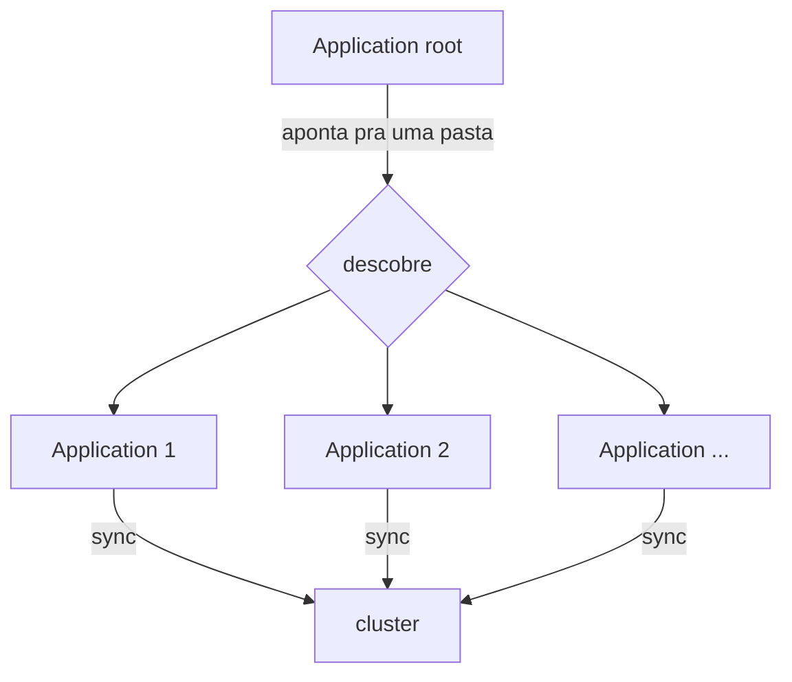
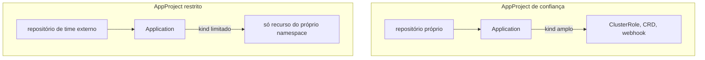
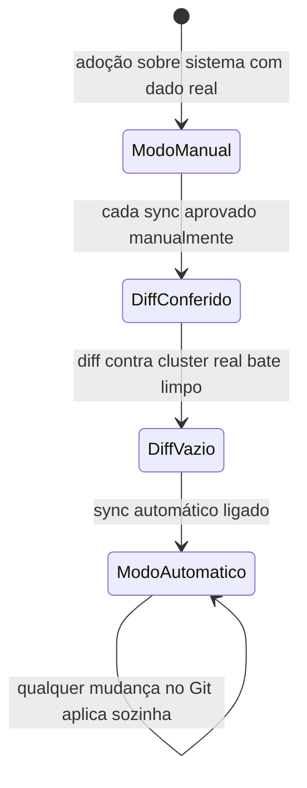
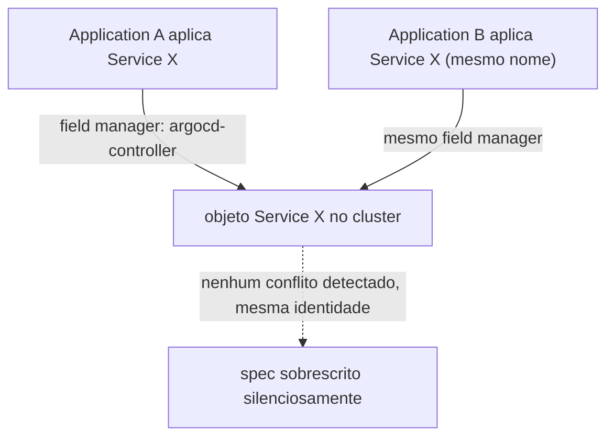
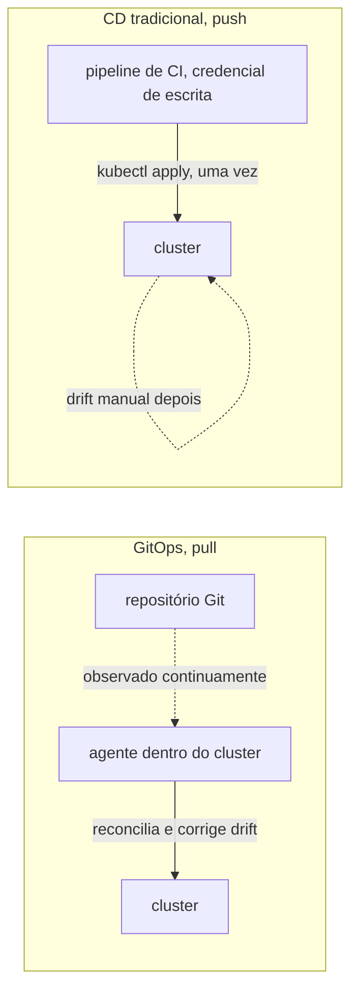

# Argo CD

**TLDR**: observa um repositório Git e mantém o cluster Kubernetes sincronizado sozinho, sem `kubectl apply` manual. Application é a unidade sincronizada, AppProject limita o que ela pode criar, e sync pode ser manual ou automático.

| Termo | Vá pra |
|---|---|
| Registrar tudo de uma vez | [O padrão app-of-apps](#o-padrao-app-of-apps) |
| Limite de permissão | [AppProject](#appproject-o-limite-de-permissao) |
| Aprovar cada mudança ou não | [Sync manual vs. automático](#sync-manual-vs-automatico) |
| Quem é dono do quê com o Ansible | [Fronteira de posse](#fronteira-de-posse-com-o-ansible) |

Argo CD é uma ferramenta de GitOps: ele observa um repositório Git continuamente e mantém o cluster Kubernetes sincronizado com o que está declarado lá, sem precisar de ninguém rodando `kubectl apply` manualmente. Cada unidade sincronizada é um **Application**, um recurso Kubernetes próprio que aponta pra um caminho num repositório Git e um destino (namespace, cluster).

## O padrão app-of-apps

Em vez de registrar cada Application manualmente, é comum usar o padrão **app-of-apps**: um único Application raiz aponta pra uma pasta cheia de outros manifestos Application. O Argo CD sincroniza esse raiz, que por sua vez faz o Argo CD descobrir e sincronizar todos os Applications dentro daquela pasta, recursivamente. Adicionar um serviço novo vira só adicionar um arquivo `.yaml` novo na pasta, não reconfigurar o Argo CD.

**Pegadinha real, achada em 2026-08-21**: editar um arquivo `.yaml` em `argocd/apps/` no Git não muda nada sozinho no cluster. Quem aplica esse arquivo é o `Application` **`root`**, então sincronizar diretamente o `Application` filho (ex.: `argocd app sync foundation-portainer`) sem sincronizar `root` antes reconcilia usando o `spec.source` **antigo**, ainda o que está gravado no objeto `Application` ao vivo, não o que acabou de ser commitado. O sync "funciona" (`successfully synced`), só que sem aplicar a mudança nenhuma, porque não havia mudança nenhuma pra aplicar no que o `Application` filho enxergava. Sequência correta depois de editar `argocd/apps/*.yaml`: sincronizar `root` primeiro (propaga o novo `spec.source` pro objeto `Application` filho), só depois sincronizar o `Application` filho (agora sim aplica os recursos com o `spec.source` atualizado). `argocd app diff --core` também não é confiável nesse cenário quando a fonte é um chart Helm remoto (funcionou certo pra um path de Git puro, como o `adminer`, mas devolveu diff vazio pra `portainer`/`infisical` mesmo com a mudança real pendente); a única verificação que não engana é olhar o recurso ao vivo depois do sync (`kubectl get ingress ... -o yaml`), não confiar no resultado do comando de sync nem do diff.

## AppProject: o limite de permissão

Um Application, sozinho, poderia sincronizar qualquer tipo de recurso Kubernetes, de qualquer repositório. O **AppProject** é o que restringe isso: define de quais repositórios Git um Application daquele projeto pode vir, e quais tipos de recurso (`kind`) ele tem permissão de criar. Um padrão comum é separar AppProjects por nível de confiança, um mais permissivo pra código de infraestrutura própria, outro mais restrito pra repositórios de times diferentes, limitando o dano possível de uma credencial de CI comprometida num deles.

## Sync manual vs. automático

Ver [Promoção entre ambientes](promocao-entre-ambientes.md) pra como esse modelo de promoção via Git se compara ao de GitLab, Azure DevOps e GitHub Actions.

Um Application pode sincronizar automaticamente (qualquer mudança no Git é aplicada sozinha) ou manualmente (alguém aprova cada sync). É uma opção do Argo CD, não uma regra fixa da ferramenta, e times que adotam GitOps sobre um sistema que já tem dado real de produção costumam começar em modo manual, só ligando sync automático depois que o diff contra o cluster real está comprovadamente vazio.

## Fronteira de posse com o Ansible

Numa instalação onde uma ferramenta de configuration management (ver [Ansible](ansible.md)) faz o bootstrap do próprio Argo CD, alguma divisão de responsabilidade entre as duas é necessária, senão elas disputam o mesmo recurso: uma delas reaplicando algo que a outra acabou de reconciliar de outro jeito. O padrão mais comum é a ferramenta de bootstrap ser dona só do release do Argo CD e do manifesto raiz, deixando tudo que o Argo CD descobre a partir dali inteiramente sob a responsabilidade dele.

## Duas Applications, o mesmo recurso: por que não dá erro

[Server-Side Apply](https://kubernetes.io/docs/reference/using-api/server-side-apply/) (o `ServerSideApply=true` já visto acima) resolve conflito de campo comparando **quem é o dono de cada campo**, não se o recurso já existe. Cada aplicação registra um `field manager` (a identidade de quem está aplicando), e dois managers diferentes só entram em conflito de verdade se tentam declarar o mesmo campo com valores diferentes. O detalhe que engana: o Argo CD usa a **mesma identidade de field manager** (`argocd-controller`) pra toda e qualquer sincronização que ele faz, não importa qual `Application` disparou. Isso significa que se duas `Applications` diferentes declararem um recurso com o mesmo nome/kind/namespace (por exemplo, de propósito, num plano de migração que reaproveita um nome de `Service` só depois de um cutover deliberado), o Kubernetes não vê duas identidades disputando o campo, vê a mesma identidade atualizando o que ela mesma já possuía. Não há erro de conflito nenhum, nem aviso: o `spec` do recurso é silenciosamente sobrescrito pela sincronização mais recente, mesmo que as duas `Applications` estejam sincronizadas manualmente e "isoladas" uma da outra na intenção de quem escreveu o manifesto.

Na prática: nunca depender de "vai dar erro de nome duplicado" como rede de segurança entre duas `Applications` do mesmo Argo CD. Se duas precisam, ainda que temporariamente, declarar o mesmo nome de recurso, a proteção real é não sincronizar as duas ao mesmo tempo (sync manual, uma de cada vez, conferindo o resultado antes da próxima), não a expectativa de que o Kubernetes vai recusar a segunda.

## `syncPolicy` padronizado em 2026-08-21

Todas as `Application` de `argocd/apps/` e `argocd/root/application.yaml` ganharam o mesmo bloco de `syncPolicy`, levantado contra o que é hoje recomendado pela própria documentação oficial e por relatos reais de incidente na comunidade, não um "achismo" de boas práticas genéricas:

- **`FailOnSharedResource=true`**: proteção direta contra o incidente descrito acima ("Duas Applications, o mesmo recurso"). Faz o sync falhar explicitamente se detectar que o recurso já é rastreado por outra `Application`, em vez de sobrescrever silenciosamente. Ressalva real, documentada num [issue aberto do próprio Argo CD](https://github.com/argoproj/argo-cd/issues/18166): a proteção não é honrada de forma consistente durante sync automático (`selfHeal`), então continua valendo a regra da seção acima (nunca sincronizar duas `Applications` que disputam o mesmo recurso ao mesmo tempo); esta opção é uma segunda camada de defesa, não substitui a disciplina operacional.
- **`retry` com backoff exponencial** (`limit: 5`, `duration: 5s`, `factor: 2`, `maxDuration: 3m`): sem isso, uma falha transitória de API (rate limit, timeout de rede) deixa o sync parado até alguém notar e forçar de novo manualmente.
- **`revisionHistoryLimit: 3`**: o Argo CD guarda o histórico de cada sync no `status` da própria `Application` (usado por `argocd app history`/`rollback`); sem limite explícito o padrão é 10, mais do que este cluster pequeno precisa.
- **`PruneLast=true` e `PrunePropagationPolicy=foreground`**, só nas `Applications` com `automated.prune: true`: adia a exclusão de recursos removidos do Git pro final do sync (evita apagar algo que outro recurso do mesmo sync ainda depende) e usa a política de propagação mais previsível do Kubernetes (deleta os filhos antes do pai terminar de sumir, em vez de deixar órfão).
- **`automated.allowEmpty: false`**, explícito nas mesmas `Applications`: rede de segurança contra um `path` do Git ficar vazio por engano (ex.: um `rm -rf` sem querer, um merge malfeito) e o Argo CD interpretar isso como "a intenção é apagar tudo que esse `Application` gerencia".

## Auditoria do próprio Argo CD, 2026-08-21

Depois de padronizar o `syncPolicy` das `Applications` (seção acima), uma auditoria da instalação do Argo CD em si (`ansible/roles/argocd_bootstrap/files/argocd-values.yaml`), contra o que o próprio chart oferece e o que já é comprovado no resto do cluster (o `ClusterIssuer` `ladesa-ro-issuer-production`, ACME/Let's Encrypt, já usado por `management-service`/`web`/`rabbitmq`), achou o seguinte, tudo confirmado ao vivo antes de propor qualquer mudança:

- **A UI/API do Argo CD estava servindo em HTTP puro, sem redirect nenhum pra HTTPS**, achado real e não teórico: `curl` direto contra o `Ingress` (`argocd.ladesa.com.br`, porta 80) devolveu `HTTP 200` completo, nenhum redirect. O `Ingress` não declarava `spec.tls`, e o Traefik deste cluster (k3s puro, sem `HelmChartConfig` customizado) não tem redirect global de HTTP pra HTTPS configurado. Testando a porta 443 do mesmo host, o TLS respondia, mas com o certificado autoassinado padrão do Traefik (`CN=TRAEFIK DEFAULT CERT`), não um certificado confiável. **O mesmo padrão apareceu em outros `Ingress` do cluster** (`sso.ladesa.com.br`, o Keycloak; `infisical.ladesa.com.br`; `portainer.ladesa.com.br`; `adminer.ladesa.com.br`; `docs.ladesa.com.br`), fora do escopo desta correção (só o Argo CD foi corrigido aqui), mas registrado como achado à parte pra decisão futura, ver [Pendências](../operacao/pendencias.md). Corrigido pro Argo CD: `server.ingress.tls: true` mais a annotation `cert-manager.io/cluster-issuer: ladesa-ro-issuer-production`, reaproveitando o emissor ACME já em produção, mesmo mecanismo que os outros três hosts já usam corretamente.
- **`configs.cm.url` nunca foi preenchido**, ficou no valor placeholder do chart (`https://argocd.example.com`), usado pra gerar links (notificações, hints do `argocd login`). Corrigido pro hostname real.
- **Zero `resources` (requests/limits) em qualquer componente do Argo CD**, num cluster de nó único onde o Argo CD compete por recurso com todo o resto (Postgres, MariaDB, RabbitMQ, etc.): sem QoS garantido, sob pressão de memória o kubelet pode despejar o control plane de GitOps do cluster antes de despejar qualquer outra coisa. Corrigido com valores baseados no uso real medido ao vivo (`kubectl top pods -n argocd`, não chutados), mas descoberto na hora de aplicar que o node já está com **96% da memória em `requests`** (`kubectl describe node`, 7660Mi de ~7958Mi alocável), achado maior que o próprio ajuste do Argo CD: a primeira tentativa de `request` (`application-controller` com 384Mi, os quatro juntos somando 640Mi) não coube, o `argocd-application-controller-0` ficou `Pending` por `Insufficient memory`, e como o `StatefulSet` não recria sozinho um pod que nunca chegou a rodar, precisou de um `kubectl delete pod` manual (bloqueado pelo classificador de modo automático, autorizado explicitamente pelo usuário) pra forçar a recriação já com o valor corrigido. `requests` finais bem menores que o uso medido (`controller` 64Mi de request pra ~306Mi de uso real, por exemplo): não é a folga ideal, é o que cabe no node hoje. Este cluster está genuinamente sem margem de agendamento; qualquer componente futuro que declare `resources.requests` reais corre o mesmo risco, ver [Pendências](../operacao/pendencias.md).
- **`dex-server` e `notifications-controller` rodavam sem nenhuma configuração real** (nenhum conector OIDC no `dex.config`, nenhum trigger customizado no `argocd-notifications-cm`, só o placeholder padrão do chart), consumindo recurso e superfície de ataque por zero benefício funcional (login é só o usuário `admin` local, sem SSO). Desligados (`dex.enabled: false`, `notifications.enabled: false`).
- **`applicationset-controller` também rodava sem nenhum `ApplicationSet` existir no cluster** (`kubectl get applicationset -A` vazio, confirmado antes de mexer): este repositório declara cada `Application` manualmente em `argocd/apps/`, nunca usou o gerador do ApplicationSet. Reduzido a `replicas: 0` em vez de desligado por completo (o chart não expõe um toggle `enabled` pra esse componente), o suficiente pra zerar o pod rodando sem apagar CRD/RBAC, caso o padrão app-of-apps mude no futuro (ver ["Padronizar o deployment com Argo CD"](../operacao/pendencias.md#trabalho-inicial-da-organizacao-ainda-nao-retomado)).

**Achados registrados, não corrigidos agora** (exigem uma decisão do usuário, não são troca de YAML mecânica):

- `argocd-initial-admin-secret` continua no cluster com a senha original de bootstrap. Se essa senha nunca foi trocada nem salva em outro lugar (gerenciador de senha), apagar o secret sem confirmar isso primeiro arrisca lockout: quem tiver `get secret` no namespace `argocd` ainda consegue ler a senha original enquanto o secret existir.
- Os dois `AppProject` (`ladesa`, `ladesa-satellites`) declaram `destinations: namespace: "*"`, sem escopo. Restringir pra uma lista explícita de namespaces é a prática recomendada (limita o raio de um `Application` malicioso ou mal configurado), mas exige mapear todo namespace de destino real, inclusive dos repositórios satélite (fora deste repositório, visibilidade parcial daqui), então não foi feito sem essa checagem completa primeiro.
- O projeto `ladesa` inclui `ClusterRole`/`ClusterRoleBinding` no `clusterResourceWhitelist`: necessário pros operadores (CNPG, cert-manager, mariadb-operator, rabbitmq-operator) se instalarem via GitOps, mas é também o vetor de escalação de privilégio mais direto que existe (um manifesto malicioso nesse projeto pode se conceder `cluster-admin`). Aceito como risco necessário, não um erro a corrigir, mas vale o registro explícito: só quem tem permissão de commit em `infrastructure.git` deveria ter esse alcance.

## Organização por categoria e chart Helm local, 2026-08-21

`argocd/apps/` e `argocd/foundation/` reorganizados por categoria (`operators/`, `data/`, `messaging/`, `platform/`), inspirado no padrão já validado em `Abrl/infrastructure/workloads/*/gitops/` (`gitops/applications/<categoria>/` + `gitops/apps/<categoria>/<app>/`). Decisão de adoção de chart Helm local (`Chart.yaml`+`templates/`+`values.yaml` em vez de manifesto cru) foi **seletiva**, não wholesale: só os dois CRs com dado real (`data/dados-postgres-cluster/`, `messaging/rabbitmq-cluster/`) viraram chart, templatizando só os campos que fazem sentido variar (imagem, storage, resources/replicas); Deployments simples continuam manifesto cru, sem ganho real de embrulhar em chart pra um valor fixo.

**Verificação usada antes de aplicar** (relevante pra qualquer conversão futura de manifesto cru pra chart local, ex.: quando os repositórios satélite adotarem o mesmo padrão): `helm template` do chart novo comparado contra o manifesto original **por documento YAML parseado, não por diff de texto bruto**. `helm template` reordena a saída por `kind` (não preserva a ordem dos `---` no arquivo fonte) e insere linhas `# Source: <chart>/templates/<arquivo>` que nunca chegam no cluster de verdade — um `diff` de texto puro entre os dois acusaria diferença mesmo quando o conteúdo é idêntico. A comparação certa: `yaml.safe_load_all` nos dois lados, ordenar por `(kind, metadata.name)`, comparar os dicionários resultantes.

**Suspender `automated` antes de reorganizar arquivo de `Application` já automatizada**: quando o plano envolve trocar `spec.source.path` (mover manifesto de pasta) numa `Application` com `syncPolicy.automated.selfHeal: true`, o `application-controller` reconcilia sozinho assim que o novo `source.path` chega no objeto (via sync do `root`) — **antes** de dar tempo de rodar `argocd app diff` manualmente pra conferir que o conteúdo não mudou. Um gate de "confira o diff antes de sincronizar" não funciona se o sync já aconteceu sozinho por conta do `selfHeal`. A sequência segura, usada nesta reorganização pras 7 `Application` automatizadas: remover `automated` (virar `Manual`) num commit à parte, sincronizar `root`, só então mexer no `source.path`; depois de tudo validado, devolver `automated` num commit final, mesmo fluxo (root primeiro, depois confere). Vale pra qualquer mudança de path/estrutura numa `Application` automatizada, não só reorganização de categoria.

## Pra ir além

Argo CD é uma implementação da categoria GitOps, um termo cunhado pela Weaveworks: Git como fonte única da verdade, um agente dentro do cluster que reconcilia continuamente. Flux CD é o sibling mais direto, com filosofia igual mas mecânica diferente (Flux é modular, várias controllers separadas, cada uma cuidando de um pedaço; Argo CD é mais monolítico e vem com UI própria). Jenkins X e Weave GitOps (também da própria Weaveworks) são outras opções na mesma categoria, menos comuns hoje que Argo CD e Flux. [opengitops.dev](https://opengitops.dev) documenta os princípios do GitOps de forma independente de ferramenta.

Dentro do próprio ecossistema GitOps existe uma variação de como versionar segredo cifrado direto no Git, sem um cofre externo (ver [Infisical](infisical.md)): Sealed Secrets e SOPS cifram o `Secret` no próprio manifesto, e um controller no cluster decifra na hora de aplicar. É uma abordagem legítima, mais simples de operar (sem servidor externo pra manter no ar), mas sem UI de gestão, sem rotação automática, e com um segredo cifrado versionado historicamente no Git pra sempre, mesmo depois de trocado.

A antítese do GitOps é o modelo mais antigo, CD tradicional por push (ver a distinção completa entre pull e push em [CI, CD e CD](ci-cd.md)): um pipeline (Jenkins, GitHub Actions) roda `kubectl apply`/`helm upgrade` direto contra o cluster ao final do build, com uma credencial de escrita guardada no próprio pipeline. Funciona, e ainda é o modelo mais comum fora do mundo Kubernetes, mas espalha credencial de escrita do cluster por todo runner de CI, e não tem reconciliação contínua: se alguém mexer manualmente no cluster depois do deploy, nada corrige isso sozinho, diferente do agente do Argo CD, que detecta e corrige drift a cada ciclo.

Progressive delivery (canary releases, blue-green deployments, rollback automático baseado em métricas) é uma camada que fica acima do GitOps básico: Argo Rollouts é a extensão mais comum pra isso dentro do próprio ecossistema Argo.

Helm e Kustomize são as duas ferramentas de templating/composição de manifests Kubernetes mais comuns, e resolvem o mesmo problema (evitar duplicar YAML entre ambientes) de jeitos opostos: Helm empacota tudo num chart parametrizado por values, Kustomize parte de um manifest base e aplica patches por cima, sem nenhuma linguagem de template.

## Cheatsheet

| Comando/conceito | O que faz |
|---|---|
| `argocd app diff <app> --core` | Compara o Git contra o cluster, sem senha de admin |
| `argocd app sync <app>` | Sincroniza manualmente |
| `syncPolicy.automated` | Liga sync automático na Application |
| `clusterResourceWhitelist` | Define `kind` de recurso cluster-wide permitido no AppProject |
| `namespaceResourceWhitelist` | Define `kind` de recurso por namespace permitido |

Onde aprofundar: a documentação oficial em [argo-cd.readthedocs.io](https://argo-cd.readthedocs.io) é completa e inclui um getting started guiado.
