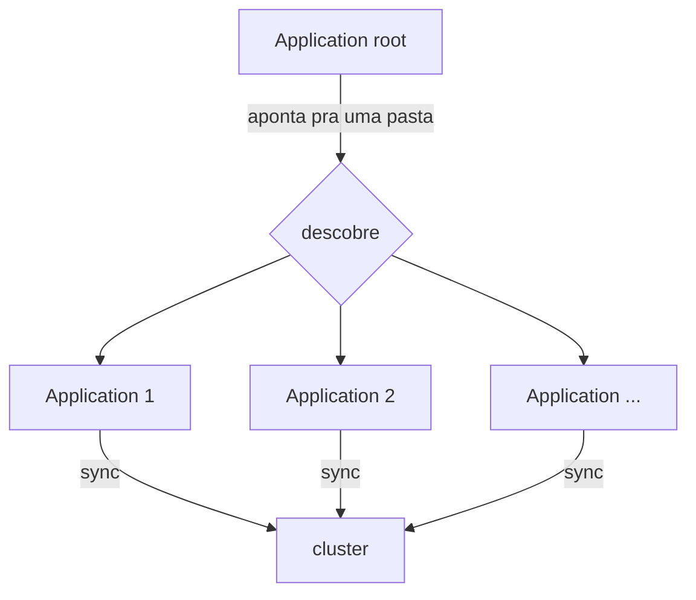
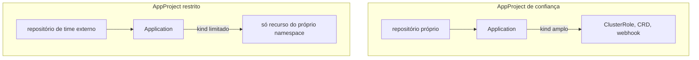
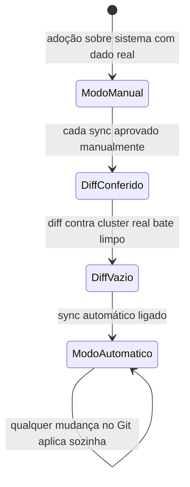
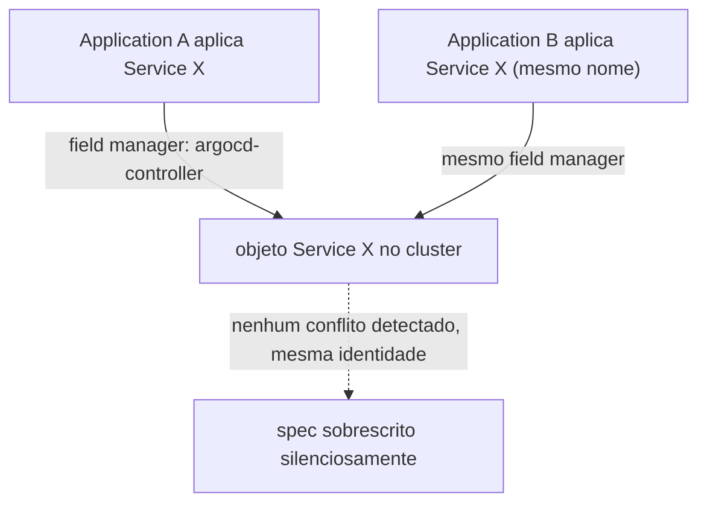
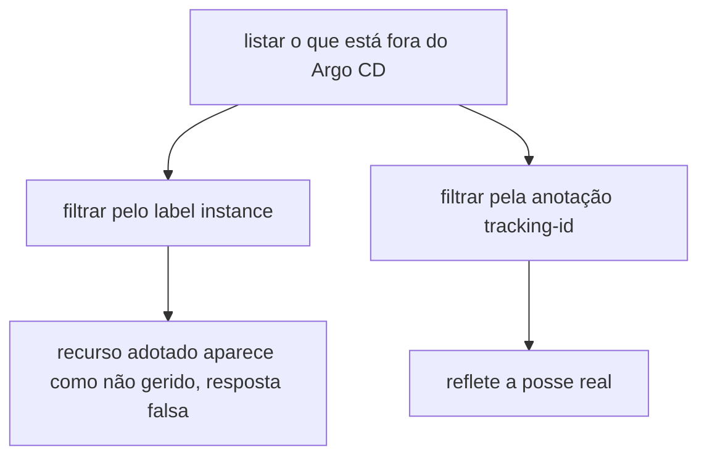
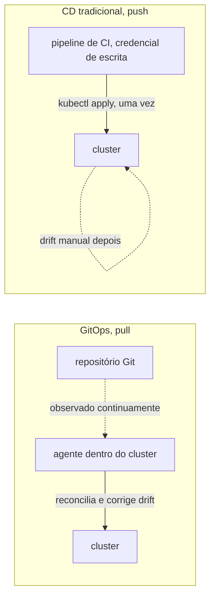

# Argo CD

**TLDR**: observa um repositório Git e mantém o cluster Kubernetes sincronizado sozinho, sem `kubectl apply` manual. Application é a unidade sincronizada, AppProject limita o que ela pode criar, e sync pode ser manual ou automático.

| Termo | Vá pra |
|---|---|
| Registrar tudo de uma vez | [O padrão app-of-apps](#o-padrao-app-of-apps) |
| Limite de permissão | [AppProject](#appproject-o-limite-de-permissao) |
| Aprovar cada mudança ou não | [Sync manual vs. automático](#sync-manual-vs-automatico) |
| Quem é dono do quê com o Ansible | [Fronteira de posse](#fronteira-de-posse-com-o-ansible) |

Argo CD é uma ferramenta de GitOps: ele observa um repositório Git continuamente e mantém o cluster Kubernetes sincronizado com o que está declarado lá, sem precisar de ninguém rodando `kubectl apply` manualmente. Cada unidade sincronizada é um **Application**, um recurso Kubernetes próprio que aponta pra um caminho num repositório Git e um destino (namespace, cluster).

## O padrão app-of-apps

Em vez de registrar cada Application manualmente, é comum usar o padrão **app-of-apps**: um único Application raiz aponta pra uma pasta cheia de outros manifestos Application. O Argo CD sincroniza esse raiz, que por sua vez faz o Argo CD descobrir e sincronizar todos os Applications dentro daquela pasta, recursivamente. Adicionar um serviço novo vira só adicionar um arquivo `.yaml` novo na pasta, não reconfigurar o Argo CD.



**Pegadinha real, achada em 2026-08-21**: editar um arquivo `.yaml` em `argocd/applications/` no Git não muda nada sozinho no cluster. Quem aplica esse arquivo é o `Application` **`root`**, então sincronizar diretamente o `Application` filho (ex.: `argocd app sync foundation-portainer`) sem sincronizar `root` antes reconcilia usando o `spec.source` **antigo**, ainda o que está gravado no objeto `Application` ao vivo, não o que acabou de ser commitado. O sync "funciona" (`successfully synced`), só que sem aplicar a mudança nenhuma, porque não havia mudança nenhuma pra aplicar no que o `Application` filho enxergava. Sequência correta depois de editar `argocd/applications/*.yaml`: sincronizar `root` primeiro (propaga o novo `spec.source` pro objeto `Application` filho), só depois sincronizar o `Application` filho (agora sim aplica os recursos com o `spec.source` atualizado). `argocd app diff --core` também não é confiável nesse cenário quando a fonte é um chart Helm remoto (funcionou certo pra um path de Git puro, como o `adminer`, mas devolveu diff vazio pra `portainer`/`infisical` mesmo com a mudança real pendente); a única verificação que não engana é olhar o recurso ao vivo depois do sync (`kubectl get ingress ... -o yaml`), não confiar no resultado do comando de sync nem do diff.

## AppProject: o limite de permissão

Um Application, sozinho, poderia sincronizar qualquer tipo de recurso Kubernetes, de qualquer repositório. O **AppProject** é o que restringe isso: define de quais repositórios Git um Application daquele projeto pode vir, e quais tipos de recurso (`kind`) ele tem permissão de criar. Um padrão comum é separar AppProjects por nível de confiança, um mais permissivo pra código de infraestrutura própria, outro mais restrito pra repositórios de times diferentes, limitando o dano possível de uma credencial de CI comprometida num deles.



## Sync manual vs. automático

Ver [Promoção entre ambientes](promocao-entre-ambientes.md) pra como esse modelo de promoção via Git se compara ao de GitLab, Azure DevOps e GitHub Actions.

Um Application pode sincronizar automaticamente (qualquer mudança no Git é aplicada sozinha) ou manualmente (alguém aprova cada sync). É uma opção do Argo CD, não uma regra fixa da ferramenta, e times que adotam GitOps sobre um sistema que já tem dado real de produção costumam começar em modo manual, só ligando sync automático depois que o diff contra o cluster real está comprovadamente vazio.



## Fronteira de posse com o Ansible

Numa instalação onde uma ferramenta de configuration management (ver [Ansible](ansible.md)) faz o bootstrap do próprio Argo CD, alguma divisão de responsabilidade entre as duas é necessária, senão elas disputam o mesmo recurso: uma delas reaplicando algo que a outra acabou de reconciliar de outro jeito. O padrão mais comum é a ferramenta de bootstrap ser dona só do release do Argo CD e do manifesto raiz, deixando tudo que o Argo CD descobre a partir dali inteiramente sob a responsabilidade dele.

## Duas Applications, o mesmo recurso: por que não dá erro

[Server-Side Apply](https://kubernetes.io/docs/reference/using-api/server-side-apply/) (o `ServerSideApply=true` já visto acima) resolve conflito de campo comparando **quem é o dono de cada campo**, não se o recurso já existe. Cada aplicação registra um `field manager` (a identidade de quem está aplicando), e dois managers diferentes só entram em conflito de verdade se tentam declarar o mesmo campo com valores diferentes. O detalhe que engana: o Argo CD usa a **mesma identidade de field manager** (`argocd-controller`) pra toda e qualquer sincronização que ele faz, não importa qual `Application` disparou. Isso significa que se duas `Applications` diferentes declararem um recurso com o mesmo nome/kind/namespace (por exemplo, de propósito, num plano de migração que reaproveita um nome de `Service` só depois de um cutover deliberado), o Kubernetes não vê duas identidades disputando o campo, vê a mesma identidade atualizando o que ela mesma já possuía. Não há erro de conflito nenhum, nem aviso: o `spec` do recurso é silenciosamente sobrescrito pela sincronização mais recente, mesmo que as duas `Applications` estejam sincronizadas manualmente e "isoladas" uma da outra na intenção de quem escreveu o manifesto.



Na prática: nunca depender de "vai dar erro de nome duplicado" como rede de segurança entre duas `Applications` do mesmo Argo CD. Se duas precisam, ainda que temporariamente, declarar o mesmo nome de recurso, a proteção real é não sincronizar as duas ao mesmo tempo (sync manual, uma de cada vez, conferindo o resultado antes da próxima), não a expectativa de que o Kubernetes vai recusar a segunda.

## `syncPolicy` padronizado em 2026-08-21

Todas as `Application` de `argocd/applications/` e `argocd/root/application.yaml` ganharam o mesmo bloco de `syncPolicy`, levantado contra o que é hoje recomendado pela própria documentação oficial e por relatos reais de incidente na comunidade, não um "achismo" de boas práticas genéricas:

- **`FailOnSharedResource=true`**: proteção direta contra o incidente descrito acima ("Duas Applications, o mesmo recurso"). Faz o sync falhar explicitamente se detectar que o recurso já é rastreado por outra `Application`, em vez de sobrescrever silenciosamente. Ressalva real, documentada num [issue aberto do próprio Argo CD](https://github.com/argoproj/argo-cd/issues/18166): a proteção não é honrada de forma consistente durante sync automático (`selfHeal`), então continua valendo a regra da seção acima (nunca sincronizar duas `Applications` que disputam o mesmo recurso ao mesmo tempo); esta opção é uma segunda camada de defesa, não substitui a disciplina operacional.
- **`retry` com backoff exponencial** (`limit: 5`, `duration: 5s`, `factor: 2`, `maxDuration: 3m`): sem isso, uma falha transitória de API (rate limit, timeout de rede) deixa o sync parado até alguém notar e forçar de novo manualmente.
- **`revisionHistoryLimit: 3`**: o Argo CD guarda o histórico de cada sync no `status` da própria `Application` (usado por `argocd app history`/`rollback`); sem limite explícito o padrão é 10, mais do que este cluster pequeno precisa.
- **`PruneLast=true` e `PrunePropagationPolicy=foreground`**, só nas `Applications` com `automated.prune: true`: adia a exclusão de recursos removidos do Git pro final do sync (evita apagar algo que outro recurso do mesmo sync ainda depende) e usa a política de propagação mais previsível do Kubernetes (deleta os filhos antes do pai terminar de sumir, em vez de deixar órfão).
- **`automated.allowEmpty: false`**, explícito nas mesmas `Applications`: rede de segurança contra um `path` do Git ficar vazio por engano (ex.: um `rm -rf` sem querer, um merge malfeito) e o Argo CD interpretar isso como "a intenção é apagar tudo que esse `Application` gerencia".

## Auditoria do próprio Argo CD, 2026-08-21

Depois de padronizar o `syncPolicy` das `Applications` (seção acima), uma auditoria da instalação do Argo CD em si (`ansible/roles/argocd_bootstrap/files/argocd-values.yaml`), contra o que o próprio chart oferece e o que já é comprovado no resto do cluster (o `ClusterIssuer` `ladesa-ro-issuer-production`, ACME/Let's Encrypt, já usado por `management-service`/`web`/`rabbitmq`), achou o seguinte, tudo confirmado ao vivo antes de propor qualquer mudança:

- **A UI/API do Argo CD estava servindo em HTTP puro, sem redirect nenhum pra HTTPS**, achado real e não teórico: `curl` direto contra o `Ingress` (`argocd.ladesa.com.br`, porta 80) devolveu `HTTP 200` completo, nenhum redirect. O `Ingress` não declarava `spec.tls`, e o Traefik deste cluster (k3s puro, sem `HelmChartConfig` customizado) não tem redirect global de HTTP pra HTTPS configurado. Testando a porta 443 do mesmo host, o TLS respondia, mas com o certificado autoassinado padrão do Traefik (`CN=TRAEFIK DEFAULT CERT`), não um certificado confiável. **O mesmo padrão apareceu em outros `Ingress` do cluster** (`sso.ladesa.com.br`, o Keycloak; `infisical.ladesa.com.br`; `portainer.ladesa.com.br`; `adminer.ladesa.com.br`; `docs.ladesa.com.br`), fora do escopo desta correção (só o Argo CD foi corrigido aqui), mas registrado como achado à parte pra decisão futura, ver [Pendências](../operacao/pendencias.md). Corrigido pro Argo CD: `server.ingress.tls: true` mais a annotation `cert-manager.io/cluster-issuer: ladesa-ro-issuer-production`, reaproveitando o emissor ACME já em produção, mesmo mecanismo que os outros três hosts já usam corretamente.
- **`configs.cm.url` nunca foi preenchido**, ficou no valor placeholder do chart (`https://argocd.example.com`), usado pra gerar links (notificações, hints do `argocd login`). Corrigido pro hostname real.
- **Zero `resources` (requests/limits) em qualquer componente do Argo CD**, num cluster de nó único onde o Argo CD compete por recurso com todo o resto (Postgres, MariaDB, RabbitMQ, etc.): sem QoS garantido, sob pressão de memória o kubelet pode despejar o control plane de GitOps do cluster antes de despejar qualquer outra coisa. Corrigido com valores baseados no uso real medido ao vivo (`kubectl top pods -n argocd`, não chutados), mas descoberto na hora de aplicar que o node já estava sem folga de memória pra agendamento (`kubectl describe node` mostra isso, o número exato fica no inventário privado apontado por [Estado fora do git](../operacao/estado-fora-do-git.md)), achado maior que o próprio ajuste do Argo CD: a primeira tentativa de `request` (`application-controller` com 384Mi, os quatro juntos somando 640Mi) não coube, o `argocd-application-controller-0` ficou `Pending` por `Insufficient memory`, e como o `StatefulSet` não recria sozinho um pod que nunca chegou a rodar, precisou de um `kubectl delete pod` manual (bloqueado pelo classificador de modo automático, autorizado explicitamente pelo usuário) pra forçar a recriação já com o valor corrigido. `requests` finais bem menores que o uso medido (`controller` 64Mi de request pra ~306Mi de uso real, por exemplo): não é a folga ideal, é o que cabe no node hoje. Este cluster está genuinamente sem margem de agendamento; qualquer componente futuro que declare `resources.requests` reais corre o mesmo risco, ver [Pendências](../operacao/pendencias.md).
- **`dex-server` e `notifications-controller` rodavam sem nenhuma configuração real** (nenhum conector OIDC no `dex.config`, nenhum trigger customizado no `argocd-notifications-cm`, só o placeholder padrão do chart), consumindo recurso e superfície de ataque por zero benefício funcional (login é só o usuário `admin` local, sem SSO). Desligados (`dex.enabled: false`, `notifications.enabled: false`).
- **`applicationset-controller` também rodava sem nenhum `ApplicationSet` existir no cluster** (`kubectl get applicationset -A` vazio, confirmado antes de mexer): este repositório declara cada `Application` manualmente em `argocd/applications/`, nunca usou o gerador do ApplicationSet. Reduzido a `replicas: 0` em vez de desligado por completo (o chart não expõe um toggle `enabled` pra esse componente), o suficiente pra zerar o pod rodando sem apagar CRD/RBAC, caso o padrão app-of-apps mude no futuro (ver ["Padronizar o deployment com Argo CD"](../operacao/pendencias.md#trabalho-inicial-da-organizacao-ainda-nao-retomado)).

A auditoria também registrou achados que exigem decisão e não troca mecânica de YAML, e por isso seguem em aberto. Eles ficam no inventário privado apontado por [Estado fora do git](../operacao/estado-fora-do-git.md), e voltam pra cá descritos por inteiro conforme forem corrigidos.

## Organização por categoria e chart Helm local, 2026-08-21

`argocd/apps/` e `argocd/foundation/` reorganizados por categoria (`operators/`, `data/`, `messaging/`, `platform/`), inspirado no padrão já validado em `Abrl/infrastructure/workloads/*/gitops/` (`gitops/applications/<categoria>/` + `gitops/apps/<categoria>/<app>/`). Decisão de adoção de chart Helm local (`Chart.yaml`+`templates/`+`values.yaml` em vez de manifesto cru) foi **seletiva**, não wholesale: só os dois CRs com dado real (`data/dados-postgres-cluster/`, `messaging/rabbitmq-cluster/`) viraram chart, templatizando só os campos que fazem sentido variar (imagem, storage, resources/replicas); Deployments simples continuam manifesto cru, sem ganho real de embrulhar em chart pra um valor fixo.

**Verificação usada antes de aplicar** (relevante pra qualquer conversão futura de manifesto cru pra chart local, ex.: quando os repositórios satélite adotarem o mesmo padrão): `helm template` do chart novo comparado contra o manifesto original **por documento YAML parseado, não por diff de texto bruto**. `helm template` reordena a saída por `kind` (não preserva a ordem dos `---` no arquivo fonte) e insere linhas `# Source: <chart>/templates/<arquivo>` que nunca chegam no cluster de verdade. Um `diff` de texto puro entre os dois acusaria diferença mesmo quando o conteúdo é idêntico. A comparação certa: `yaml.safe_load_all` nos dois lados, ordenar por `(kind, metadata.name)`, comparar os dicionários resultantes.

**Suspender `automated` antes de reorganizar arquivo de `Application` já automatizada**: quando o plano envolve trocar `spec.source.path` (mover manifesto de pasta) numa `Application` com `syncPolicy.automated.selfHeal: true`, o `application-controller` reconcilia sozinho assim que o novo `source.path` chega no objeto (via sync do `root`), **antes** de dar tempo de rodar `argocd app diff` manualmente pra conferir que o conteúdo não mudou. Um gate de "confira o diff antes de sincronizar" não funciona se o sync já aconteceu sozinho por conta do `selfHeal`. A sequência segura, usada nesta reorganização pras 7 `Application` automatizadas: remover `automated` (virar `Manual`) num commit à parte, sincronizar `root`, só então mexer no `source.path`; depois de tudo validado, devolver `automated` num commit final, mesmo fluxo (root primeiro, depois confere). Vale pra qualquer mudança de path/estrutura numa `Application` automatizada, não só reorganização de categoria.

## Chart de terceiro + recurso próprio: wrapper chart, não multi-source, 2026-08-21

Duas formas diferentes de combinar um chart oficial de terceiro com um recurso próprio (ex.: o `Service` `db-mariadb`, que o chart `mariadb-operator/mariadb-cluster` não gera) foram tentadas nesta sessão, nessa ordem:

1. **`spec.sources` (multi-source Application)**: `spec.source` (um só) vira `spec.sources` (lista), combinando uma fonte de chart remoto com uma fonte de manifesto cru no próprio Git, cada uma produzindo recurso independente, unidas na mesma `Application`. Padrão oficial, documentado, limite de "2-3 fontes no máximo". Funcionou, mas foi abandonado.
2. **Wrapper chart (chart Helm local com o chart de terceiro como `dependencies:`)**: `Chart.yaml` do nosso próprio chart declara o chart de terceiro como subchart (`dependencies: [{name, version, repository}]`), vendorizado via `helm dependency update` (`Chart.lock` + `charts/<nome>-<versão>.tgz`, comitados), e um `templates/` próprio pro recurso extra (ex.: `templates/service.yaml`). Os valores do subchart ficam aninhados sob a chave do nome dele no `values.yaml` do wrapper (regra padrão de repasse de pai pra filho do Helm). `spec.source` volta a ser único, apontando pro wrapper.

**Por que trocar pro wrapper**: multi-source funciona, mas o wrapper dá mais poder de fato. O `template` do recurso extra pode referenciar valores do `values.yaml` (multi-source não tem esse acesso cruzado entre fontes), e não tem limite de "2-3 fontes". A troca foi decidida depois de comparar com o padrão real usado em outro cluster de referência (`portainer-stack`, `grafana-central`), que usa exatamente essa mecânica.

**Cuidado real, confirmado com pesquisa externa depois de uma primeira tentativa de aplicar o wrapper em todo chart de terceiro do repositório indiscriminadamente**: [orientação de mercado sobre umbrella chart no Argo CD](https://oneuptime.com/blog/post/2026-02-26-argocd-helm-umbrella-charts/view) é clara: funciona bem quando componentes são fortemente acoplados e precisam versionar juntos; se um chart evolui sozinho, sem nenhum recurso extra acoplado, `Application` com chart remoto direto (sem wrapper) dá mais flexibilidade e menos manutenção (bump de versão vira só editar `targetRevision`, sem `helm dependency update` nem `.tgz` novo pra comitar). Também confirmado: o próprio Argo CD já roda `helm dependency build` sozinho quando existe `Chart.lock`, então vendorizar o `.tgz` no Git é opcional, não obrigatório. Vale a pena aqui só porque mantém a mesma verificação `helm template` offline já em uso a sessão toda. Neste repositório, só `dados-mariadb` (chart + `Service` acoplado) justifica o wrapper; os outros charts de terceiro (`mariadb-operator`, `mariadb-operator-crds`, `portainer`, `infisical`, `secrets-operator`) continuam com referência direta, sem wrapper, de propósito.

**Quando o chart não suporta `Prune=false` por-recurso, mitigar em `automated.prune` da `Application` inteira**: o CR antigo tinha `argocd.argoproj.io/sync-options: Prune=false` na própria annotation, pra nunca ser apagado por acidente (`local-path` StorageClass tem `ReclaimPolicy: Delete`, apagar o CR apaga o volume). Chart oficial sem `commonAnnotations`/`extraLabels` no `values.yaml` não tem como reproduzir isso recurso a recurso, nem como wrapper nem como multi-source. Mitigação adotada: `automated.prune: false` na `Application` inteira (era `true`), mantendo `selfHeal: true`. É proteção de granularidade mais grossa (a `Application` toda nunca prune nada, não só o CR de dado), aceito como troca deliberada por falta de mecanismo mais fino, não um descuido.

## Migração de manifesto vendorizado pra chart oficial, cert-manager, 2026-08-21

O componente de maior blast radius do cluster (cert-manager emite TLS pra Argo CD, Infisical, Portainer, Adminer e o webhook do RabbitMQ Cluster Operator) migrou de manifesto vendorizado (`kubectl apply`) pro chart oficial `jetstack/cert-manager`, mesmo rigor de dead man switch já usado no upgrade do k3s/firewalld. Duas lições novas, específicas desse tipo de migração (chart de terceiro que instala CRD+webhook cluster-wide, não só um Deployment simples):

**Trocar `repoURL` de um chart de terceiro exige editar o `AppProject`, não só a `Application`**: toda `Application` deste repositório pertence ao projeto `ladesa` (`argocd/root/project.yaml`), que tem uma lista explícita de `sourceRepos` permitidos. Apontar `spec.source.repoURL` pra um repositório novo (`https://charts.jetstack.io`, neste caso) sem adicionar ele em `sourceRepos` produz `InvalidSpecError: application repo ... is not permitted in project`, a `Application` fica com `Sync Status: Unknown` até corrigir. Não é erro de sincronização, é o `AppProject` fazendo exatamente o trabalho de proteção pra qual existe. Detalhe que engana: `argocd/root/*.yaml` (incluindo `project.yaml`) **não é gerenciado pelo sync do próprio `Application` `root`** (que só cobre `path: argocd/applications`, recursivo). É aplicado pelo bootstrap do Ansible. Editar `project.yaml` e só rodar `argocd app sync root` não propaga a mudança; precisa de `kubectl apply -f argocd/root/project.yaml` direto (ou re-rodar o playbook de bootstrap), mesma fronteira de posse Ansible/Argo CD já documentada em ["Fronteira de posse com o Ansible"](#fronteira-de-posse-com-o-ansible) acima.

**Provar que um webhook funciona de verdade exige testar o admission, não só olhar o pod `1/1 Running`**: um `ValidatingWebhookConfiguration`/`MutatingWebhookConfiguration` pode estar com o pod saudável e ainda assim rejeitar (ou aceitar incorretamente) todo recurso do tipo que ele valida, se o `caBundle` não foi injetado direito ou a rota de rede mudou. A verificação que não engana: criar um recurso de teste descartável do tipo que o webhook intercepta (aqui, um `Certificate` contra o `ClusterIssuer` real de produção) e confirmar que a cadeia inteira reage (`CertificateRequest` aprovado, `Order`/`Challenge` criados). Não precisa esperar a emissão terminar de verdade (isso depende de DNS/rede externa, fora do controle do teste) pra provar que o webhook e o resto do pipeline de reconciliação estão funcionando, só a reação em cadeia já é prova suficiente. Apagar o recurso de teste depois, e só cancelar o dead man switch depois dessa prova, não só depois dos pods subirem.

## `--prune` explícito pode apagar mais do que o esperado: incidente real, CNPG, 2026-08-21

Migração do operador CNPG pro chart oficial (`cnpg-op/cloudnative-pg`) precisou renomear `Deployment`/`ServiceAccount`/`ClusterRole`/`ClusterRoleBinding` (o chart usa convenção de nome diferente do manifesto vendorizado, sem jeito de preservar via `values`, confirmado direto no `_helpers.tpl` do chart antes de decidir prosseguir). Renomear um recurso é, pro Argo CD, apagar o antigo (não está mais no alvo) e criar o novo. Precisa de `argocd app sync --prune` explícito pra completar, já que a `Application` estava com `automated` suspenso (etapa de segurança já documentada, ver seção do cert-manager acima).

**O que deu errado**: o chart, como o do cert-manager, não renderiza o `Namespace` (`CreateNamespace=true` no `syncOptions` cobre a criação, então o chart não precisa declarar um). Isso significa que o `Namespace` também aparece como "só ao vivo, não no alvo", exatamente a mesma categoria de recurso que o rename do `Deployment`/`ServiceAccount` também caía. O `--prune` explícito dessa sincronização **não distingue "recurso que eu quero apagar de propósito" de "recurso que só não está declarado por natureza do chart"**: ambos entram no mesmo prune. Resultado real: o `Namespace cnpg-system` foi apagado junto com os recursos antigos renomeados, cascateando a exclusão de **tudo** que tinha acabado de ser criado dentro dele naquele mesmo sync (o operador ficou fora do ar por cerca de 1 minuto).

**Por que não foi grave**: o recurso que importa de verdade (`Cluster` de produção, `dados/postgres`) fica em outro namespace inteiramente (`dados`, não `cnpg-system`), e não tem `ownerReferences` nenhuma apontando pro operador, confirmado ao vivo antes de decidir prosseguir com o rename. O Pod/PVC reais do Postgres são possuídos pelo `Cluster` CR, não pelo `Deployment` do operador. `Cluster in healthy state` o tempo todo durante o incidente, verificado ao vivo enquanto o `cnpg-system` estava `Terminating`.

**Recuperação**: um segundo `argocd app sync`, dessa vez **sem** `--prune`, recriou o `Namespace` (via `CreateNamespace=true`) e todos os recursos do operador de uma vez, sem precisar do dead man switch (que continuava armado, mas não chegou a disparar).

**Lição pra qualquer rename futuro num chart que não renderiza `Namespace`**: antes de rodar `--prune` explícito, conferir no `argocd app diff` se o `Namespace` também aparece como "só ao vivo". Se aparecer, ele **vai** ser prunado junto no mesmo sync, não é opcional escolher só os recursos do rename. Se o recurso protegido por esse namespace tiver `ownerReferences` reais (diferente do caso do CNPG), isso seria um risco de dado real, não só um susto de operador fora do ar por um minuto. Confirmar a ausência de `ownerReferences` antes é obrigatório, não opcional, sempre que o plano envolver `--prune` explícito.

## Rename de topo (`argocd/apps` e `argocd/foundation` trocam de nome entre si), 2026-08-21

Renomear os dois diretórios de topo pra bater com o nome exato do Abrl (`argocd/apps` virou `argocd/applications`, `argocd/foundation` virou `argocd/apps`) confirmou, na prática, um detalhe da fronteira Ansible/Argo CD que já valia pra `argocd/root/project.yaml` (ver ["Fronteira de posse com o Ansible"](#fronteira-de-posse-com-o-ansible) e a lição do cert-manager acima) mas que ainda não tinha sido testado pro outro arquivo do mesmo diretório: **`argocd/root/application.yaml` também não é sincronizado pelo próprio `root`**, pelo mesmo motivo (é o `spec.source.path` da própria `Application` `root`, então ela não pode se autoatualizar via sync; é exclusivamente domínio do bootstrap do Ansible).

Depois do commit do rename ir pro Git e o node puxar a mudança, a `Application` `root` ao vivo continuou com `path: argocd/apps` (o valor antigo), mesmo com o arquivo já corrigido no repositório. Um `argocd app sync root` não notou nada de diferente pra sincronizar (o `path` que ele estava comparando contra o alvo era o antigo, o mesmo dos dois lados). O sintoma só apareceu de um jeito indireto: como o diretório `argocd/apps` agora continha o conteúdo do antigo `argocd/foundation` (charts Helm locais, com sintaxe de template Go tipo `{{ .Values.instances }}`), o `root` tentou reconciliar contra um conteúdo que não é YAML puro nesse path, e quebrou com `ComparisonError: Failed to unmarshal "cluster.yaml"`, jogando `root` e as 14 `Applications` filhas pra `Sync Status: Unknown`. **A causa raiz não tinha nada a ver com o conteúdo do rename em si** (que estava correto), só com o fato de que o arquivo que aponta pro path certo nunca tinha sido reaplicado.

Correção: `kubectl apply -f argocd/root/application.yaml` direto no node, igual já era feito pro `project.yaml`. Depois de aplicado, `argocd app get root --hard-refresh` confirmou o `path` correto, e o `diff` mostrou exatamente as 7 mudanças de `source.path` esperadas (as `Applications` que migraram de `argocd/foundation/...` pra `argocd/apps/...`), nada além disso.

**Trava de operação presa depois de um sync que travou**: a primeira tentativa de `argocd app sync root` (antes da correção acima) ficou tentando reconciliar contra o path incompatível, estourou o timeout do lado do CLI e foi pro background, mas o processo continuou vivo no node tentando de novo sozinho (o `retry` com backoff exponencial documentado acima, ver "`syncPolicy` padronizado"), e o Argo CD manteve a trava de operação (`status.operationState.phase: Running`) o tempo todo. Uma segunda tentativa de sync, já depois da correção do `path`, falhou com `"another operation is already in progress"`, não porque havia um sync legítimo em andamento, mas porque a trava do primeiro (já obsoleto) continuava presa. Resolvido matando o processo do CLI ainda vivo no node (`kill -9 <pid>`, achado via `ps aux | grep "argocd app sync"`) e confirmando via `kubectl get application root -n argocd -o jsonpath="{.status.operationState.phase}"` que a fase mudou de `Running` pra `Error` (o processo morto = a última tentativa de retry falhou = a trava foi liberada), só então repetindo o sync com sucesso. `argocd app terminate-op` sozinho não resolveu (retornou "no operation is in progress" porque a operação já tinha se auto-limpado entre a checagem e a tentativa); o problema real era o processo do CLI ainda vivo tentando de novo, não a trava do servidor em si.

## Corrigindo a causa raiz do `Namespace` não declarado, cert-manager e CNPG, 2026-08-21

A mitigação `automated.prune: false` no cert-manager e no CNPG (ver seções acima) resolvia o sintoma, não a causa: os dois charts oficiais não renderizam o `Namespace` (dependem de `CreateNamespace=true`), então ele aparecia pra sempre como "só ao vivo, não no alvo" em qualquer `argocd app diff`, e um `prune: true` apagaria o namespace inteiro no próximo ciclo (foi exatamente o que aconteceu por acidente no CNPG). Correção de causa raiz aplicada nos dois, mesmo padrão wrapper chart já usado no `dados-mariadb` (seção "Chart de terceiro + recurso próprio" acima), mas com `templates/namespace.yaml` declarando o `Namespace` em vez de um `Service`.

**O `Namespace` declarado não precisa de nenhum campo além do nome**: `kubernetes.io/metadata.name` (label) e `argocd.argoproj.io/tracking-id` (annotation) são adicionados automaticamente pelo Kubernetes/Argo CD, não fazem parte do manifesto declarado. Um `templates/namespace.yaml` de 4 linhas (`apiVersion`, `kind`, `metadata.name`) é suficiente.

**A verificação `helm template` idêntico continua obrigatória, mas com uma exceção esperada e só uma**: comparando o wrapper contra o chart direto, a única diferença válida é o próprio `Namespace` novo (documento a mais só no lado do wrapper). Qualquer outra diferença significa que o `values.yaml` do wrapper não reproduziu exatamente os valores que já estavam em produção.

**Resultado prático depois do sync**: no cert-manager, o `Namespace` já existia idêntico ao vivo (criado antes via `CreateNamespace=true`, sem nenhuma customização própria), então a `Application` virou `Synced` sozinha, sem nem precisar de um sync manual, só a comparação já bateu. No CNPG, sobrou uma diferença mínima e esperada: a annotation `argocd.argoproj.io/tracking-id`, que o `Namespace` não tinha porque nunca tinha sido criado como recurso rastreado (só como efeito colateral do `CreateNamespace=true`). Um sync normal (sem `--prune`, não havia nenhum rename desta vez) adicionou só essa annotation, sem recriar nada, confirmado por `uid`/`creationTimestamp` inalterados no `Namespace` e em todo o resto. Depois disso, o `diff` dos dois veio **totalmente vazio**, sem a exceção do `Namespace` que existia desde a migração original, permitindo `automated.prune: true` nos dois com segurança de verdade, não só mitigação.

## Nem todo chart oficial vale a migração: CNPG `Cluster` CR, 2026-08-21

Pesquisa completa (não só leitura de `values.yaml`, renderização real do fixture de teste do próprio chart oficial `cnpg/cluster` contra o cenário de import `monolith`) confirmou que o chart cobre a mesma estrutura final que o `Cluster` CR de produção deste repositório já declara na mão (`bootstrap.initdb.import`+`externalClusters`, `managed.roles` com `passwordSecret` por role, `fullnameOverride` pro nome do `Cluster`). Mesmo assim, a migração foi descartada, decisão explícita do usuário depois de pesar o achado abaixo, não um veto técnico automático.

**Nem todo template de chart tem override pra tudo**: o template `databases.yaml` do `cnpg/cluster` nomeia toda CR `Database` gerada como `{{ fullname }}-{{ nome }}` (ex.: `postgres-api-dev-v1`), sem nenhum campo em `values.yaml` pra sobrescrever só o nome do objeto Kubernetes. Diferente do `Namespace`/`Service` (onde um `templates/` extra no wrapper resolve, ver a correção de causa raiz do cert-manager/CNPG acima), aqui o recurso conflitante nasce de dentro do PRÓPRIO chart de terceiro, não tem como acrescentar por fora, só editando o `.tgz` vendorizado (fora de cogitação, quebra o próprio propósito de usar um chart de terceiro).

**`databaseReclaimPolicy: retain` protege o dado, não o objeto Kubernetes**: o CNPG casa uma CR `Database` com o banco de dado real pelo campo `spec.name` (o nome do banco dentro do Postgres), não pela identidade do objeto Kubernetes que a declara. Isso significa que renomear a CR (apagar a antiga, criar uma nova com outro nome, mesmo `spec.name`) não apaga nem recria o banco de dado real, `retain` cumpre a promessa. Mas ainda é um rename de recurso de produção de verdade (evento de delete+create observável, mesma categoria de risco do rename do CNPG operador documentado acima), só que sem o ganho de "causa raiz corrigida" que justificou aquele rename (aqui, o `Cluster` já funciona bem do jeito que está).

**Serviço gerenciado pelo operador é uma transferência de posse, não só uma diferença de template**: o mecanismo nativo do CNPG pra Service customizado (`spec.managed.services.additional`, exposto no chart como `cluster.services`) faz o **operador** criar o objeto `Service`, não o Argo CD. Adotar isso trocaria quem é dono do `Service db-postgres` (hoje rastreado direto pelo Argo CD, com `tracking-id` próprio) por um objeto que o Argo CD nem vê no `diff` (só existe como efeito colateral do reconcile do `Cluster`). Tecnicamente funciona, mas é uma mudança de responsabilidade que merece ser deliberada, não vir de brinde numa migração de chart.

**O critério que decidiu**: nenhum dos três achados acima é, sozinho, motivo pra não migrar (todos têm mitigação: aceitar o rename, ou manter um wrapper com `templates/service.yaml` próprio em vez do mecanismo nativo). O que pesou foi o conjunto: o custo real (rename de 5 recursos de produção, mais uma decisão de posse do `Service`) contra um ganho que já existe hoje por outro caminho (`ignoreDifferences` já cobre o drift que o CNPG defaulta sozinho, ver a seção de auditoria em [Pendências](../operacao/pendencias.md)). Migrar pra chart oficial não é um objetivo em si, é um meio; quando o meio custa mais do que resolve, a decisão certa é não migrar, e registrar o porquê pra não precisar refazer a mesma pesquisa se a pergunta voltar.

## `spec.selector` de `Deployment` é imutável: nomes preservados não bastam, 2026-08-21

Migração do Redis pro chart `stakater/application` (ver [Pendências](../operacao/pendencias.md)) manteve de propósito o mesmo nome de `Deployment`/`Service`/`PersistentVolumeClaim` do manifesto anterior, evitando a categoria inteira de risco de rename/prune já documentada acima (CNPG, cert-manager). Mesmo assim, o sync falhou repetidamente: `Deployment.apps "redis-server" is invalid: spec.selector: ... field is immutable`.

**Por quê**: o `Deployment`/`Service` antigos usavam `app: redis-server` como seletor (convenção livre, escrita à mão). O chart novo usa um seletor fixo, gerado por um helper interno (`app.kubernetes.io/name`+`application.stakater.com/workload-class`), sem nenhum campo em `values.yaml` pra sobrescrever só o seletor. `spec.selector` de um `Deployment` é um dos poucos campos verdadeiramente imutáveis da API do Kubernetes (por design: mudar o seletor depois de criado deixaria pods órfãos, sem `ReplicaSet` dono), então qualquer update que tente mudar esse campo é rejeitado na validação, não aplicado parcialmente.

**O `helm template`/`argocd app diff` não avisam disso com antecedência**: os dois mostram a mudança de campo normalmente, como qualquer outra diferença de spec, sem nenhum sinal de que aquele campo específico vai ser rejeitado pela API ao aplicar. A única forma de descobrir foi tentar sincronizar de verdade e ler a mensagem de erro do `operationState`.

**Por que foi seguro mesmo assim**: dado real (Redis com 1858 chaves) vive no `PersistentVolumeClaim`, não no `Deployment`. A API rejeitou o update inteiro antes de tocar em qualquer coisa (nem o `Deployment` nem o `Pod` antigos foram afetados pelas tentativas que falharam), e a correção (apagar só o `Deployment`, deixar o Argo CD recriar do zero com o seletor novo, montando o mesmo PVC por nome) não tocou no PVC em nenhum momento. Verificado depois: PVC manteve a idade original (604 dias), prova de que nunca foi recriado.

**Lição pra qualquer migração futura que troque o mecanismo de um `Deployment` já existente**: preservar nome de recurso evita rename/prune, mas não evita conflito de campo imutável. Vale conferir explicitamente se o novo chart/manifesto muda `spec.selector` (ou qualquer outro campo imutável: `spec.storageClassName`/`volumeName` de PVC, por exemplo) antes de assumir que "os nomes batem, então é seguro". Se mudar, a correção é apagar só o recurso específico com o campo imutável (não a `Application` inteira, não os recursos que carregam dado real), e deixar o próximo sync recriar.

## Recurso não rastreado com nome diferente do novo fica órfão coexistindo, não substituído, 2026-08-22

Migração do `web` (repositório satélite) pro Argo CD (ver [Pendências](../operacao/pendencias.md)) tinha um `Ingress` aplicado à mão por script (`kubectl apply`, sem `Application` nenhuma dona dele, sem `tracking-id`), chamado `ladesa-ro-web-ingress`. O chart novo (`stakater/application`, `applicationName: ladesa-ro-web`) gera o `Ingress` com o nome do `applicationName`, sem sufixo: `ladesa-ro-web`, nome diferente do antigo.

**Por que isso é mais arriscado que um rename comum**: nas migrações anteriores desta sessão (CNPG, cert-manager, secrets-operator), o recurso antigo e o novo eram rastreados pela mesma `Application`, então o Argo CD sabia que um substituía o outro e prunava o antigo depois de criar o novo. Aqui não: o `Ingress` antigo nunca foi rastreado por nenhuma `Application`, então não existe prune nenhum agindo sobre ele. O resultado de sincronizar sem limpar antes não seria um `Ingress` faltando, seria **dois `Ingress` distintos**, `ladesa-ro-web-ingress` (antigo, órfão, continuando a existir pra sempre) e `ladesa-ro-web` (novo, rastreado), os dois declarando o mesmo host (`dev.ladesa.com.br`) e o mesmo path (`/`) ao mesmo tempo, uma condição de rota duplicada que depende do comportamento do controller de Ingress (aqui, Traefik) pra decidir qual vence, não de nada que o Argo CD controle.

**Como isso foi percebido antes de sincronizar**: o mesmo hábito já documentado em ["Coisas implícitas"](execucao-segura-e-qualidade.md#coisas-implicitas-comportamento-que-ninguem-escreveu-mas-que-existe). Inspecionar o `argocd app diff` da `Application` nova mostrou o `Ingress` novo inteiro como "só no alvo" (esperado, primeira criação), e uma checagem separada, fora do `diff` (que só descreve o que a própria `Application` rastreia, não o resto do cluster), confirmou que o `ladesa-ro-web-ingress` antigo continuava vivo e sem dono.

**Correção**: apagar o recurso não rastreado antes do primeiro sync, não depois, já que não há prune nenhum que vá fazer isso sozinho. Mesmo raciocínio de sempre pra recurso sem dado real (sem PVC nem estado, só uma regra de roteamento): baixo risco, reversível reaplicando o backup se algo desse errado.

**Lição geral**: um recurso aplicado fora do Argo CD (`kubectl apply` direto, UI do Portainer, script imperativo) nunca aparece em nenhum `argocd app diff`, de nenhuma `Application`, porque `diff` só compara contra o que a própria `Application` declara. Antes de introduzir uma `Application` nova que vai gerenciar um namespace que já tem recurso imperativo dentro, vale procurar explicitamente por esse tipo de recurso (`kubectl get <kind> -n <namespace>` comparado contra o que a `Application` nova vai criar), não confiar que o `diff` já contaria a história toda.

## O rastreio de posse é anotação, não label, e o `argocd-cm` engana, 2026-08-21

Perguntar "o que neste cluster está fora do Argo CD" parece trivial: basta listar os recursos sem o marcador de posse. O erro está em qual marcador procurar.

Historicamente o Argo CD marcava cada recurso adotado com o **label** `app.kubernetes.io/instance`, configurável por `application.instanceLabelKey` no `argocd-cm`. Label tem duas limitações sérias: o valor é limitado a 63 caracteres, então nome de `Application` longo é truncado, e o campo colide com o que os próprios charts Helm já escrevem. Por isso o Argo CD ganhou o modo `annotation`, que grava `argocd.argoproj.io/tracking-id` com o nome da `Application`, o grupo, o tipo e o caminho do recurso, tudo num valor só, sem disputar nada com o chart.

A armadilha é que **o padrão implícito mudou** e o `argocd-cm` não reflete isso. Neste cluster, `application.resourceTrackingMethod` está **vazio**, e `application.instanceLabelKey` está declarado como `argocd.argoproj.io/instance`. Lendo só o ConfigMap, a conclusão natural é que o rastreio é por label. Ao vivo, nenhum recurso adotado carrega esse label, e todos carregam a anotação. O `instanceLabelKey` continua ali, configurado e sem efeito nenhum, que é o pior estado possível para um campo de configuração: parece a resposta e não é.

O sintoma prático é uma varredura que mente na direção mais perigosa, a de falso alarme invertido. Uma listagem filtrando pelo label devolve como "fora do Argo CD" recursos que acabaram de ser adotados com sucesso, e a mesma lógica aplicada a um `PersistentVolumeClaim` responde "não está rastreado, logo está a salvo da poda" sem ter verificado coisa alguma. A resposta certa pelo motivo errado é indistinguível da errada até alguém conferir.



A conferência que não engana é ir ao recurso ao vivo e olhar o que o Argo CD de fato escreveu, em vez de deduzir do ConfigMap:

```bash
kubectl get deploy <nome> -n <namespace> \
  -o jsonpath='{.metadata.annotations.argocd\.argoproj\.io/tracking-id}{"\n"}'
```

**Lição pra qualquer auditoria de posse**: o marcador de rastreio é uma decisão de versão do Argo CD, não do `argocd-cm`, e configuração declarada não prova comportamento. Antes de varrer o cluster inteiro em busca do que está fora, confirmar em **um** recurso sabidamente adotado qual marcador ele carrega, e só então generalizar a consulta. É o mesmo princípio já registrado na lição do `continue-on-error` em [Desenvolvimento](../operacao/desenvolvimento.md): uma verificação que nunca rodou de verdade é visualmente idêntica a uma que rodou e não achou nada.

## Pra ir além

Argo CD é uma implementação da categoria GitOps, um termo cunhado pela Weaveworks: Git como fonte única da verdade, um agente dentro do cluster que reconcilia continuamente. Flux CD é o sibling mais direto, com filosofia igual mas mecânica diferente (Flux é modular, várias controllers separadas, cada uma cuidando de um pedaço; Argo CD é mais monolítico e vem com UI própria). Jenkins X e Weave GitOps (também da própria Weaveworks) são outras opções na mesma categoria, menos comuns hoje que Argo CD e Flux. [opengitops.dev](https://opengitops.dev) documenta os princípios do GitOps de forma independente de ferramenta.

Dentro do próprio ecossistema GitOps existe uma variação de como versionar segredo cifrado direto no Git, sem um cofre externo (ver [Infisical](infisical.md)): Sealed Secrets e SOPS cifram o `Secret` no próprio manifesto, e um controller no cluster decifra na hora de aplicar. É uma abordagem legítima, mais simples de operar (sem servidor externo pra manter no ar), mas sem UI de gestão, sem rotação automática, e com um segredo cifrado versionado historicamente no Git pra sempre, mesmo depois de trocado.

A antítese do GitOps é o modelo mais antigo, CD tradicional por push (ver a distinção completa entre pull e push em [CI, CD e CD](ci-cd.md)): um pipeline (Jenkins, GitHub Actions) roda `kubectl apply`/`helm upgrade` direto contra o cluster ao final do build, com uma credencial de escrita guardada no próprio pipeline. Funciona, e ainda é o modelo mais comum fora do mundo Kubernetes, mas espalha credencial de escrita do cluster por todo runner de CI, e não tem reconciliação contínua: se alguém mexer manualmente no cluster depois do deploy, nada corrige isso sozinho, diferente do agente do Argo CD, que detecta e corrige drift a cada ciclo.



Progressive delivery (canary releases, blue-green deployments, rollback automático baseado em métricas) é uma camada que fica acima do GitOps básico: Argo Rollouts é a extensão mais comum pra isso dentro do próprio ecossistema Argo.

Helm e Kustomize são as duas ferramentas de templating/composição de manifests Kubernetes mais comuns, e resolvem o mesmo problema (evitar duplicar YAML entre ambientes) de jeitos opostos: Helm empacota tudo num chart parametrizado por values, Kustomize parte de um manifest base e aplica patches por cima, sem nenhuma linguagem de template.

## Cheatsheet

| Comando/conceito | O que faz |
|---|---|
| `argocd app diff <app> --core` | Compara o Git contra o cluster, sem senha de admin |
| `argocd app sync <app>` | Sincroniza manualmente |
| `syncPolicy.automated` | Liga sync automático na Application |
| `clusterResourceWhitelist` | Define `kind` de recurso cluster-wide permitido no AppProject |
| `namespaceResourceWhitelist` | Define `kind` de recurso por namespace permitido |

Onde aprofundar: a documentação oficial em [argo-cd.readthedocs.io](https://argo-cd.readthedocs.io) é completa e inclui um getting started guiado.
