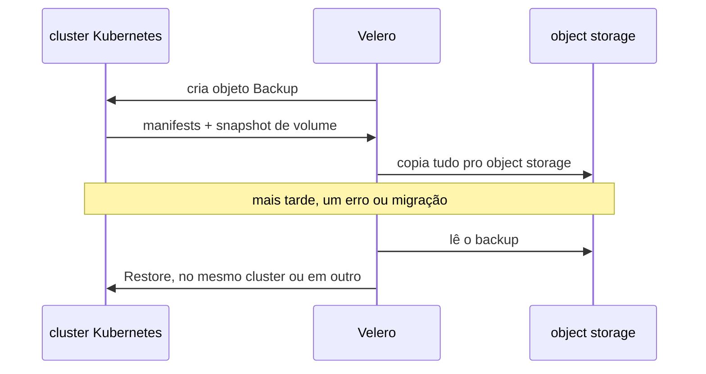
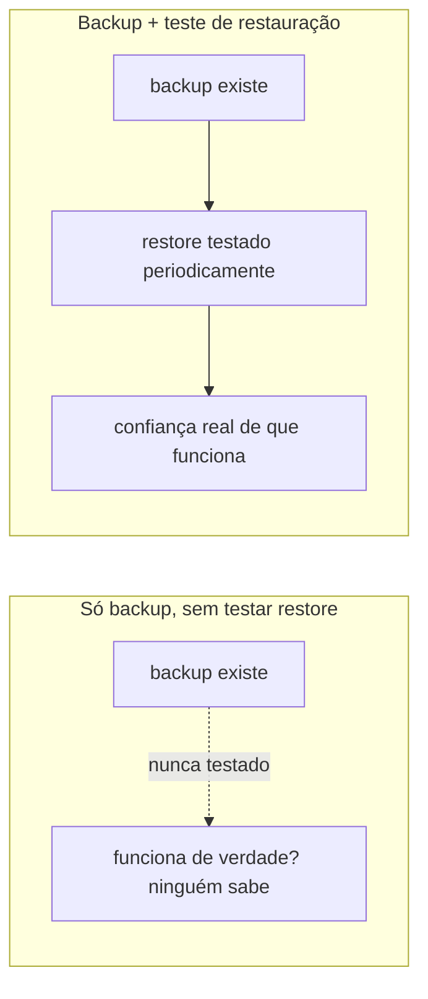

# Backup e disaster recovery

Backup é ter uma cópia recuperável de dado importante, fora do lugar onde ele vive normalmente. Disaster recovery é o processo inteiro de voltar a operar depois de uma perda real (disco morto, erro humano que apaga algo, o node inteiro sumindo), não só o arquivo de backup em si, também o roteiro de como restaurar e quanto tempo isso leva.

## Como Velero resolve isso em Kubernetes

Velero é a ferramenta mais citada pra backup e disaster recovery de cluster Kubernetes: cria um objeto `Backup`, que dispara a cópia de recursos do Kubernetes (manifests) pra um object storage, junto com snapshot de volume persistente. `Restore` faz o caminho inverso, inclusive em outro cluster, o que cobre tanto "recuperar de um erro" quanto "migrar pra um cluster novo". Suporta agendamento (backup recorrente automático, não só manual).

## Pra ir além

Restic (que o próprio Velero pode usar por baixo, como plugin, quando o storage não suporta snapshot nativo de volume) é a ferramenta mais citada fora do contexto Kubernetes especificamente, backup de arquivo com deduplicação, útil pra qualquer coisa fora de um cluster, um servidor tradicional, por exemplo, que Velero não cobre por só saber lidar com recurso Kubernetes.

A antítese de backup automatizado é confiar que nada vai dar errado, ou fazer backup manual esporádico, sem agendamento nem teste de restauração. O ponto cego mais comum não é "esquecer de fazer backup", é nunca ter testado se o backup restaura de verdade, até precisar dele.

Onde aprofundar: [Como o Velero funciona](https://velero.io/docs/main/how-velero-works/), na documentação oficial, detalha o fluxo completo de backup e restore, incluindo a ressalva importante de que um backup não é atomicamente consistente se algo estiver sendo criado/editado durante a captura.
