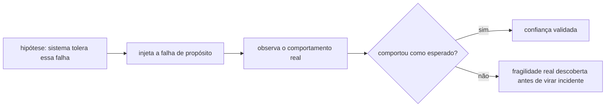
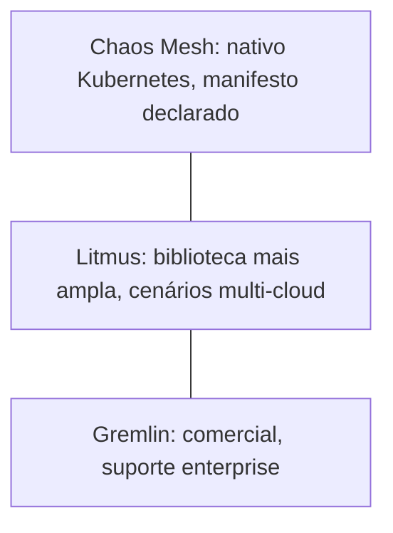

# Chaos engineering

Chaos engineering é o experimento controlado de injetar falha real (matar um pod, derrubar a rede entre dois serviços, encher o disco) num sistema em produção ou pré-produção, de propósito, pra descobrir se ele se comporta como esperado antes que a falha aconteça sozinha, sem aviso, no pior momento possível. Nasceu na Netflix (o artigo original, [Chaos Engineering (2017)](https://arxiv.org/abs/1702.05843), já citado em [Referências](referencias.md)), como resposta direta ao problema de rodar em infraestrutura que falha o tempo todo por natureza (cloud pública, milhares de instâncias).

## As ferramentas mais citadas

Duas categorias distintas aparecem nas buscas por essa prática: orquestradores de experimento (que definem o que injetar, quando, e como medir o resultado) e injetores propriamente ditos. Chaos Mesh, um projeto sandbox da CNCF, é nativo de Kubernetes, cada experimento é declarado como um recurso Kubernetes, o mesmo modelo de "tudo é um manifesto" que o GitOps já usa pra tudo mais (ver [Argo CD](argocd.md)), e cobre mais de quinze tipos de ataque diferentes, desde latência de rede até pane de kernel simulada. Litmus, também CNCF, tem a biblioteca de experimento pronta mais ampla, incluindo cenários específicos de AWS/GCP/Azure, não só Kubernetes puro. Gremlin é a opção comercial, com suporte e garantia enterprise, cobrando por host gerenciado.

## Pra ir além

A antítese de chaos engineering deliberado é só esperar a falha acontecer sozinha e reagir quando ela aparecer. Não é necessariamente um erro de projeto: chaos engineering formal só compensa depois que a confiabilidade básica (backup, observabilidade, um processo claro de resposta a incidente) já existe, injetar falha de propósito num sistema que ainda nem tem como saber se está saudável é prematuro. Ver [Observabilidade](observabilidade.md) pro pré-requisito que normalmente vem antes.

Onde aprofundar: o livro *Chaos Engineering: System Resiliency in Practice*, dos próprios autores originais da prática na Netflix (Casey Rosenthal e Nora Jones), publicado pela O'Reilly, é a referência mais citada além do artigo original.
