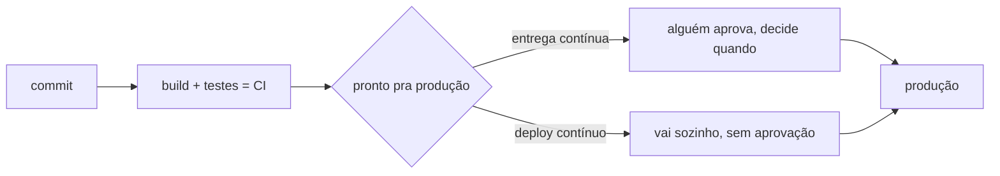
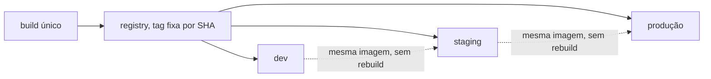
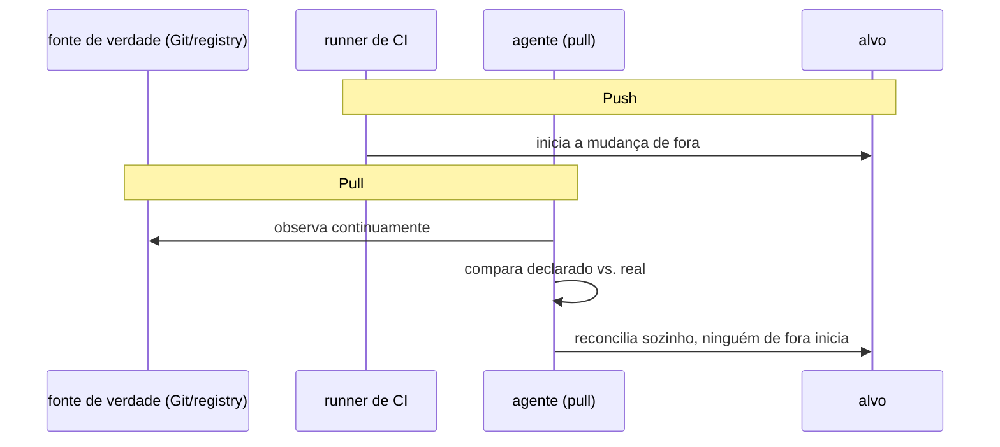
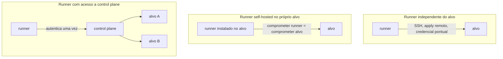

# CI, CD (entrega) e CD (deploy)

**TLDR**: CI integra e testa código com frequência; entrega contínua garante que toda mudança **pode** ir pra produção, mas alguém decide quando; deploy contínuo garante que toda mudança **vai**, sem aprovação humana no meio.

| Termo | Vá pra |
|---|---|
| Integrar com frequência | [Continuous Integration](#continuous-integration-ci) |
| Pode ir, alguém decide quando | [Continuous Delivery](#continuous-delivery-entrega-continua) |
| Vai sozinho, sem aprovação | [Continuous Deployment](#continuous-deployment-deploy-continuo) |
| Artefato, tag, registry | [Artefato, tag, registry](#artefato-tag-registry-e-promocao-entre-ambientes) |
| Push vs. pull, onde o runner fica | [Pull vs. push](#pull-vs-push-e-onde-o-runner-fica) |

"CI/CD" é usado como se fosse uma coisa só, mas são três práticas diferentes, com fronteiras que costumam confundir quem está começando. A definição de referência aqui vem de Martin Fowler, que documentou os três termos separadamente: [Continuous Integration](https://martinfowler.com/articles/continuousIntegration.html) e [bliki: Continuous Delivery](https://martinfowler.com/bliki/ContinuousDelivery.html).

## Continuous Integration (CI)

Cada pessoa do time integra seu código na branch principal com frequência, pelo menos uma vez por dia, e cada integração é verificada por um build automatizado (compilação + testes) que detecta erro de integração o mais cedo possível. O produto de um CI bem feito não é "o código funciona na minha máquina", é "o código funciona integrado com o de todo mundo, agora". Mesmo fora de código de aplicação, o mesmo princípio aparece em checagem de sintaxe e lint automatizados antes de qualquer mudança de infraestrutura ser proposta.

## Continuous Delivery (entrega contínua)

Uma extensão do CI: toda mudança que passa no build está automaticamente pronta pra ir pra produção a qualquer momento, mas alguém ainda decide quando isso acontece (um clique de aprovação, uma release manual). A garantia é "isto pode ir pra produção agora", não "isto vai".

## Continuous Deployment (deploy contínuo)

Vai um passo além: toda mudança que passa no build vai pra produção automaticamente, sem aprovação humana no meio. Muitas equipes usam "CD" pra se referir indistintamente a entrega ou deploy contínuo, o que é a origem principal da confusão. A frase de Fowler que resume a diferença: entrega contínua garante que toda mudança **pode** ser implantada; deploy contínuo garante que toda mudança **é** implantada.

## Artefato, tag, registry, e promoção entre ambientes

Conceitos que aparecem o tempo todo em qualquer pipeline de CI/CD:

**Artefato**: o resultado do build, pronto pra rodar. Aqui, isso é uma imagem de container.

**Registry**: onde a imagem construída fica armazenada depois do build, pra ser puxada depois no deploy (Docker Hub, GitHub Container Registry, ECR, entre outros).

**Tag**: um rótulo que aponta pra uma versão específica de uma imagem num registry (`v1.2.3`, `latest`, o SHA do commit). `latest` é conveniente mas ambíguo, o mesmo nome aponta pra coisas diferentes ao longo do tempo; fixar por SHA ou versão semântica é o que garante que "a versão que rodou em staging é exatamente a mesma que vai pra produção".

**Promoção entre ambientes**: mover a mesma imagem, já testada, de um ambiente pro próximo (dev -> staging -> produção), em vez de reconstruir a imagem em cada ambiente. Em GitOps, isso normalmente significa atualizar a referência de tag num arquivo de manifest, o que pode ser um PR revisado por alguém, ou automático por uma ferramenta como o Argo CD Image Updater, que tanto pode abrir esse PR (`write-back-method: git`) quanto aplicar a referência nova direto no objeto que o Argo CD já reconcilia, sem passar por commit nenhum (`write-back-method: argocd`), e que pode reagir a um push de imagem em segundos, via webhook do próprio registry, em vez de esperar o próximo ciclo de polling. Ver [Promoção entre ambientes](promocao-entre-ambientes.md#outras-estrategias-relevantes) pros dois modos em detalhe, e [Rollout de imagens](../arquitetura/rollout-de-imagens.md) pra como isso está configurado neste cluster. Pra uma cadeia de mais de um ambiente por serviço, existe uma categoria de ferramenta dedicada só a isso, [Kargo](promocao-entre-ambientes.md#kargo-promocao-como-cidadao-de-primeira-classe-do-gitops).

## Pull vs. push, e onde o runner fica

Depois que um artefato está pronto, existem dois modelos bem diferentes pra fazer ele chegar no destino, cruzados com outra distinção independente, declarativo vs. imperativo.

**Push**: alguém (ou algo) de fora do destino inicia a mudança contra ele, um pipeline de CI roda um comando que sai do runner e chega no alvo. Pode ser imperativo (uma sequência de passos: conectar via SSH, copiar o artefato, reiniciar o serviço, na ordem exata que alguém escreveu) ou declarativo (o comando final ainda descreve um estado desejado, como `kubectl apply` ou `helm upgrade`, mesmo que o disparo em si seja um passo a mais dentro de um pipeline imperativo).

**Pull**: um agente que já vive dentro ou perto do destino observa uma fonte de verdade (um repositório Git, um registry) continuamente, e é ele quem decide aplicar a mudança, ninguém de fora inicia isso diretamente. É sempre declarativo por natureza: o agente compara o que está declarado contra o estado real e reconcilia a diferença, não executa uma receita de passos. `ansible-pull` (ver [Ansible](ansible.md)) e o agente do Argo CD (ver [Argo CD](argocd.md)) são os dois exemplos mais diretos desse modelo, cada um reconciliando um tipo de alvo diferente (um host, um cluster Kubernetes).

Dentro do modelo push especificamente, onde o runner roda muda o risco: um **runner independente do alvo**, que nunca roda nada dentro dele, só faz a ponte de fora, via SSH, via reconstrução e substituição de uma imagem, via chamada a uma API remota de apply, nunca precisa de acesso permanente ao alvo, só de uma credencial pontual pra aquela ponte específica. Um **runner self-hosted que roda dentro do próprio alvo** (instalado na mesma máquina que ele deploya) elimina a necessidade dessa ponte, mas concentra risco: comprometer o runner é o mesmo que comprometer o alvo diretamente. Um meio-termo comum, mais frequente em ambiente com múltiplos alvos, é um **runner self-hosted com acesso a um control plane**, não ao alvo final diretamente, mas a algo com autoridade sobre vários alvos (a API do Kubernetes, o control plane de uma cloud), autenticado uma vez contra esse control plane e usando essa autoridade pra alcançar qualquer alvo que ele gerencie, sem precisar de credencial própria pra cada um.

Nada disso ainda diz **qual** artefato específico vai pra **qual** ambiente e **quando**, decisão de promoção. Ver [Promoção entre ambientes](promocao-entre-ambientes.md) pra como GitLab, Azure DevOps, GitHub Actions e outras ferramentas modelam essa etapa de formas bem diferentes.

## Pra ir além

A antítese completa de qualquer automação de CI/CD é deploy manual: alguém builda localmente, copia o artefato pro servidor, reinicia o serviço na mão, sem pipeline nenhum registrando o que foi feito. Ainda comum em operação pequena ou legada, funciona até o processo precisar ser repetido rápido ou por outra pessoa que não decorou os passos, o motivo mais comum de qualquer time eventualmente automatizar isso.

Existem ferramentas dedicadas a promoção e progressive delivery: Argo Rollouts (canary, blue-green, rollback automático por métrica), Flagger. Vale também conhecer o conceito de feature flag, que desacopla "o código foi implantado" de "a funcionalidade está visível pro usuário", um jeito de fazer deploy contínuo com segurança mesmo pra mudanças arriscadas.

## Cheatsheet

| Termo | Definição curta |
|---|---|
| CI | Integrar e testar com frequência |
| Continuous Delivery | Toda mudança **pode** ir pra produção |
| Continuous Deployment | Toda mudança **vai** pra produção, sem aprovação |
| Artefato | Resultado do build, pronto pra rodar |
| Registry | Onde o artefato fica armazenado após o build |
| Tag | Rótulo que aponta pra uma versão específica |
| Push | Alguém de fora inicia a mudança contra o alvo |
| Pull | Um agente dentro/perto do alvo reconcilia sozinho |
