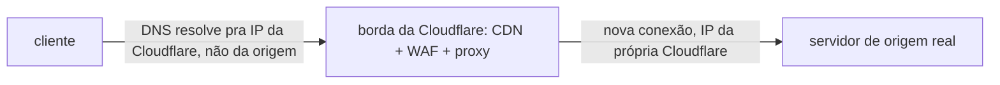
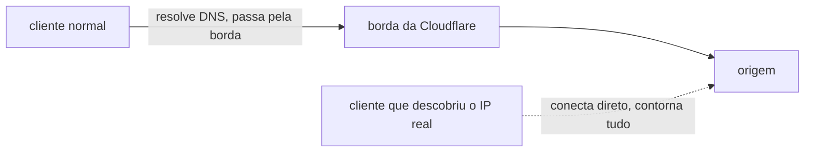
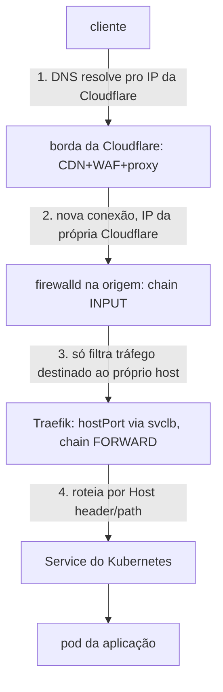

# Cloudflare

**TLDR**: Cloudflare fica na frente do domínio via DNS proxy (o "orange cloud"), funcionando como CDN, WAF e reverse proxy-as-a-service ao mesmo tempo. A proteção só vale enquanto o cliente é obrigado a passar por ela. Se o IP de origem for descoberto e aceitar conexão direta, o Cloudflare inteiro é contornável. Achado real confirmado neste cluster (ver [firewalld](firewalld.md#firewalld-nao-protege-trafego-roteado-pro-kubernetes-achado-real-em-2026-08-21)).

Cloudflare é um serviço de rede que fica entre o cliente e a origem (o servidor de verdade), cumprindo três papéis ao mesmo tempo quando o DNS de um domínio é "proxied" através dele (o ícone de nuvem laranja no painel, em oposição ao cinza, "DNS only"):

- **CDN** (Content Delivery Network): cacheia conteúdo estático nas bordas da rede da Cloudflare, fisicamente mais perto do cliente do que a origem, reduzindo latência.
- **WAF/proteção DDoS**: filtra tráfego malicioso antes dele sequer chegar na origem, absorvendo ataques volumétricos que a origem sozinha não aguentaria.
- **Reverse proxy-as-a-service**: termina a conexão TLS do cliente na borda da Cloudflare, depois abre uma conexão própria até a origem. O cliente nunca fala diretamente com o servidor real, só com a borda da Cloudflare.

## O modo SSL decide o que acontece na perna Cloudflare -> origem

A perna cliente -> Cloudflare é sempre criptografada quando "Always Use HTTPS"/certificado da borda está ativo, mas a perna Cloudflare -> origem depende do **modo SSL** configurado no painel:

- **Flexible**: Cloudflare -> origem em HTTP puro, mesmo que cliente -> Cloudflare seja HTTPS. A origem nem precisa ter certificado.
- **Full**: Cloudflare -> origem em HTTPS, mas aceita qualquer certificado da origem, mesmo autoassinado ou expirado.
- **Full (Strict)**: Cloudflare -> origem em HTTPS, exigindo certificado válido e confiável na origem (o mais parecido com "TLS de verdade ponta a ponta").

Isso importa pra decidir se a origem *precisa* de certificado próprio: em Flexible, não precisa (mas também não tem proteção nenhuma na segunda perna); em Full/Full Strict, precisa.

## O bypass: por que "estar atrás da Cloudflare" não é suficiente sozinho

A proteção da Cloudflare depende inteiramente do cliente ser **obrigado** a resolver o domínio pro IP da Cloudflare e passar pela borda dela. Nada no protocolo impede um cliente de descobrir o IP real da origem (por vazamento em registro DNS histórico, em cabeçalho de resposta, ou simplesmente testando o mesmo IP que serve outro serviço não-proxied do mesmo servidor) e conectar direto nele, com o `Host` header certo. A origem, se não tiver seu próprio controle de acesso, atende normalmente, sem passar pela Cloudflare, sem WAF, sem cache, sem rate limit.

**Achado real e confirmado neste cluster** (2026-08-21): `curl -H 'Host: argocd.ladesa.com.br' http://<IP-da-origem>/` retornou `HTTP 200` completo, em texto puro, sem passar pela Cloudflare nenhuma vez. A correção recomendada (documentada oficialmente pela própria Cloudflare) é **restringir o firewall da origem pra só aceitar conexão das [faixas de IP publicadas da Cloudflare](https://www.cloudflare.com/ips/)** (`https://www.cloudflare.com/ips-v4` e `-v6`), rejeitando qualquer outra fonte. Só assim a garantia "só passa pela Cloudflare" deixa de ser uma esperança e vira uma regra de fato aplicada. Neste cluster, essa restrição foi aplicada no `firewalld` (ver [Pendências](../operacao/pendencias.md#revisao-de-seguranca-portas-ingress-e-service-expostos)), mas **não fechou o problema completamente**: o tráfego que chega no Traefik via Kubernetes passa pela chain `FORWARD` do `iptables`, que o `firewalld` não controla neste cluster específico (achado técnico completo em [firewalld](firewalld.md#firewalld-nao-protege-trafego-roteado-pro-kubernetes-achado-real-em-2026-08-21)). A lição é que "restringir por IP de origem" só vale se a camada que aplica a restrição realmente vê e filtra o tráfego em questão, não basta a regra existir em algum lugar do sistema.

## O caminho completo de uma requisição neste cluster

Juntando [DNS](dns-e-dhcp.md), Cloudflare, [firewalld](firewalld.md) e o [reverse proxy](servidores-web.md) (Traefik, como [Ingress Controller](api-gateway.md)):

Cada uma das quatro camadas resolve um problema diferente (tradução de nome, absorção de ataque/cache, controle de acesso na borda do host, roteamento por hostname/path) e cada uma só protege o que realmente enxerga. A lição prática deste achado inteiro é que uma cadeia de proteção é tão forte quanto o elo que menos filtra, não a soma otimista de todos os elos.

## Pra ir além

A antítese de proxy-as-a-service é rodar o próprio reverse proxy/CDN (ver [Servidores web](servidores-web.md)) sem nenhum serviço terceiro na frente: mais controle, mas perde a absorção de ataque volumétrico que uma rede do tamanho da Cloudflare tem e um data center próprio não tem como replicar.

Outros provedores do mesmo tipo de serviço (CDN + WAF + DNS proxy): Fastly, Akamai, AWS CloudFront (mais focado em CDN, WAF é um produto separado). A escolha entre eles geralmente é rede de borda (quantos pontos de presença, quão perto do usuário final) e modelo de preço, não uma diferença conceitual de arquitetura.

Onde aprofundar: a [documentação oficial da Cloudflare sobre os modos de SSL/TLS](https://developers.cloudflare.com/ssl/origin-configuration/ssl-modes/) e sobre [restringir a origem só às faixas de IP da Cloudflare](https://developers.cloudflare.com/fundamentals/security/protect-your-origin-server/).
