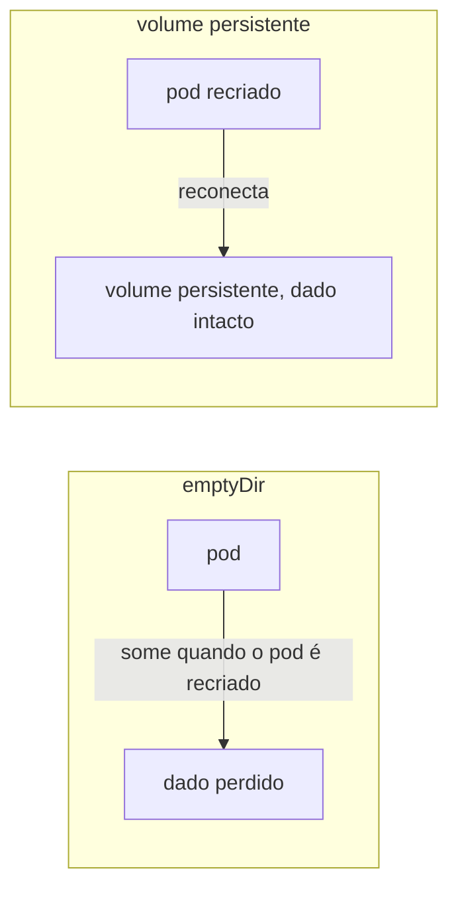
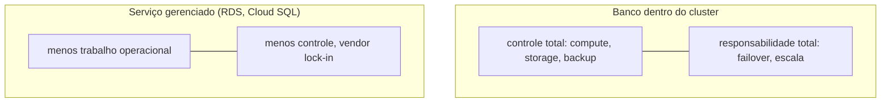

# Dados dentro do cluster

Bancos de dados e armazenamento de arquivo normalmente têm um requisito que a maioria das aplicações não tem: precisam manter estado, um pod recriado não pode simplesmente perder tudo que já tinha. Rodar isso dentro do próprio Kubernetes, com volume persistente em vez de `emptyDir`, é uma escolha específica, com trade-off real contra usar um serviço gerenciado (RDS, Cloud SQL, e equivalentes). MinIO, um object storage compatível com a API S3 da AWS, resolve o mesmo problema pra arquivo em vez de linha de banco: qualquer código escrito pra falar com S3 funciona contra o MinIO sem alteração, só trocando o endpoint.

## O trade-off real

Rodar banco dentro do cluster dá visibilidade completa sobre compute, storage, backup e escala, sem markup de provedor, e sem prender a infraestrutura a um provedor cloud específico. O custo é responsabilidade: você (não um provedor) é quem lida com failover, backup (ver [Backup e disaster recovery](backup-e-disaster-recovery.md)), e escala, e depende do disco físico da máquina onde roda, sem replicação nem failover automático a menos que algo mais seja adicionado por cima. A antítese, um serviço gerenciado (RDS da AWS, Cloud SQL do Google, e equivalentes de outros provedores), inverte isso, menos trabalho operacional, ao custo de menos controle e, geralmente, vendor lock-in mais forte.

## Pra ir além

Longhorn, OpenEBS e Rook são operators (ver [Operators](kubernetes-operators.md)) que dão replicação de storage entre nodes dentro do próprio Kubernetes, a peça que resolve o risco de disco único sem depender de storage de cloud. KubeBlocks e a categoria mais ampla de "database operators" (Percona Operator, CloudNativePG pra Postgres especificamente) automatizam ainda mais: backup, failover e upgrade de versão declarados como CRD, em vez de manifesto cru gerenciado manualmente.

Onde aprofundar: a documentação oficial do [MinIO](https://docs.min.io) detalha a compatibilidade com a API S3 em profundidade, útil pra saber exatamente o que funciona e o que não funciona comparado à AWS de verdade.
