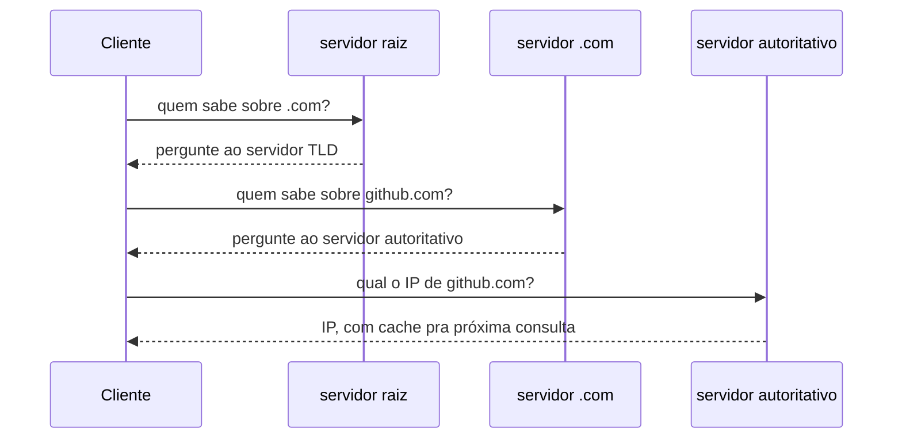
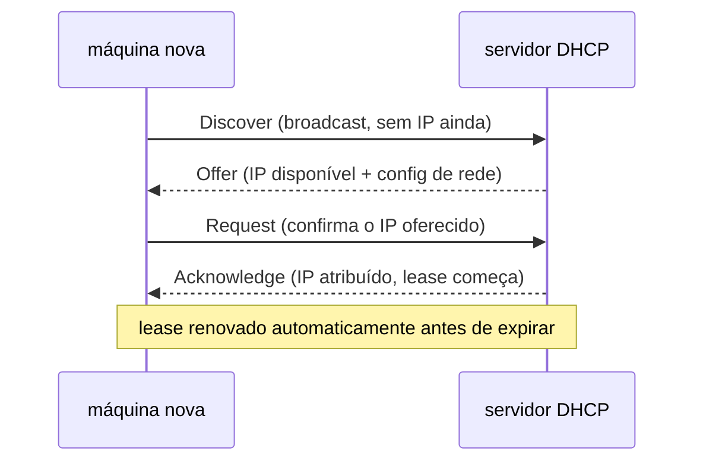
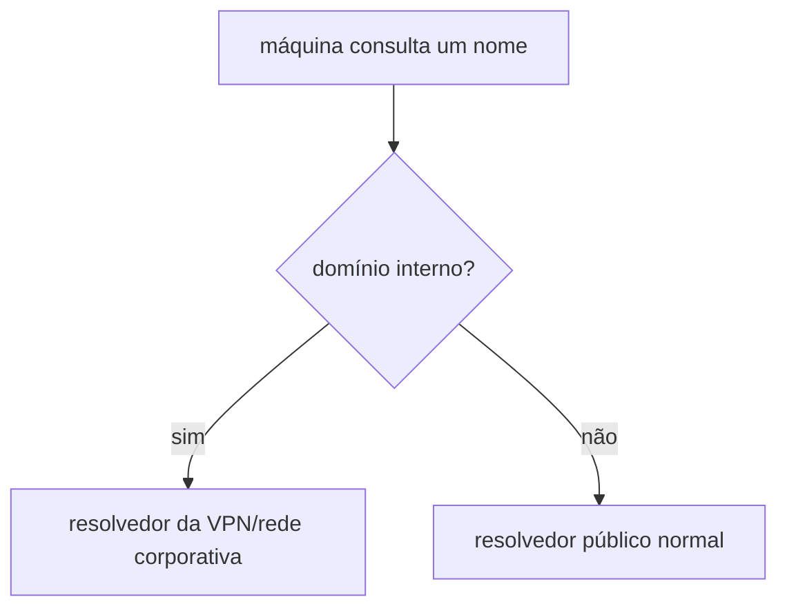

# DNS e DHCP

Dois protocolos que a maioria das pessoas nunca configura diretamente, mas que sustentam toda rede moderna funcionando nos bastidores.

DNS traduz nome pra número: `github.com` vira um IP de verdade, porque nenhum ser humano memoriza endereço numérico pra cada serviço que usa. Uma consulta DNS sobe uma cadeia de servidores (raiz, depois o servidor responsável pelo domínio de topo `.com`, depois o servidor autoritativo do domínio específico) até alguém responder com o IP certo, com cache em cada nível pra não repetir essa cadeia inteira a cada consulta. [CoreDNS](rede-interna-do-cluster.md), já citado, resolve exatamente esse mesmo problema, só que dentro do cluster, nome de serviço vira IP de pod, não o DNS público da internet.

DHCP resolve um problema anterior ao DNS: como uma máquina nova, chegando numa rede, descobre seu próprio IP, sem alguém configurar isso manualmente. O fluxo tem quatro passos, conhecido pela sigla DORA: a máquina manda um `Discover` em broadcast (ainda não tem IP, então não pode mandar unicast); um servidor DHCP responde com um `Offer`, um IP disponível junto com o resto da configuração de rede (máscara, gateway, servidor DNS); a máquina confirma com um `Request`; o servidor fecha o ciclo com um `Acknowledge`, e só a partir daí o IP está de fato atribuído, por um tempo limitado (o "lease"), renovado automaticamente antes de expirar.

Dentro de um cluster Kubernetes, o CNI (ver [Rede interna do cluster](rede-interna-do-cluster.md)) atribui IP a cada pod por um mecanismo próprio, não DHCP tradicional. DNS, por outro lado, aparece em pelo menos duas camadas ao mesmo tempo: o CoreDNS interno do cluster, e a resolução DNS pública normal, que precisa apontar pro IP certo antes de qualquer emissão automática de certificado via ACME conseguir validar domínio (ver [TLS automático](tls-automatico.md)).

## Split DNS

Split DNS (também chamado split-horizon DNS) é um desvio do modelo simples de "uma consulta, um resolvedor": a mesma máquina resolve domínios diferentes através de resolvedores diferentes, dependendo de qual rede ela está conectada no momento. Um domínio interno só resolve corretamente através do DNS de uma VPN ou rede corporativa (ver [SSH](ssh.md) sobre VPN ponto-a-site vs. malha), enquanto todo o resto do tráfego DNS segue pro resolvedor público normal, os dois convivendo na mesma máquina sem conflito. É também o nome usado quando o mesmo domínio público resolve pra IPs diferentes dependendo de estar sendo consultado de dentro ou de fora de uma rede específica, comum quando uma organização quer que o próprio tráfego interno não saia pra internet pra alcançar um serviço que também é público.

## Pra ir além

A antítese de DHCP é IP estático configurado manualmente: mais previsível (o endereço nunca muda sozinho), mas não escala pra rede com centenas de dispositivo entrando e saindo, o caso comum que motivou o DHCP existir. mDNS/Bonjour (usado por Chromecast, impressora de rede, e outros dispositivos "plug and play" domésticos) resolve descoberta de nome sem depender de servidor DNS central nenhum, útil numa rede local pequena, mas não pensado pra escalar além disso.

Onde aprofundar: [ldap.com](https://ldap.com) tem uma seção introdutória sobre protocolos de diretório e rede que, apesar do nome, cobre bem o contexto histórico de LDAP/DNS/DHCP juntos, útil pra ver como as peças se encaixam, não só cada uma isolada.
