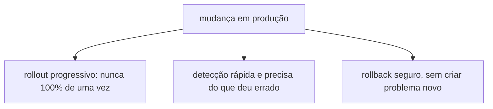
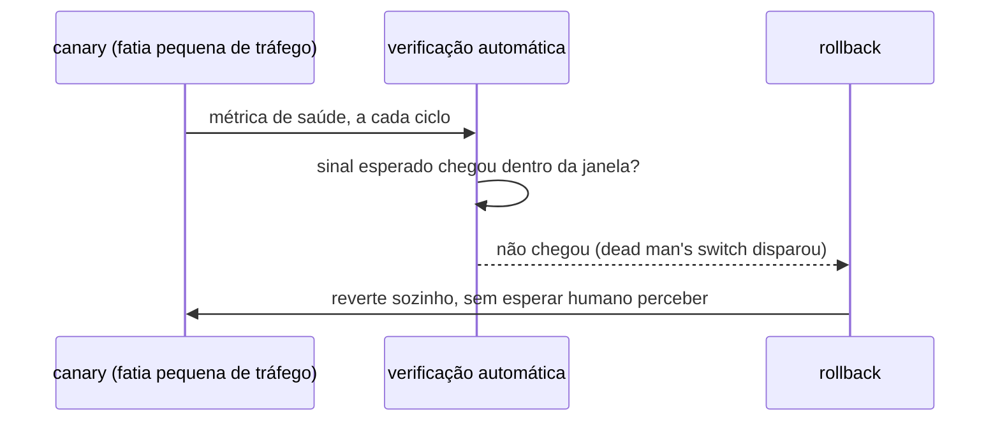
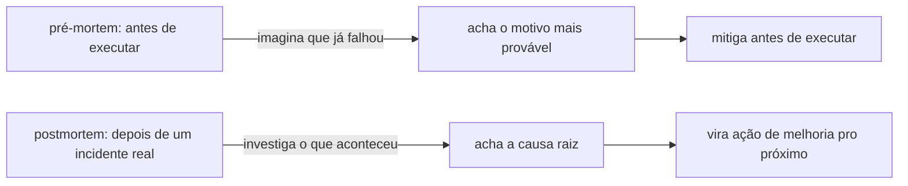
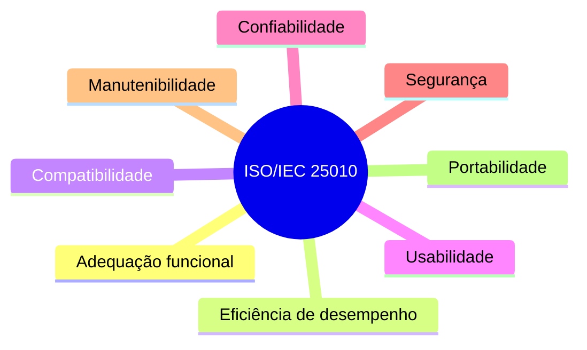

# Execução segura de mudança e qualidade de software

**TLDR**: a maior fonte de incidente em produção é mudança, não falha espontânea, por isso a indústria formalizou um conjunto de práticas pra executar mudança com segurança (rollout progressivo, rollback automático, checklist, análise de risco). Qualidade de software, por outro lado, tem uma norma própria, a ISO/IEC 25010, que define o que "qualidade" quer dizer em características mensuráveis.

| Termo | Vá pra |
|---|---|
| Por que mudança é a maior fonte de risco | [Mudança como maior fonte de risco](#mudanca-como-maior-fonte-de-risco) |
| Rollback automático sem depender de alguém perceber | [Dead man's switch e blast radius](#dead-mans-switch-e-blast-radius) |
| Checklist, FMEA, pré-mortem | [Checklist e análise de risco antes de executar](#checklist-e-analise-de-risco-antes-de-executar) |
| Reprocessar sem duplicar efeito | [Idempotência como propriedade de segurança](#idempotencia-como-propriedade-de-seguranca) |
| A norma que define o que é qualidade de software | [ISO/IEC 25010](#isoiec-25010-as-caracteristicas-de-qualidade-de-software) |

## Mudança como maior fonte de risco

*Site Reliability Engineering*, do Google (o "livro SRE", gratuito em [sre.google/books](https://sre.google/books), já citado em [Referências](referencias.md)), é a fonte mais citada da indústria sobre esse assunto: a maioria dos incidentes de produção documentados ali vem de mudança introduzida por humano ou por automação, não de hardware falhando sozinho. A consequência prática, no capítulo "Managing Incidents" e no de "Change Management", é que toda mudança arriscada deveria seguir três princípios ao mesmo tempo: rollout progressivo (nunca aplicar em 100% de uma vez), detecção rápida e precisa (saber que algo deu errado antes que o impacto cresça), e rollback seguro (voltar ao estado anterior sem criar um problema novo no processo).

## Dead man's switch e blast radius

**Blast radius** é o tamanho do dano se uma mudança específica der errado, o critério que decide o quão progressivo o rollout precisa ser: uma mudança de blast radius pequeno (um flag que afeta 1% dos usuários) tolera rollout mais rápido que uma que afeta todo o tráfego de uma vez. **Canary** é a técnica mais citada pra reduzir blast radius sem atrasar a entrega inteira: aplica a mudança numa fatia pequena do tráfego real primeiro, compara métrica contra o resto, só expande se o comportamento bater com o esperado.

**Dead man's switch**, um termo emprestado de sistema de segurança física (o freio de um trem que só continua liberado enquanto o maquinista mantém um pedal pressionado, solta sozinho se ele desmaiar), aplicado a operação de software é um mecanismo que assume que algo deu errado quando um sinal esperado *para* de chegar, em vez de esperar alguém perceber ativamente. Um rollback automático disparado porque a taxa de erro do canary não voltou a subir dentro da janela esperada é um dead man's switch: ninguém precisa estar olhando o gráfico no momento exato em que o problema começa.

### Um dead man's switch pode falhar silenciosamente se outra coisa mexeu no mesmo recurso, achado real em 2026-08-21

Durante o cutover do RabbitMQ (ver [Foundation](../arquitetura/foundation.md)), foi armado um `systemd-run --on-active=10min` que reaplicaria o `Service` original (`kubectl apply -f <backup>`) caso o cutover não fosse confirmado a tempo. Quando o timer disparou (porque o cutover real levou mais tempo que o esperado, não porque algo deu errado), o `kubectl apply` **falhou**: `Operation cannot be fulfilled on services "rabbitmq-amqp": the object has been modified; please apply your changes to the latest version and try again`.

A causa: entre armar o switch e ele disparar, o `Service` foi editado ao vivo com `kubectl patch --type=json` (não `kubectl apply`). `kubectl patch` não atualiza a annotation `kubectl.kubernetes.io/last-applied-configuration` que `kubectl apply` usa pra calcular o 3-way merge; a próxima chamada de `apply` viu um estado que não batia com o que ela esperava encontrar e recusou aplicar, em vez de sobrescrever silenciosamente.

**A falha acabou sendo inofensiva** (o cutover real já tinha sido confirmado antes do timer disparar, então o revert nem deveria acontecer mesmo), mas expõe uma suposição que não é garantida: **um dead man's switch baseado em `kubectl apply -f <backup>` só reverte de verdade se nada mais tocou o mesmo recurso via um método diferente de `apply` entre a hora de armar e a hora de disparar**. Misturar `kubectl patch`/`kubectl edit` com o `kubectl apply` que o switch vai rodar depois é o cenário que quebra essa garantia. Pra um dead man's switch confiável quando o próprio operador vai continuar mexendo no recurso durante a janela armada: usar `kubectl replace --force` (não depende de `last-applied-configuration`) no comando do timer, ou reduzir a janela pro mínimo necessário e não tocar o recurso por nenhum outro caminho enquanto ela está aberta.

## Checklist e análise de risco antes de executar

*The Checklist Manifesto*, de Atul Gawande, é a referência mais citada fora do software (aviação, cirurgia) sobre por que checklist reduz erro mesmo em quem já é especialista: o ponto do livro não é que profissional experiente esquece o básico, é que sistema complexo tem passo demais pra confiar só em memória, mesmo de quem já fez aquilo cem vezes. Boa parte do vocabulário de runbook e playbook operacional (documentação executável de um procedimento arriscado, passo a passo) vem dessa mesma ideia aplicada a operação de infraestrutura.

**FMEA** (Failure Mode and Effects Analysis) é a metodologia de análise de risco mais formal antes de uma mudança grande: lista todo jeito que a mudança pode falhar (failure mode), e pra cada um atribui nota de severidade (quão grave), ocorrência (quão provável) e detectabilidade (quão fácil perceber antes que vire incidente), multiplicando as três num número que prioriza onde investir mitigação primeiro.

**Pré-mortem** (o termo é do psicólogo Gary Klein) é o inverso de um postmortem: em vez de investigar por que uma mudança já falhou, o time simula que ela já falhou, antes de executar, e trabalha de trás pra frente até achar o motivo mais provável. É mais barato que FMEA formal e pega parte do mesmo risco, à custa de ser menos sistemático (depende de quem participa lembrar do modo de falha certo, FMEA força passar por uma lista).

## Idempotência como propriedade de segurança

Idempotência (reprocessar a mesma operação produz o mesmo resultado que processar uma vez só) não é só conveniência de automação, é uma propriedade de segurança de execução: um passo idempotente pode ser repetido depois de uma falha no meio do caminho (rede caiu, processo morreu) sem medo de duplicar efeito colateral. O [Ansible](ansible.md) inteiro é construído em cima dessa garantia, e a seção [Roles do Ansible](../arquitetura/index.md) deste repositório mostra a aplicação concreta. Aqui fica só o princípio geral, que se aplica igual a script de deploy, migração de banco, ou chamada de API (a diferença entre método HTTP seguro/idempotente e não idempotente, do próprio protocolo HTTP, é o mesmo princípio generalizado pra rede).

## ISO/IEC 25010: as características de qualidade de software

[Compliance e frameworks](compliance-e-frameworks.md) já cobre ISO 27001 e ISO 27701, mas os dois são sobre gestão de segurança da informação, não sobre o que "qualidade de software" significa em si. Quem define isso é a **ISO/IEC 25010** (parte do modelo SQuaRE, Software Quality Requirements and Evaluation), com oito características:

- **Adequação funcional**: o software faz o que deveria fazer, completo e correto.
- **Eficiência de desempenho**: usa tempo e recurso (CPU, memória, rede) de forma proporcional ao que faz.
- **Compatibilidade**: convive com outro software no mesmo ambiente sem conflito, e troca dado com ele quando precisa.
- **Usabilidade**: quem usa consegue operar, aprender e entender sem esforço desproporcional.
- **Confiabilidade**: mantém o nível de desempenho esperado sob condição normal e sob falha, o mesmo sentido de confiabilidade coberto em [Observabilidade](observabilidade.md), [Chaos engineering](chaos-engineering.md) e [Backup e disaster recovery](backup-e-disaster-recovery.md).
- **Segurança**: protege informação e dado contra acesso ou modificação não autorizados.
- **Manutenibilidade**: pode ser modificado com esforço proporcional à mudança, sem degradar o resto.
- **Portabilidade**: pode ser transferido de um ambiente pra outro sem reescrever do zero.

Diferente de SOC 2/ISO 27001 (ver [Compliance e frameworks](compliance-e-frameworks.md)), não existe um "certificado ISO 25010" comum de mercado: a norma serve mais como vocabulário compartilhado e checklist de requisito não funcional (o time de qualidade referencia "isto é um problema de manutenibilidade" ou "isto é um problema de compatibilidade" com um significado preciso e comum), do que como algo auditado por terceiro. Duas normas vizinhas completam o mesmo grupo: **ISO/IEC 12207** (ciclo de vida de processo de software, do requisito ao descomissionamento) e **ISO/IEC 29119** (processo formal de teste de software), ambas menos citadas no dia a dia do que a 25010.

## Pra ir além

O capítulo "Change Management" do livro SRE e o de "Effective Troubleshooting" cobrem em muito mais detalhe o raciocínio por trás de rollout progressivo e detecção de erro. *Continuous Delivery*, de Jez Humble e David Farley, é a referência mais citada especificamente sobre blue-green deployment e feature flag como técnica de reduzir blast radius sem atrasar entrega, complementar ao livro SRE.
