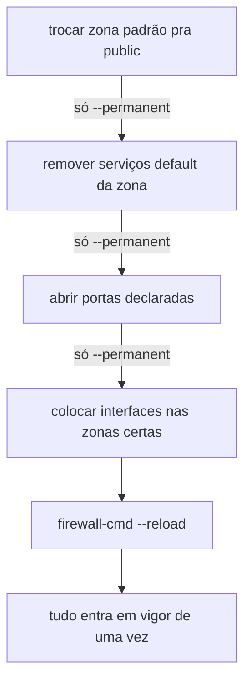

# firewalld

firewalld é o gerenciador de firewall padrão em distribuições como Debian/RHEL, uma camada sobre `nftables`/`iptables` organizada em **zonas**: cada zona tem seu próprio conjunto de serviços e portas liberadas, e cada interface de rede (ou faixa de IP de origem) pertence a uma zona. Tráfego de uma interface na zona `public` segue as regras da `public`; tráfego de uma interface na zona `trusted` segue regras mais permissivas.

## Permanente vs. runtime

Toda mudança em firewalld pode ser aplicada de dois jeitos: **runtime** (efeito imediato, mas some no próximo reload ou reboot) ou **`--permanent`** (só entra em vigor no próximo `firewall-cmd --reload`, mas sobrevive a reboot). Um padrão comum, quando várias mudanças precisam acontecer juntas (abrir porta, trocar zona, remover serviço padrão), é aplicar tudo só com `--permanent` e reservar um único `--reload` pro fim, fazendo tudo entrar em vigor **atomicamente**, em vez de uma mudança de cada vez, cada uma abrindo uma janela onde o sistema fica num estado intermediário e potencialmente inseguro.

## Por que isso importa pra não travar o próprio SSH

Enquanto nenhum `--reload` rodou, a configuração **ao vivo** continua sendo a de antes da mudança começar. Isso é o que sustenta a técnica acima: mesmo removendo (só via `--permanent`) o serviço `ssh` que a zona `public` já vem com liberado por padrão de fábrica, a sessão atual continua protegida por esse mesmo default até o único reload no fim, momento em que a porta explícita já declarada entra em vigor junto. É esse desencontro deliberado entre "declarado" e "ao vivo" que permite reorganizar a política inteira sem nunca existir um instante em que a porta de administração fique descoberta.

## Pra ir além

firewalld é uma camada de abstração sobre [`nftables`](https://en.wikipedia.org/wiki/Nftables) (ou [`iptables`](https://en.wikipedia.org/wiki/Iptables), em sistemas mais antigos), organizada em zonas nomeadas. `ufw`, comum em distros baseadas em Ubuntu, resolve o mesmo problema com uma sintaxe mais simples e menos conceito de zona. Mexer direto em `nftables`/`iptables`, sem nenhuma abstração, dá mais controle mas exige gerenciar a ordem das regras manualmente, algo que essas ferramentas escondem.

O princípio "negar por padrão, liberar só o declarado" não é exclusivo de firewall de sistema operacional: provedores cloud aplicam a mesma ideia em outra camada, security groups (AWS) ou firewall rules (GCP), que filtram tráfego antes mesmo de chegar na VM. Dentro de um cluster Kubernetes, [service mesh](https://en.wikipedia.org/wiki/Service_mesh) com mTLS (Istio, Linkerd, ver [Service mesh](service-mesh.md)) estende esse princípio pra comunicação entre pods, criptografando e autenticando tráfego interno.

A antítese completa de "negar por padrão" é allow-all, todo tráfego passa a menos que uma regra explícita bloqueie, o comportamento de fábrica de muita distro Linux antes de qualquer firewall ser configurado. Mais simples de não travar nada por engano, mas expõe qualquer serviço que suba numa porta nova por padrão, sem ninguém precisar declarar essa exposição de propósito.

Onde aprofundar: a documentação oficial em [firewalld.org](https://firewalld.org) cobre a ferramenta em si; pra entender o que está por baixo dela, a página man `nft(8)` (`man nft`, já instalada em qualquer sistema com `nftables`) é a referência mais direta pra sintaxe de regras sem passar por abstração nenhuma.
