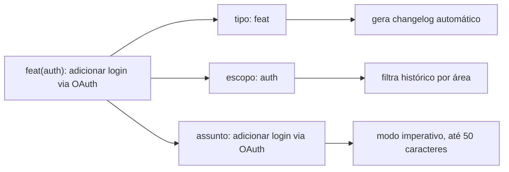
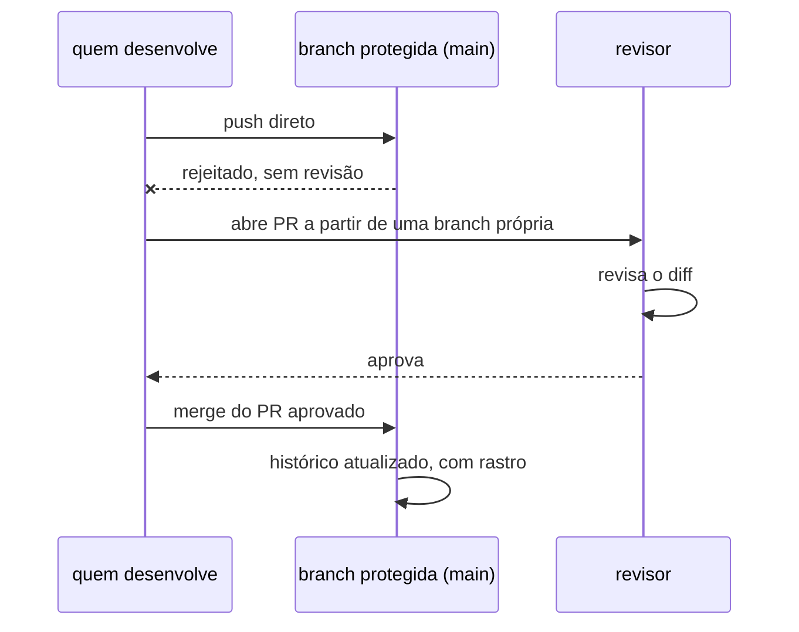
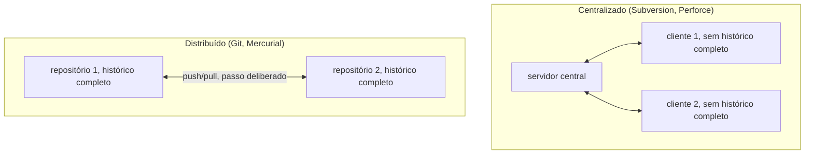
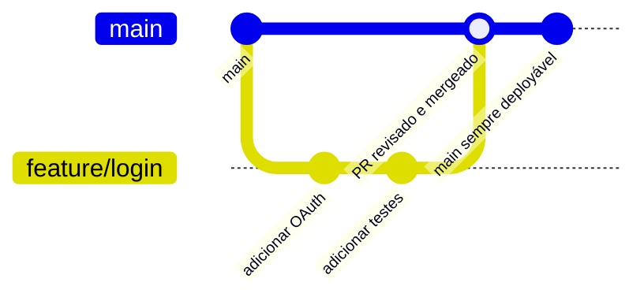
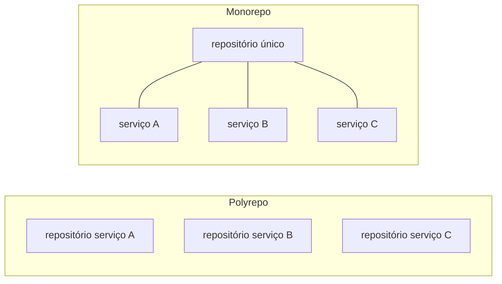

# Git

**TLDR**: controle de versão distribuído; toda mudança vira commit rastreável; Conventional Commits padroniza a mensagem, proteção de branch impede push sem revisão.

| Termo | Vá pra |
|---|---|
| Padronizar mensagem de commit | [Conventional Commits](#conventional-commits) |
| Impedir push sem revisão | [Proteção de branch](#protecao-de-branch) |
| Centralizado vs. distribuído, branching, mono/polyrepo | [Pra ir além](#pra-ir-alem) |

Git é o que torna um repositório uma fonte da verdade de verdade: toda mudança passa por um commit, com autor, data e mensagem, antes de existir. Um servidor administrado por Git puro não tem edição direta que não deixe rastro em algum lugar, diferente de editar um arquivo de configuração direto na máquina.

## Conventional Commits

Um padrão comum é seguir `tipo(escopo): assunto`, com tipos como `feat` (mudança nova), `fix` (correção de bug) e `docs` (só documentação), assunto curto (frequentemente até 50 caracteres), modo imperativo ("adicionar", não "adicionado"). Isso existe pra manter o `git log` legível como uma lista de decisões, não uma narração passo a passo do processo de chegar lá. A especificação formal está em [conventionalcommits.org](https://www.conventionalcommits.org).

## Proteção de branch

GitHub (e a maioria das plataformas de hosting Git) permite exigir revisão antes de qualquer push chegar numa branch protegida, tipicamente `main`. Sem isso configurado, não existe trava técnica nenhuma impedindo um push direto sem revisão, e a disciplina de commits pequenos e mensagens claras passa a ser a única coisa sustentando a qualidade do histórico.

## Pra ir além

Git é uma implementação específica de um controle de versão distribuído, uma categoria mais ampla que também inclui Mercurial (a alternativa mais próxima, perdeu adoção pra Git ao longo dos últimos quinze anos; o próprio Firefox usou Mercurial como fonte da verdade por quase duas décadas, até migrar de vez pro Git em 2025) e antecessores centralizados como Subversion e Perforce, onde só existe um repositório central e ninguém tem histórico completo localmente. A diferença não é só técnica: um controle centralizado exige rede pra praticamente qualquer operação (inclusive ver um log antigo), enquanto num distribuído como o Git quase tudo é local, e sincronizar com um remoto é um passo separado, deliberado. Perforce ainda domina em estúdios de jogos e outros times que versionam arquivo binário grande (textura, asset de áudio), onde o modelo distribuído do Git degrada mal.

Dentro do próprio Git, existem várias abordagens de branching, cada uma compensando um custo diferente: trunk-based development (só uma branch de longa duração, geralmente com feature flags pra código incompleto que ainda não deve ir pra produção), Git Flow (branches dedicadas pra release/hotfix/develop, mais burocrático, mais comum em software com ciclos de release formais e versionamento semântico rígido), e GitHub Flow (branch por feature, PR, merge, o que a maioria dos times de produto usa hoje no dia a dia).

Dois conceitos que aparecem em repositórios maiores ou mais maduros: [monorepo](https://en.wikipedia.org/wiki/Monorepo) vs. polyrepo (um repositório por serviço, mais comum em organizações com times independentes; monorepo é a antítese, tudo num repositório só, prática de empresas como Google e Meta pra manter dependência interna sempre em sincronia, ao custo de tooling de build muito mais elaborado) e assinatura de commit ([GPG](https://en.wikipedia.org/wiki/GNU_Privacy_Guard) ou SSH signing, pra provar quem de fato autorou cada commit).

## Cheatsheet

| Comando | O que faz |
|---|---|
| `git commit -m "feat(escopo): assunto"` | Commit no padrão Conventional Commits |
| `git log --oneline` | Histórico compacto, uma linha por commit |
| `git checkout -b feature/x` | Cria e muda pra uma branch nova |
| `git push -u origin feature/x` | Publica a branch e associa o remoto |
| `git commit -S` | Assina o commit com GPG |
| `git commit --gpg-sign=ssh` (ou `-S` com chave SSH configurada) | Assina o commit com SSH signing |

Onde aprofundar: a documentação oficial em [git-scm.com/doc](https://git-scm.com/doc) inclui o livro *Pro Git* na íntegra, de graça, e é o material de referência mais citado pra Git especificamente.
