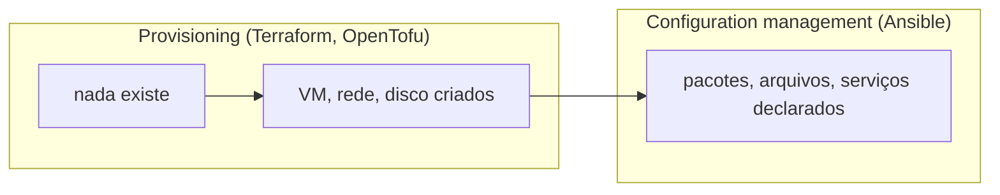
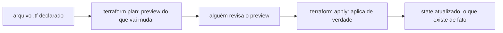

# Infrastructure as Code e provisionamento

Infrastructure as Code (IaC) é o termo guarda-chuva pra descrever infraestrutura em arquivo versionado em vez de clique em console ou comando digitado na hora. Dentro desse guarda-chuva existem duas camadas diferentes, frequentemente confundidas: configuration management (o que já roda numa máquina que já existe, coberto em [Ansible](ansible.md)) e provisioning (fazer a máquina, a rede, o disco existirem primeiro, numa cloud ou num datacenter). Nem todo projeto usa provisioning: quando a máquina já existia antes da automação chegar, a configuração pode começar direto a partir dela, sem essa camada.

## As ferramentas mais citadas

A lista [awesome-iac](https://github.com/brandonhimpfen/awesome-iac) organiza bem essa camada. Terraform, da HashiCorp, é o nome mais associado ao termo IaC hoje, com uma linguagem declarativa própria (HCL) e um modelo de `plan`/`apply`: primeiro mostra o que vai mudar, só depois aplica, o mesmo princípio de preview-antes-de-aplicar já discutido em [Ansible](ansible.md).

OpenTofu é o fork open source do Terraform, criado depois que a HashiCorp mudou a licença do projeto original pra uma licença mais restritiva em 2023; hoje é mantido pela Linux Foundation. Pulumi resolve o mesmo problema mas com linguagem de programação de verdade (Python, TypeScript, Go) em vez de uma linguagem declarativa dedicada, o que dá acesso a loop, função e teste unitário de verdade, ao custo de mais poder pra errar (nada impede um loop infinito criando recursos). CloudFormation (AWS) e outras ferramentas nativas de provedor resolvem o mesmo problema só dentro daquele provedor específico.

A mesma lista também documenta duas categorias vizinhas: **policy as code** (ver [Policy as Code](policy-as-code.md)) pra impedir infraestrutura declarada errada antes dela ser aplicada, e **testing tools** como Terratest e Checkov, que testam módulo de infraestrutura como se testa código de aplicação.

## Pra ir além

Crossplane é a antítese mais interessante dentro da própria categoria: em vez de uma ferramenta externa (Terraform) provisionar recursos cloud e depois sumir, o Crossplane roda dentro de um cluster Kubernetes e representa cada recurso cloud (um bucket, um banco gerenciado) como um CRD, sincronizado continuamente do mesmo jeito que o Argo CD sincroniza qualquer outro manifesto (ver [Argo CD](argocd.md)). É GitOps aplicado até na camada de provisionamento, não só na de aplicação.

Onde aprofundar: a [introdução oficial do Terraform](https://developer.hashicorp.com/terraform/intro) explica o modelo de `state` (o arquivo que registra o que o Terraform pensa que existe), a peça mais frequentemente mal-entendida por quem está começando.
