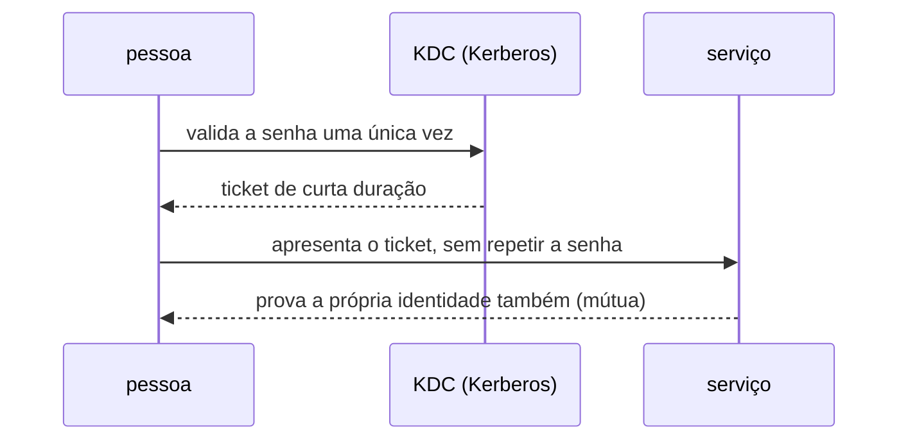

# Identidade e diretório

**TLDR**: Kerberos prova identidade sem mandar senha pela rede; LDAP guarda o diretório de quem existe e o que cada um acessa; FreeIPA e Kanidm empacotam os dois prontos; OAuth2/OIDC resolve um problema parecido, mas pra aplicação web, não máquina numa rede local.

Um diretório é um banco de dado central de quem existe numa organização, pessoa e máquina, e o que cada um pode acessar. Antes de qualquer sistema moderno de single sign-on existir, esse problema já tinha solução consolidada no mundo corporativo, e boa parte do vocabulário de autenticação usado até hoje vem de lá.

Kerberos, criado no MIT nos anos 80, resolveu um problema específico: provar identidade numa rede insegura sem nunca mandar a senha pela rede. Um servidor central e confiável, o KDC, emite um ticket de curta duração depois de validar a senha uma única vez; esse ticket é apresentado a cada serviço que a pessoa quiser acessar depois, sem repetir a senha, e com autenticação mútua, o serviço também prova sua própria identidade pra quem está acessando, não só o contrário. Essa ideia de ticket de curta duração em vez de credencial permanente reaparece, décadas depois, na motivação por trás de certificado SSH de curta duração via Vault (ver [SSH](ssh.md)).



Kerberos sozinho só prova identidade, não guarda o diretório de quem existe nem o que cada um pode acessar; isso é papel do LDAP, o protocolo que padroniza como consultar e modificar um diretório desse tipo pela rede. LDAP é mais antigo que a web como a conhecemos hoje, uma versão simplificada (por isso "lightweight" no nome) de um padrão ainda mais pesado, o X.500 dos anos 80, pensada pra rodar direto sobre TCP/IP. Um registro LDAP é uma entrada com atributo (nome, e-mail, grupo, o que for), organizada em árvore, e é essa árvore que praticamente todo sistema de login corporativo consulta por baixo, mesmo quando quem usa nunca vê "LDAP" na tela.

FreeIPA empacota Kerberos junto com um diretório LDAP, um servidor DNS e uma autoridade certificadora própria, tudo integrado, pra ser a solução completa de identidade num ambiente Linux, o equivalente funcional ao Active Directory do mundo Windows (que também é, por baixo, Kerberos mais LDAP, só que da Microsoft). É poderoso e maduro, mas tem reputação consolidada de ser pesado de administrar, muitas peças móveis pra manter no ar. Kanidm é a resposta mais recente a esse problema, escrita em Rust: entrega praticamente a mesma cobertura de funcionalidade (LDAP, SSH, integração Unix) mas já nasce com OAuth2/OIDC e WebAuthn (passkey) nativos, sem precisar somar um Keycloak por cima como o FreeIPA tradicionalmente precisaria, com desempenho medido várias vezes maior em benchmark de busca e escrita.

```mermaid
flowchart TB
    subgraph FreeIPA["FreeIPA"]
        F1[Kerberos] --- F2[LDAP] --- F3[DNS] --- F4[autoridade certificadora]
        F5[OAuth2/OIDC] -.->|precisa somar Keycloak| FreeIPA
    end
    subgraph Kanidm["Kanidm"]
        K1[Kerberos-like] --- K2[LDAP] --- K3[SSH/Unix]
        K4[OAuth2/OIDC + WebAuthn] -.->|nativo| Kanidm
    end
```

Uma alternativa comum em operação pequena é nunca centralizar: autenticação de máquina resolvida caso a caso, uma deploy key SSH por repositório (ver [SSH](ssh.md)), uma machine identity própria por cofre de segredo (ver [Infisical](infisical.md)), um ServiceAccount nativo do Kubernetes por Operator. Funciona sem nenhum diretório único, mas cada peça carrega seu próprio mecanismo de identidade, isolado das demais, o candidato mais comum a virar gargalo assim que o número de pessoas e serviços exigindo controle de acesso cresce.

A antítese completa de diretório centralizado é justamente essa identidade fragmentada, uma por sistema. OAuth2/OIDC, o padrão que domina autenticação web moderna (login social, single sign-on entre aplicação SaaS), resolve um problema parecido mas não idêntico ao de Kerberos, delegação de autorização entre aplicação web, não autenticação de máquina numa rede local, e frequentemente aparece embutido em cima de um diretório mais tradicional (como o próprio Kanidm já traz nativo), não como substituto dele.

## Cheatsheet

| Termo | Definição curta |
|---|---|
| KDC | Servidor central que emite ticket Kerberos |
| LDAP | Protocolo pra consultar/modificar um diretório |
| FreeIPA | Kerberos + LDAP + DNS + CA, integrado |
| Kanidm | Como o FreeIPA, mas com OAuth2/OIDC/WebAuthn nativo |
| Active Directory | Kerberos + LDAP da Microsoft |
| OAuth2/OIDC | Delegação de autorização entre aplicação web |

Onde aprofundar: a comparação oficial em [kanidm.com/comparisons](https://kanidm.com/comparisons) contrasta Kanidm contra FreeIPA, Active Directory e outras alternativas lado a lado, mais direto que qualquer resumo de terceiro.
