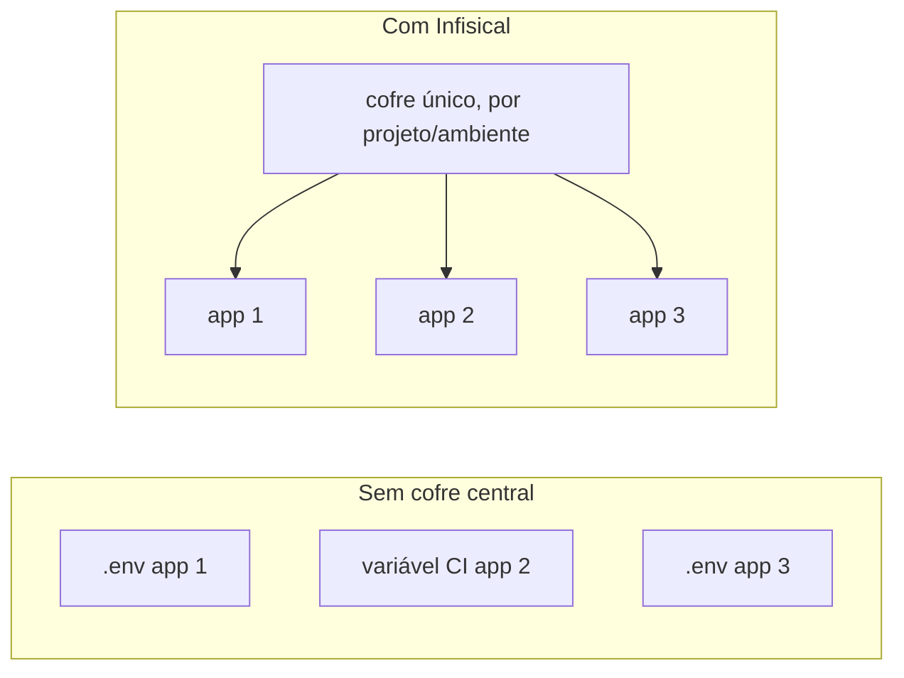
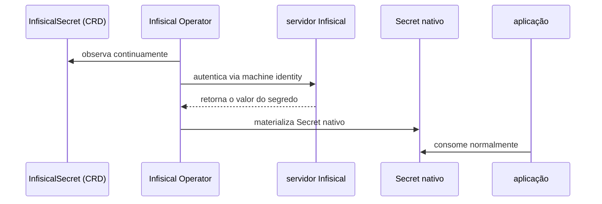
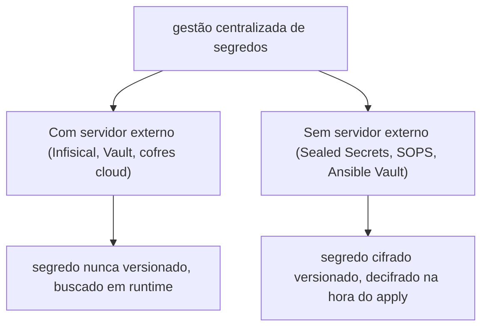

# Infisical

Infisical é uma plataforma de gestão de segredos: em vez de cada aplicação guardar senha de banco, token de API e chave de terceiro espalhados em arquivo `.env` ou variável de CI, tudo fica centralizado num cofre só, organizado por projeto e ambiente, com controle de acesso e histórico de quem mudou o quê. É open source (licença MIT), com um plano hospedado e a opção de rodar self-hosted.

## Como funciona dentro de um cluster Kubernetes

Um servidor Infisical roda dentro do próprio cluster, e o Infisical Kubernetes Operator (ver [Operators](kubernetes-operators.md)) é quem faz a ponte: ele lê um recurso `InfisicalSecret`, busca o valor correspondente no Infisical, e materializa isso como um `Secret` nativo do Kubernetes, que o resto da aplicação consome normalmente. Ninguém precisa colar segredo em YAML nem em variável de ambiente de pipeline. A autenticação entre o Operator e o Infisical usa uma machine identity (credencial não-humana, própria pra automação) via universal auth, não uma senha de usuário.

## Pra ir além

Infisical é uma implementação de uma categoria mais ampla, gestão centralizada de segredos, que também inclui HashiCorp Vault (o mais estabelecido e o mais flexível, mas com curva de aprendizado maior, e o caminho mais citado pra certificado SSH de curta duração, ver [SSH](ssh.md)), e os cofres nativos de cada provedor cloud, AWS Secrets Manager, Google Secret Manager, Azure Key Vault, que resolvem o mesmo problema mas prendem você àquele provedor específico. Doppler é outro concorrente direto do Infisical, hospedado, sem opção self-hosted robusta.

Uma categoria adjacente, específica de quem já usa GitOps, resolve o mesmo problema sem servidor externo nenhum: Sealed Secrets e SOPS cifram o segredo direto no manifesto Kubernetes versionado no Git, decifrado por um controller no cluster na hora do apply (ver [Argo CD](argocd.md)). Ansible Vault é parente dessa mesma família, cifra o arquivo, não terceiriza pra um servidor.

A antítese é não ter gestão de segredos nenhuma: cada aplicação lê variável de ambiente direta, definida manualmente em cada lugar que precisa dela (CI, servidor, laptop de quem desenvolve). Funciona pra projeto pequeno, mas escala mal: não tem rotação centralizada, não tem trilha de auditoria de quem acessou o quê, e revogar um segredo vazado significa caçar manualmente todo lugar que ele foi colado.

Onde aprofundar: a documentação oficial em [infisical.com/docs](https://infisical.com/docs) cobre desde o modelo de projeto/ambiente até a API de machine identity usada pelo Operator.
