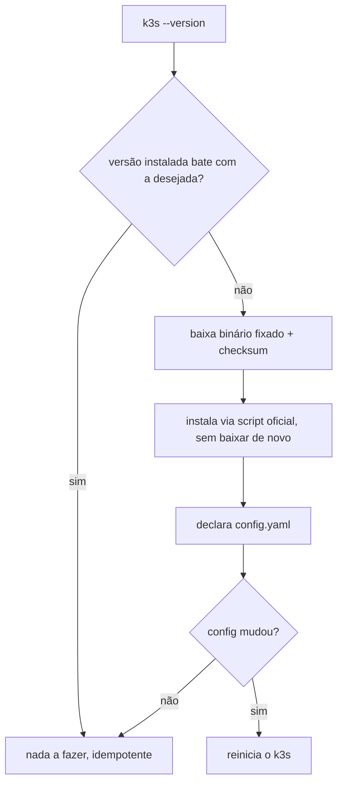

# k3s

k3s é uma distribuição do Kubernetes empacotada como um único binário, feita pela Rancher pra rodar em ambientes menores (edge, IoT, ou, como aqui, um node único de produção sem necessidade do peso operacional de um cluster Kubernetes "completo" multi-componente). Ele empacota o control plane inteiro (API server, scheduler, controller manager, etcd substituído por SQLite por padrão) e o runtime de containers num processo só, com bem menos overhead de memória que um Kubernetes tradicional montado componente por componente.

Pra quem já conhece Kubernetes: a API é a mesma, `kubectl` funciona igual, Deployments/Services/Secrets se comportam igual. As diferenças ficam na instalação (um script, não `kubeadm`), no armazenamento de estado (SQLite embutido em vez de etcd externo, adequado pra um node só) e no Ingress Controller que já vem incluído por padrão (Traefik).

## Um node só, ou vários

Um único node não tem alta disponibilidade de control plane nem failover automático se o node cair, mas é uma opção legítima pra ambiente pequeno, não uma limitação técnica do k3s: ele suporta múltiplos nodes e um control plane em HA, se e quando isso for necessário.

## Como instalar de forma reprodutível

Instalar o k3s de forma versionada normalmente significa fixar o binário por versão e checksum (nunca `curl | sh` sem verificação), e declarar a configuração do servidor em `/etc/rancher/k3s/config.yaml`, o mecanismo nativo do k3s pra isso, em vez de flags soltas no comando de start. Toda mudança nesse arquivo reinicia o serviço.

## O `kubeconfig`

`/etc/rancher/k3s/k3s.yaml` é o arquivo de credenciais que autoriza `kubectl`/`helm`/`argocd` a falar com a API do cluster. Ele nunca sai do node (não é copiado pra sua máquina nem versionado): quem administra usa `export KUBECONFIG=/etc/rancher/k3s/k3s.yaml` dentro de uma sessão SSH já no node, não localmente. Isso evita que uma credencial de admin do cluster inteiro trafegue ou fique guardada fora do lugar onde ela já precisa estar de qualquer jeito.

## Pra ir além

k3s é uma entre várias formas de rodar [Kubernetes](https://en.wikipedia.org/wiki/Kubernetes). Outras distros leves e focadas em simplicidade: k0s, MicroK8s. `kind` e `minikube` cumprem um papel diferente, rodar Kubernetes só localmente, pra desenvolvimento, não pra produção. No outro extremo, Kubernetes "completo" via `kubeadm` dá mais controle mas exige montar e manter cada componente (etcd, API server, scheduler) separadamente; ferramentas como Kubespray (Ansible por baixo) e Kops automatizam esse "completo" pra bare-metal e cloud respectivamente, um nível de automação a mais que o `kubeadm` cru mas ainda bem mais operação do que o instalador único do k3s. Serviços gerenciados como EKS (AWS), GKE (Google Cloud) e AKS (Azure) tiram a operação do control plane de você completamente, ao custo de rodar num provedor específico.

Pro dia a dia de quem opera um cluster, seja qual for a distro, a lista [awesome-go, categoria devops-tools](https://awesome-go.com/devops-tools/) cataloga boa parte do ferramental de linha de comando escrito em Go que preenche as lacunas do `kubectl` puro: k9s (navega o cluster inteiro, interativo, sem digitar `kubectl get` repetidamente), kubefwd (port-forward em lote, útil pra debugar vários serviços de uma vez), e o próprio `kind`/`k3d`, que empacotam um cluster de desenvolvimento dentro de um único container Docker.

Alta disponibilidade multi-node (múltiplos control planes, etcd externo replicado) é algo que o k3s suporta nativamente, a peça que normalmente entra primeiro quando um cluster de node único precisa crescer.

Subindo um nível: Kubernetes em si é uma resposta específica ao problema de orquestração de container, não a única. HashiCorp Nomad é a antítese mais direta, descrito por quem o usa como "Kubernetes sem a complexidade": sem etcd separado, sem admissão de webhook, um binário só pros servers e um só pros clients, e não se limita a container, também agenda binário puro e processo JVM no mesmo cluster. Docker Swarm é ainda mais simples, built-in no próprio Docker, mas escala mal além de um punhado de nodes, o que é parte de por que perdeu espaço pro Kubernetes ao longo dos anos. A pergunta que decide entre essas opções não é "qual é melhor", é "o quanto de complexidade operacional este time consegue absorver, e o quanto disso paga o próprio investimento".

Pra uma visão do ecossistema inteiro ao redor de Kubernetes (redes, storage, observability, service mesh, e onde cada ferramenta se encaixa), o [CNCF Landscape](https://landscape.cncf.io) é o mapa de referência mais usado. Documentação oficial: [kubernetes.io/docs](https://kubernetes.io/docs) e [docs.k3s.io](https://docs.k3s.io). Pra entender Kubernetes de dentro pra fora, montando cada componente manualmente em vez de usar um instalador, [*Kubernetes the Hard Way*](https://github.com/kelseyhightower/kubernetes-the-hard-way), de Kelsey Hightower (ex-engenheiro do Google, uma das vozes mais respeitadas da comunidade), é a referência mais citada: um tutorial gratuito, sem script nenhum escondendo o que está acontecendo.
