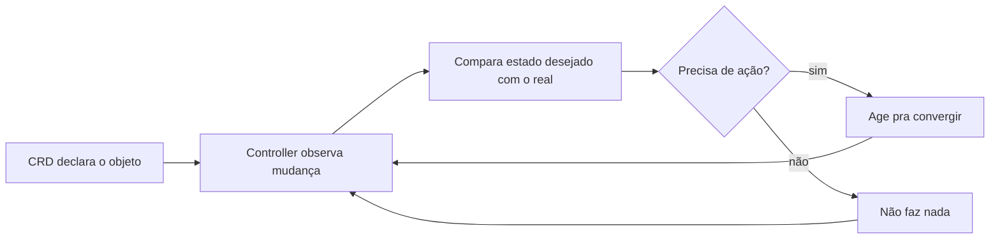

# Operators

Um Operator é um padrão pra estender o que o Kubernetes sabe gerenciar nativamente, com duas peças: um Custom Resource Definition (CRD), que ensina a API do cluster um novo tipo de objeto (além dos nativos como `Pod` ou `Service`), e um controller, um processo rodando dentro do cluster que observa esse novo tipo de objeto continuamente e age pra fazer o estado real convergir pro que foi declarado. É o mesmo princípio de reconciliação contínua já discutido em [Ansible](ansible.md) e [Argo CD](argocd.md), só que rodando de dentro do próprio cluster, dono de um domínio de conhecimento específico, em vez de um agente externo. O Infisical Kubernetes Operator (ver [Infisical](infisical.md)) é um exemplo concreto: o CRD é `InfisicalSecret`, e o controller observa cada recurso desse tipo, busca o segredo correspondente, e materializa um `Secret` nativo do Kubernetes com o valor, sem ninguém precisar rodar comando manual nenhum, nem de novo quando o segredo muda na origem.

## O ciclo de reconciliação

A reconciliação precisa ser idempotente, rodar de novo sem mudança real necessária não pode ter efeito colateral, o mesmo princípio central que [Ansible](ansible.md) segue fora do cluster.

## Outros Operators conhecidos

Prometheus Operator (gerencia a instalação e configuração do próprio Prometheus, ver [Observabilidade](observabilidade.md), via CRDs como `ServiceMonitor`), KubeVirt (roda VMs completas dentro de Pods do Kubernetes) e strimzi-kafka-operator (gerencia cluster Kafka inteiro, ver [Mensageria](mensageria.md)) são exemplos maduros e citados com frequência em [awesome-cloud-native](https://github.com/rootsongjc/awesome-cloud-native), categoria "Kubernetes Operators". O roteiro de Kubernetes do [roadmap.sh](https://roadmap.sh/kubernetes) trata "Creating Custom Controllers" e "Custom Resource Definitions (CRDs)" como tópico avançado próprio, depois de scheduling e storage, o que dá uma ideia de quão fundo esse padrão vai quando alguém decide construir um Operator do zero, em vez de só consumir um já pronto como o Infisical Operator.

## Pra ir além

A antítese de um Operator é gestão manual ou via script externo: alguém (ou um cron job fora do cluster) roda comandos periodicamente pra manter algo no estado certo. Funciona pra tarefa simples, mas não reage a mudança em tempo real, e não tem o mesmo nível de integração com a API do Kubernetes (RBAC, eventos, status visível via `kubectl get`).

Onde aprofundar: o [Kubebuilder Book](https://book.kubebuilder.io) é o guia de referência pra quem quer construir um Operator próprio, não só consumir um existente, cobrindo desde o CRD até o reconcile loop de verdade.
