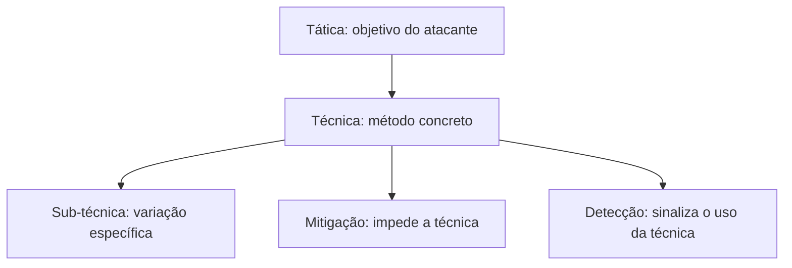
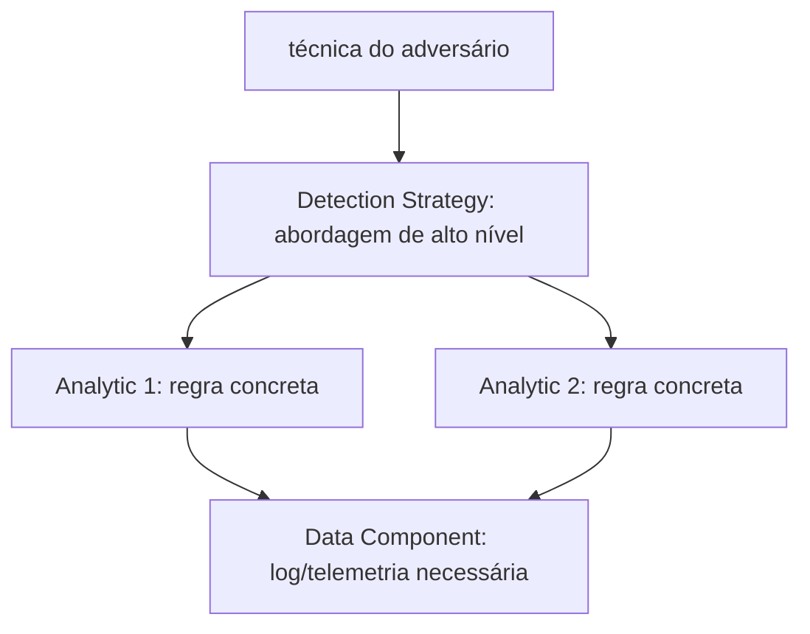

# MITRE ATT&CK

**TLDR**: um catálogo público e gratuito, mantido pela MITRE, de como atacantes de verdade se comportam, organizado em táticas (o objetivo), técnicas (o método) e defesas (mitigação e detecção). Não é uma ferramenta nem uma metodologia de projeto, é vocabulário e dado empírico que outras ferramentas e processos consomem.

MITRE ATT&CK é uma base de conhecimento pública, mantida pela MITRE, de tática e técnica de adversário baseada em observação real de ataque, não em teoria. Existem três matrizes por domínio (Enterprise, Mobile, ICS); a matriz Enterprise, a mais citada, cobre o ambiente corporativo típico: rede, endpoint, cloud, identidade.

## Tática, técnica, mitigação: a estrutura em camadas

Uma **tática** é o objetivo do atacante numa fase do ataque ("mover lateralmente pela rede"). Uma **técnica** é o método concreto pra alcançar aquele objetivo ("usar credencial roubada via `pass-the-hash`"), com sub-técnicas quando o método se ramifica. Cada técnica pode ter uma ou mais **mitigações**, contramedida que impede a técnica de funcionar (MFA, segmentação de rede, backup), e uma ou mais formas de **detecção**, sinal de que a técnica está sendo usada mesmo que a mitigação falhe.

## As táticas da matriz Enterprise

A matriz Enterprise organiza 15 táticas na ordem aproximada em que um ataque real costuma progredir, embora um atacante possa pular etapas ou voltar: **Reconnaissance** (juntar informação pra planejar), **Resource Development** (montar infraestrutura de ataque), **Initial Access** (entrar na rede), **Execution** (rodar código malicioso), **Persistence** (manter o acesso), **Privilege Escalation** (ganhar permissão maior), **Stealth** e **Defense Impairment** (esconder ação e quebrar mecanismo de defesa), **Credential Access** (roubar senha/token), **Discovery** (mapear o ambiente), **Lateral Movement** (mover entre máquinas), **Collection** (juntar dado de interesse), **Command and Control** (manter canal com o sistema comprometido), **Exfiltration** (roubar o dado) e **Impact** (manipular, interromper ou destruir).

```mermaid
flowchart LR
    Recon[Reconnaissance] --> ResDev[Resource Development] --> Initial[Initial Access] --> Exec[Execution] --> Persist[Persistence]
    Persist --> PrivEsc[Privilege Escalation] --> Stealth[Stealth/Defense Impairment] --> Cred[Credential Access] --> Disc[Discovery]
    Disc --> Lateral[Lateral Movement] --> Collect[Collection] --> C2[Command and Control] --> Exfil[Exfiltration] --> Impact[Impact]
```

## Detecção: strategies, analytics, data components

Detecção em ATT&CK também é em camadas, não um campo único. Uma **detection strategy** define a abordagem de alto nível pra detectar uma técnica específica, e agrupa uma ou mais **analytics**, a regra ou consulta concreta que de fato dispara o alerta. Cada analytic depende de **data components**, a fonte de dado ou tipo de log que precisa existir pra aquela análise funcionar (log de autenticação, telemetria de processo, tráfego de rede). Sem o data component certo coletado, a analytic não tem o que analisar.

## Pra ir além

A antítese de usar um catálogo de comportamento real de adversário é threat modeling puramente teórico (ver [Threat modeling](threat-modeling.md)): STRIDE e PASTA perguntam "o que **poderia** dar errado" a partir de categoria abstrata, antes de qualquer sistema existir; ATT&CK responde "o que **já deu** errado, de verdade, em ataque documentado", depois do fato, e serve tanto pra desenhar defesa quanto pra escrever regra de [runtime security](runtime-security.md) (Falco, por exemplo) mapeada direto numa técnica específica. Muitos times usam os dois: threat modeling na fase de design, ATT&CK pra validar cobertura de detecção depois que o sistema já roda.

## Links diretos

| Recurso | O que é |
|---|---|
| [attack.mitre.org](https://attack.mitre.org/) | Página inicial, visão geral da base de conhecimento |
| [Tactics (Enterprise)](https://attack.mitre.org/tactics/enterprise/) | As 15 táticas, cada uma com sua página de técnicas relacionadas |
| [Techniques (Enterprise)](https://attack.mitre.org/techniques/enterprise/) | Catálogo completo de técnicas e sub-técnicas |
| [Mitigations (Enterprise)](https://attack.mitre.org/mitigations/enterprise/) | As 44 mitigações, cada uma ligada às técnicas que ela impede |
| [Detection Strategies](https://attack.mitre.org/detectionstrategies/) | Abordagens de detecção por técnica |
| [Analytics](https://attack.mitre.org/analytics/) | Regras de detecção concretas, agrupadas por strategy |
| [Data Components](https://attack.mitre.org/datacomponents/) | Fontes de dado que uma analytic precisa pra funcionar |
| [Resources](https://attack.mitre.org/resources/) | Material de treinamento, ferramentas, comunidade |

Onde aprofundar: o [Getting Started](https://attack.mitre.org/resources/) da própria MITRE lista curso gratuito e webinar introdutório, o ponto de partida mais direto antes de tentar navegar a matriz inteira de uma vez.
