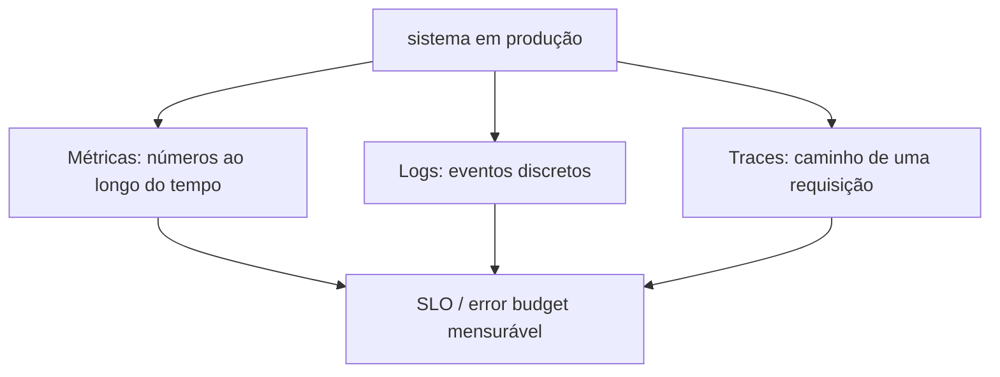
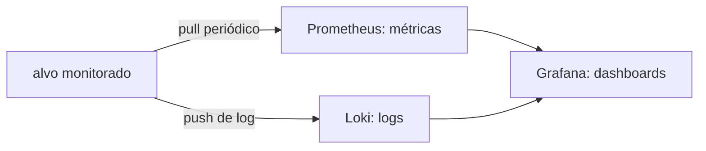

# Observabilidade

Observabilidade é a capacidade de responder "o que está acontecendo lá dentro" olhando só pro que o sistema expõe de fora, sem precisar adicionar código novo pra investigar cada problema específico. Normalmente se divide em três pilares: métricas (números ao longo do tempo, quanto de CPU, quantas requisições por segundo), logs (eventos discretos, texto), e traces (o caminho de uma requisição específica através de vários serviços). É a base concreta que sustenta a promessa de SLO/error budget da disciplina de SRE, ver [Papéis](papeis.md): não dá pra ter um objetivo de confiabilidade sem conseguir medir se ele está sendo cumprido.

## As ferramentas mais citadas

Nas listas curadas de DevOps ([awesome-devops](https://github.com/wmariuss/awesome-devops) e o site espelho [awesome-devops.xyz](https://awesome-devops.xyz/list/)), a categoria "Observability & Monitoring" é uma das maiores, e os nomes que aparecem quase sempre juntos são Prometheus (coleta e armazena métricas, modelo de "pull", o servidor busca a métrica em cada alvo periodicamente), Grafana (visualização, dashboards, quase sempre citado ao lado do Prometheus mas serve pra qualquer fonte de dado, não só ele), e Loki (logs, feito pela mesma empresa do Grafana, deliberadamente mais simples que a stack ELK/Elasticsearch por indexar só metadado, não o conteúdo inteiro do log).

A stack ELK/Elastic (Elasticsearch, Logstash, Kibana) é a alternativa mais robusta e mais cara operacionalmente pra log, mais comum em empresas que já têm um time dedicado a isso. Zabbix é um sibling mais antigo, nascido de monitoramento de infraestrutura tradicional (servidor, rede), antes da onda cloud native, ainda muito usado fora do mundo Kubernetes. Antes do log chegar em qualquer uma dessas stacks, alguma coisa precisa coletar e encaminhar ele: Fluentd e seu sucessor mais leve, Fluent Bit, são os coletores mais citados no ecossistema Kubernetes (ambos CNCF), rodando como DaemonSet e enviando log de cada node pra Loki, Elasticsearch, ou qualquer destino configurado; Vector, mais recente, escrito em Rust, compete no mesmo espaço com foco em performance e um pipeline de transformação mais expressivo. `rsyslog` e `syslog-ng` são a versão pré-container do mesmo problema, ainda o padrão em servidor Linux tradicional fora de cluster.

Na lista específica de [awesome-cloud-native](https://github.com/rootsongjc/awesome-cloud-native), a categoria "Tracing & Profiling" cobre a terceira perna do tripé: Jaeger e Zipkin são as ferramentas de distributed tracing mais citadas, cada uma seguindo (ou tendo influenciado) o padrão OpenTelemetry, hoje o jeito vendor-neutro de instrumentar código pra emitir métrica/log/trace sem prender a aplicação a uma ferramenta específica.

## Pra ir além

A antítese de observabilidade centralizada é monitoramento pontual: entrar no servidor quando algo já quebrou e investigar na mão, via `kubectl logs`/`kubectl top` ou equivalente. Funciona até o sistema ficar grande ou crítico o suficiente que "descobrir que quebrou" demora mais do que o aceitável, o gatilho mais comum pra adotar Prometheus/Grafana é justamente um incidente que demorou pra ser percebido.

Onde aprofundar: a documentação oficial do [Prometheus](https://prometheus.io/docs/introduction/overview/) explica bem o modelo de dados (métricas como séries temporais rotuladas), diferente de bancos relacionais tradicionais, e vale entender antes de instalar qualquer coisa.
