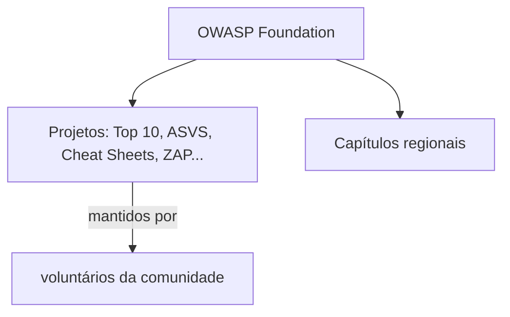
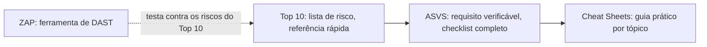

# OWASP

**TLDR**: fundação sem fins lucrativos que produz, de graça e aberto, boa parte do vocabulário e das listas de referência de segurança de aplicação usadas hoje, o Top 10 é só o projeto mais famoso, não o único.

OWASP (Open Worldwide Application Security Project, antes "Open Web Application Security Project") é uma fundação open source dedicada a segurança de aplicação, com o objetivo declarado de tornar segurança de software visível pra que organizações consigam tomar decisão informada sobre risco real. Funciona baseada em voluntário, sem vender nada: todo projeto, documento e ferramenta é gratuito.

## Fundação, projetos, capítulos

A estrutura da OWASP tem três camadas: a **fundação**, o corpo organizacional que sustenta tudo; os **projetos**, cada um um documento, padrão ou ferramenta desenvolvido pela comunidade (Top 10, ASVS, ZAP, e dezenas de outros); e os **capítulos**, grupos regionais que organizam encontro e evento local. Um projeto pode nascer pequeno e virar referência de indústria (o Top 10 é o exemplo mais claro) ou ficar de nicho, dependendo de quanto a comunidade adota.

## Os projetos mais citados, e o que cada um resolve

**OWASP Top 10** é uma lista, atualizada a cada alguns anos, dos dez riscos mais críticos de aplicação web, o projeto mais conhecido da OWASP e citado como referência mesmo fora de contexto técnico (auditoria, contrato, requisito de compliance). **ASVS** (Application Security Verification Standard) vai além de uma lista, é um framework de centenas de requisitos verificáveis, organizado em capítulos, pensado pra ser usado como checklist de verificação durante design e teste, não só como lista de risco pra conhecer. **Cheat Sheet Series** é uma coleção de guias curtos e práticos, um por tópico específico (validação de input, gestão de sessão, configuração de TLS), escrito pra quem já sabe o problema e quer o "como fazer certo" direto, sem teoria. **ZAP** (OWASP Zed Attack Proxy, já citado em [Vulnerability scanning](vulnerability-scanning.md)) é a ferramenta de DAST mais citada da própria OWASP, testa a aplicação já rodando, de fora.

## Pra ir além

A antítese de usar um padrão aberto e comunitário como o OWASP é depender só de auditoria paga ou consultoria fechada, sem nenhum material público pra validar o próprio trabalho antes de uma revisão externa. Funciona, mas cada verificação começa do zero, sem checklist prévio, e o conhecimento fica preso em quem foi contratado pra revisar, não documentado em lugar nenhum que o time consiga reconsultar depois. OWASP ASVS e Cheat Sheet Series existem exatamente pra dar esse checklist prévio, gratuito, antes de qualquer auditoria de verdade acontecer.

## Links diretos

| Recurso | O que é |
|---|---|
| [owasp.org](https://owasp.org/) | Página inicial da fundação |
| [OWASP Top Ten](https://owasp.org/www-project-top-ten/) | Projeto oficial, os dez riscos mais críticos de aplicação web |
| [ASVS](https://owasp.org/www-project-application-security-verification-standard/) | Framework de requisitos verificáveis de segurança |
| [Cheat Sheet Series](https://owasp.org/www-project-cheat-sheets/) | Guias práticos curtos por tópico específico |

Onde aprofundar: o [Cheat Sheet Series indexado por item do ASVS](https://cheatsheetseries.owasp.org/IndexASVS.html) cruza os dois projetos, útil pra ir do requisito abstrato do ASVS direto pro guia prático de como atender ele.
