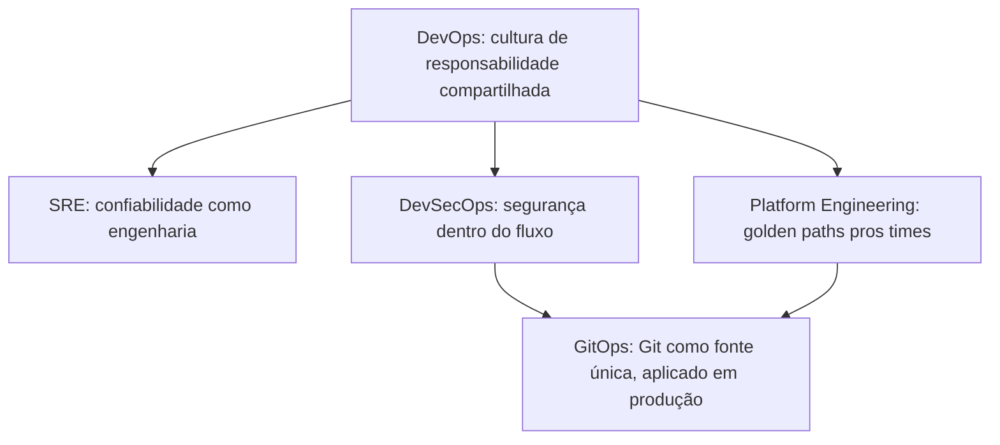
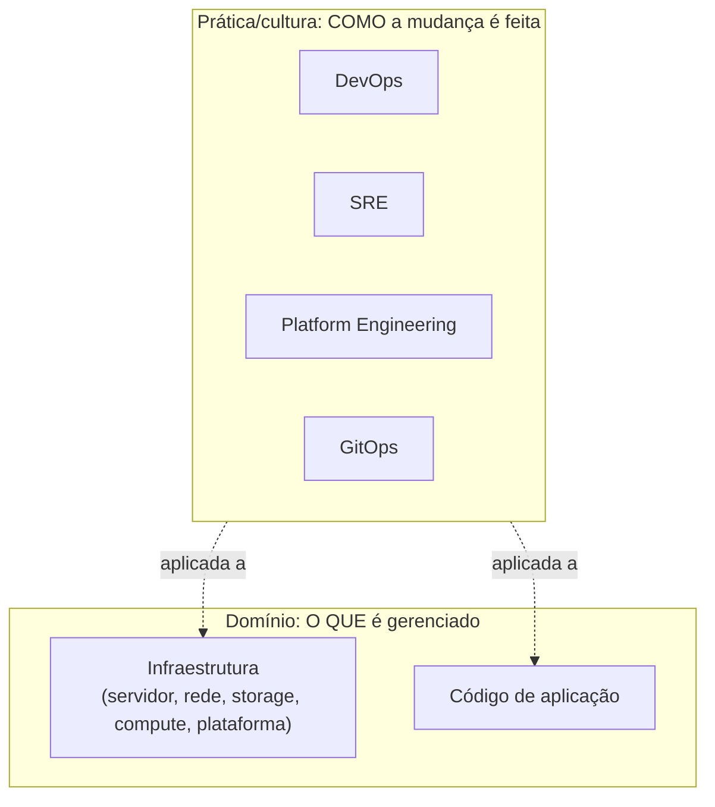
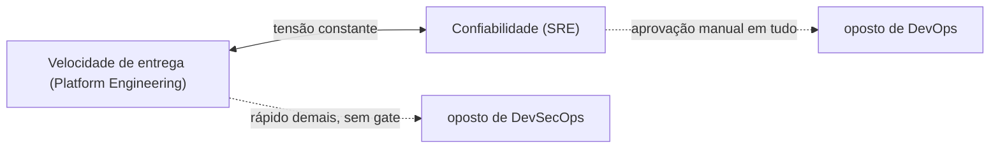

# Papéis

Um projeto de infraestrutura pequeno costuma viver na intersecção de vários papéis que, em times maiores, seriam pessoas ou squads diferentes; uma pessoa só cobre pedaços de todos eles. Vale saber nomear cada um, o que cada um prioriza, e onde as prioridades tensionam entre si, mesmo que você nunca venha a se especializar em só um. [roadmap.sh](https://roadmap.sh) tem roteiros visuais e gratuitos, nó por nó, pra cada um dos papéis abaixo, útil como checklist de "o que ainda falta" pra quem já está no meio do caminho.

## Infraestrutura e DevOps: qual contém qual

Pergunta comum, e a resposta direta é: **nenhum dos dois contém o outro**, são dois eixos diferentes, não uma hierarquia. **Infraestrutura** é um **domínio técnico** (o quê é gerenciado: servidor, rede, storage, compute, plataforma), existente desde muito antes do termo DevOps existir (sysadmin, engenheiro de rede, DBA já geriam infraestrutura nos anos 90). **DevOps** é uma **prática/cultura** (como a mudança é feita: automação, colaboração Dev+Ops, CI/CD), que pode ser aplicada tanto a infraestrutura quanto a código de aplicação. Confundir os dois é comum: [Splunk descreve o Infrastructure Engineer como "o arquiteto da fundação de TI de uma organização"](https://www.splunk.com/en_us/blog/learn/infrastructure-engineering.html), enquanto DevOps foca no lado de software do ciclo de entrega; mas os artigos comparativos da própria indústria já constatam que, na prática, [as duas disciplinas "trabalham interconectadas" e seu trabalho se sobrepõe boa parte do tempo](https://invictusprotalent.com/understanding-the-difference-between-infrastructure-and-devops-engineers/).

**Por que parece que um contém o outro na prática**: em organização cloud-native moderna (o caso deste próprio repositório), infraestrutura quase sempre É gerida via prática DevOps (infraestrutura como código, ver [IaC e provisionamento](iac-provisionamento.md), GitOps, ver [Argo CD](argocd.md)), então quem só viu infraestrutura sendo gerida desse jeito enxerga as duas coisas como uma só. Historicamente é o oposto do que a intuição sugere: infraestrutura existia antes, DevOps é a camada de prática que foi aplicada em cima dela (e depois estendida pra cobrir entrega de aplicação também), não o contrário. Um "Infrastructure Engineer" tradicional que nunca usou automação/CI ainda está fazendo trabalho de infraestrutura, só que sem prática DevOps; um "DevOps Engineer" que só automatiza pipeline de aplicação, sem nunca tocar servidor/rede/cluster, está fazendo DevOps sem estar necessariamente dentro do domínio de infraestrutura.

Cargo de mercado tende a fundir os dois nomes de propósito (mencionado também na seção [DevOps](#devops) abaixo: "muitas empresas usam DevOps Engineer como sinônimo de alguém que cuida de CI/CD e infraestrutura"), o que reforça a confusão de nomenclatura mas não muda a relação real entre os dois conceitos.

## SRE (Site Reliability Engineering)

Disciplina criada no Google, formalizada no livro *Site Reliability Engineering*, disponível de graça em [sre.google/books](https://sre.google/books). O foco é confiabilidade tratada como engenharia, não como heroísmo: SLOs (objetivos de nível de serviço), orçamento de erro (error budget), post-mortems sem culpa, automação do trabalho repetitivo ("toil"). Ver também [Site reliability engineering](https://en.wikipedia.org/wiki/Site_reliability_engineering) na Wikipédia.

## DevOps

Um movimento cultural, não um cargo com definição única: encurtar a distância entre quem escreve código e quem opera em produção, geralmente via automação, CI/CD e responsabilidade compartilhada. Ver [DevOps](https://en.wikipedia.org/wiki/DevOps) na Wikipédia. Na prática, muitas empresas usam "DevOps Engineer" como sinônimo de alguém que cuida de CI/CD e infraestrutura, o que gera bastante confusão de nomenclatura no mercado, vale estar ciente disso em entrevista e em vaga.

## Platform Engineering

Mais recente que DevOps (ver [Platform engineering](https://en.wikipedia.org/wiki/Platform_engineering) na Wikipédia): em vez de cada time de produto reinventar sua própria esteira de deploy, um time de plataforma constrói ferramentas e "golden paths" (caminhos prontos, com boas práticas embutidas) que os outros times consomem como produto interno, geralmente chamado de Internal Developer Platform, ver [IDP](idp.md).

## DevSecOps

DevOps com segurança tratada como parte do fluxo, não como um portão no fim (revisão de segurança só antes do deploy). A Wikipédia ainda não tem um artigo próprio pra "DevSecOps" (o termo redireciona pro artigo de [DevOps](https://en.wikipedia.org/wiki/DevOps)), sinal de que é um termo mais recente e ainda em consolidação, mas a prática já é bem estabelecida na indústria: segredo nunca em texto puro (ver [Segredos](../arquitetura/segredos.md)), least privilege (ver o raciocínio dos dois AppProjects em [`argocd-bootstrap`](../arquitetura/roles/argocd-bootstrap.md)), scan de dependência e imagem automatizado, infraestrutura como código revisável em PR. A lista [awesome-devsecops](https://github.com/devsecops/awesome-devsecops) organiza o ferramental típico dessa prática por fase: testing (OWASP ZAP pra varredura de vulnerabilidade em aplicação web, Snyk pra dependência, Checkov, já citado em [Policy as Code](policy-as-code.md), pra infraestrutura), hunting (osquery, pra investigar o estado real de uma máquina como se fosse um banco de dados), e gestão de segredo (Vault, já citado em [SSH](ssh.md) e [Infisical](infisical.md)).

## GitOps

Um princípio mais estreito que os anteriores, específico de como aplicar mudança em Kubernetes (ou qualquer sistema): Git como única fonte da verdade, um agente dentro do sistema que reconcilia continuamente contra o que o Git declara, em vez de alguém rodar comandos manualmente contra produção. [opengitops.dev](https://opengitops.dev) documenta os quatro princípios formais. É o que o Argo CD implementa, ver [Argo CD](argocd.md).

## Onde esses papéis tensionam entre si

Velocidade de entrega (o que Platform Engineering geralmente otimiza) e confiabilidade (o que SRE geralmente otimiza) competem por atenção o tempo todo: automatizar rápido demais sem gate de segurança é o oposto de DevSecOps; travar tudo atrás de aprovação manual é o oposto de DevOps. Reconhecer esse tipo de tensão, e escolher deliberadamente onde ceder, é boa parte do trabalho real desses papéis, mais do que decorar qual ferramenta usar.

Um framework útil pra pensar em como times e plataformas se organizam ao redor desses papéis: *Team Topologies*, de Matthew Skelton e Manuel Pais ([teamtopologies.com](https://teamtopologies.com)), que nomeia o "platform team" como um dos quatro tipos fundamentais de time em engenharia de software.

ChatOps é uma prática adjacente, não um papel: rodar comando de operação (deploy, rollback, escalar réplica) a partir de um bot dentro do chat do time (Slack, Discord, Microsoft Teams) em vez de abrir um terminal separado, o que deixa o histórico de quem rodou o quê, e quando, visível pra todo mundo no mesmo canal onde a conversa sobre o incidente já está acontecendo.
