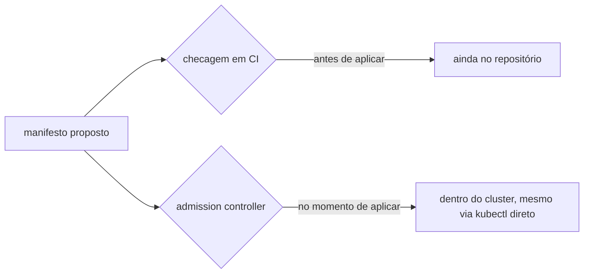
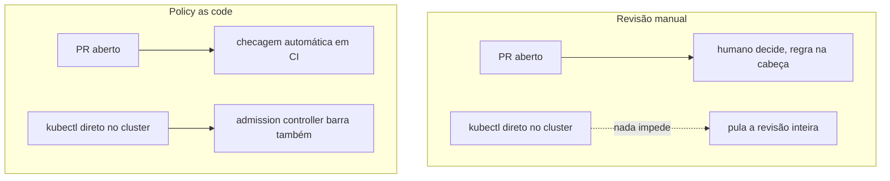

# Policy as code

Policy as code é declarar regra de governança (que tipo de recurso pode existir, que campo é obrigatório, que imagem de container é proibida) em arquivo versionado, verificado automaticamente, em vez de depender de revisão manual ou de convenção que só existe na cabeça de quem já trabalha no time há tempo suficiente. A verificação pode acontecer em dois momentos bem diferentes: antes de aplicar (analisando o manifesto ainda no repositório, em CI) ou no momento de aplicar (um admission controller dentro do próprio cluster, que aceita ou rejeita a mudança em tempo real, mesmo que alguém tente aplicar direto com `kubectl`, ignorando o CI).

## Um paralelo mais simples e mais rígido

O `clusterResourceWhitelist`/`namespaceResourceWhitelist` de um AppProject do Argo CD (ver [Argo CD](argocd.md)) é uma versão mais simples e mais rígida da mesma ideia: uma lista fixa de que `kind` de recurso um Application tem permissão de criar, decidida uma vez, na hora que o AppProject é definido. Um admission controller de policy as code faz algo parecido mas mais dinâmico e mais expressivo: em vez de só "que `kind` é permitido", consegue expressar regra como "todo `Pod` precisa declarar `resources.limits.memory`" ou "nenhuma imagem pode vir de um registry fora de uma lista aprovada", checando o conteúdo do manifesto, não só o tipo dele.

## As ferramentas mais citadas

Tanto o [awesome-iac](https://github.com/brandonhimpfen/awesome-iac) quanto o [awesome-cloud-native](https://github.com/rootsongjc/awesome-cloud-native) apontam pro mesmo par como as opções dominantes hoje: Open Policy Agent (OPA), um projeto graduado da CNCF, com uma linguagem de política própria, Rego, poderosa o bastante pra considerar múltiplos recursos e dado externo na mesma regra, mas com curva de aprendizado real; e OPA Gatekeeper, que é a integração específica do OPA como admission controller do Kubernetes. Kyverno é o concorrente mais direto, também CNCF, com uma proposta de valor específica: política escrita em YAML puro, no mesmo formato de manifesto Kubernetes que qualquer pessoa já lê no dia a dia, sem aprender uma linguagem nova. Fora do universo Kubernetes especificamente, HashiCorp Sentinel cumpre papel parecido pra política em cima de Terraform, e Conftest aplica o mesmo Rego do OPA contra qualquer arquivo de configuração estruturado (YAML, JSON, HCL), não só Kubernetes.

## Pra ir além

A antítese de policy as code automatizado é revisão manual: um humano olha cada PR/manifesto e decide se está de acordo com a convenção do time. Funciona em times pequenos com convenção clara, mas não escala: a regra vive só na cabeça de quem revisa, é aplicada de forma inconsistente dependendo de quem está de plantão, e nada impede alguém de aplicar direto no cluster, pulando a revisão inteiramente, exatamente o motivo pelo qual um admission controller (que roda dentro do cluster, não só no CI) é a versão mais forte dessa garantia.

Onde aprofundar: a documentação do [OPA pra admission control no Kubernetes](https://www.openpolicyagent.org/docs/kubernetes) mostra o fluxo completo, do manifesto ao Rego que decide aceitar ou rejeitar.
