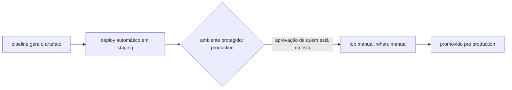
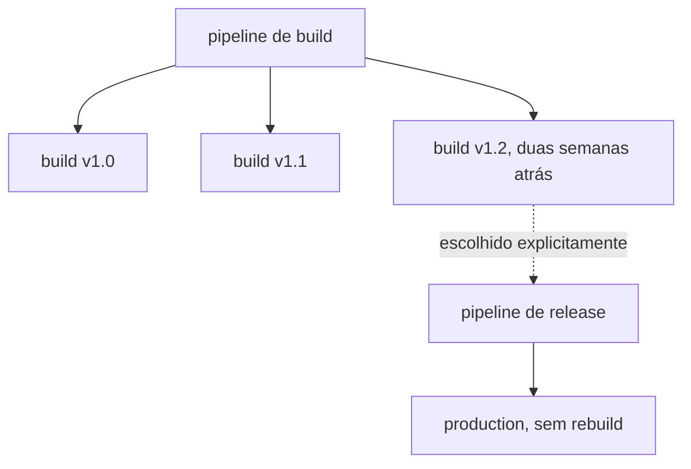
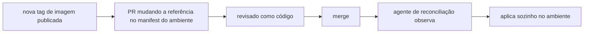

# Promoção entre ambientes

**TLDR**: depois que o CI builda, alguém (ou algo) decide qual versão vai pra qual ambiente e quando; GitLab modela isso como job manual, Azure DevOps como release separada do build, GitHub Actions via environment + input manual, GitOps como PR revisado num manifesto.

| Modelo | Vá pra |
|---|---|
| Job manual, ambiente protegido | [GitLab](#gitlab-jobs-manuais-e-ambientes-protegidos) |
| Release separada do build | [Azure DevOps](#azure-devops-release-classico-e-environments-em-yaml) |
| Environment + input manual | [GitHub Actions](#github-actions-environments-approvals-e-o-que-falta-nativamente) |
| Snapshot, stage de pipeline, plugin, PR revisado | [Outras estratégias](#outras-estrategias-relevantes) |
| Comparação lado a lado | [Comparação entre os modelos](#comparacao-entre-os-modelos) |

CI produz um artefato. Promoção é a etapa seguinte, e conceitualmente separada: decidir qual artefato específico, já construído, vai rodar em qual ambiente, e quando. As plataformas de CI/CD tratam essa etapa de formas bem diferentes: algumas têm um objeto de "release" separado do build, algumas modelam promoção como só mais um job de pipeline, e algumas assumem que git já é o registro de promoção e não precisam de UI nenhuma pra isso.

## GitLab: jobs manuais e ambientes protegidos

No [GitLab CI/CD](https://docs.gitlab.com/ci/environments/), um `environment` é um destino nomeado (`staging`, `production`) declarado direto no job que implanta nele. Promoção manual é `when: manual`: o job existe na pipeline, mas fica parado até alguém clicar em "Run" na interface. Encadear isso pelos ambientes, deploy automático em `staging`, manual em `production`, é o padrão mais comum: a mesma pipeline gera o artefato e, na sequência, cada estágio de ambiente vira um job manual próprio.

[Ambientes protegidos](https://docs.gitlab.com/ci/environments/deployment_approvals/) vão além de `when: manual`: restringem quem tem permissão de rodar aquele job (só quem está na lista "Allowed to deploy") e podem exigir múltiplas aprovações antes da execução ser sequer permitida, um bloqueio genuíno, não só um botão que qualquer um pode apertar. GitLab também classifica ambientes automaticamente em tiers (development, staging, production) por convenção de nome, o que alimenta relatório e política sem configuração extra.

## Azure DevOps: Release clássico e Environments em YAML

O Azure DevOps historicamente separa duas coisas que o GitLab funde numa pipeline só: um **pipeline de build**, que produz e publica um artefato versionado, e um **pipeline de release** (Classic Release), que consome artefatos já publicados. É aqui que mora a diferença central em relação ao GitLab: ao criar uma release, quem implanta escolhe explicitamente qual build vai ser a fonte, a versão mais recente por padrão, mas também uma versão específica, ou a versão mais recente de uma branch específica (ver [Artifact sources em Classic release pipelines](https://learn.microsoft.com/en-us/azure/devops/pipelines/release/artifacts?view=azure-devops)). Isso permite pegar um build de duas semanas atrás, que nunca chegou a produção, e promovê-lo direto pra lá sem rodar o build de novo.

Cada [stage](https://learn.microsoft.com/en-us/azure/devops/pipelines/process/stages?view=azure-devops) do release pipeline pode ter aprovação pré-deploy e pós-deploy, gate automatizado (uma checagem de API externa, por exemplo), e política de fila (deployar builds em sequência ou só o mais recente, cancelando os outros). O modelo mais novo, pipelines YAML multi-stage, converge pipeline de build e de deploy num arquivo só, com `stages` e `environments`, mas mantém a mesma ideia de aprovação por ambiente via [checks](https://learn.microsoft.com/en-us/azure/devops/pipelines/process/approvals) configurados no próprio ambiente, não no pipeline.

## GitHub Actions: environments, approvals, e o que falta nativamente

[Environments no GitHub Actions](https://docs.github.com/en/actions/deployment/targeting-different-environments/using-environments-for-deployment) cobrem boa parte do mesmo terreno: até seis required reviewers por ambiente, wait timer configurável, restrição de qual branch/tag pode implantar naquele ambiente, e secrets que só ficam disponíveis depois que a aprovação passa. Cada job que referencia um ambiente gera um objeto de deployment rastreável via API/webhook, então rastreabilidade de "o que foi implantado onde e quando" existe nativamente.

O que falta nativamente é o pedaço específico que o Azure DevOps oferece: escolher, numa interface, um build já existente e promovê-lo, sem reconstruir. GitHub Actions não tem um objeto de "release" separado do "workflow run" do jeito que o Azure tem. Os workarounds mais comuns: um `workflow_dispatch` com input `choice`/`string` pra quem dispara escolher a versão/tag manualmente (não existe um tipo de input nativo "tag do repositório", então normalmente é texto livre); publicar o artefato de build (imagem de container com tag imutável, por exemplo) e ter um segundo workflow, disparado por `release: published` ou por `workflow_dispatch`, que só puxa essa tag já publicada e implanta, sem rebuildar; ou usar [`actions/download-artifact`](https://docs.github.com/en/actions/tutorials/store-and-share-data) pra puxar um artefato de um workflow run anterior (retenção padrão de 90 dias, configurável). Nenhuma dessas opções tem uma tela dedicada de "escolher versão pra promover" como o Azure Release, é tudo composto a partir de gatilho + input + convenção.

## Outras estratégias relevantes

**Octopus Deploy**, uma ferramenta dedicada só a deploy, sem CI próprio (normalmente emparelhada com Jenkins, GitHub Actions ou Azure Pipelines pro build), formaliza a ideia de [release como snapshot imutável](https://octopus.com/docs/releases): criar uma release captura o processo de deploy, as versões de pacote e as variáveis naquele instante, e essa mesma release pode ser reimplantada em qualquer ambiente depois, sem rebuildar e sem que uma mudança posterior no processo afete releases já criadas. É o modelo mais próximo do Azure Release levado ao extremo: a ferramenta inteira é organizada ao redor do conceito de release versionada, não só uma tela dentro de um pipeline maior.

**Spinnaker**, criado no Netflix, modela promoção como estágio de pipeline: um estágio [Manual Judgment](https://spinnaker.io/docs/reference/pipeline/stages/) pausa a execução até alguém aprovar, e um estágio "Find Artifact from Execution" busca explicitamente um artefato de uma execução anterior da mesma pipeline (ver [promoção de artefato entre ambientes no Spinnaker](https://docs.armory.io/continuous-deployment/spinnaker-user-guides/artifact-promotion/)) pra promovê-lo adiante, o equivalente funcional de "escolher um build específico" do Azure, só que expresso como stage de pipeline em vez de tela dedicada.

**Jenkins**, sem conceito nativo de ambiente nem de release, historicamente resolve isso via plugin: o Copy Artifact Plugin copia artefato de um job pra outro, o Promoted Builds Plugin marca um build específico como "promovido" depois de critério manual ou automático, o que abre um job de deploy parametrizado com o número daquele build. É a versão "faça você mesmo" do que GitLab/Azure/Octopus oferecem prontos.

**GitOps** (ver [Argo CD](argocd.md)) inverte a pergunta inteira: em vez de uma tela onde alguém escolhe "esta versão, para este ambiente", a versão desejada de cada ambiente já está declarada num arquivo, uma pasta ou branch por ambiente, cada um apontando pra uma tag de imagem. Promover é abrir um PR mudando essa referência (manualmente, ou automaticamente por uma ferramenta como o Argo CD Image Updater) e mergear, revisado como qualquer mudança de código; o agente de reconciliação (ver [pull vs. push](ci-cd.md#pull-vs-push-e-onde-o-runner-fica)) aplica sozinho a partir daí. Rastreabilidade e histórico de aprovação vivem no `git log`, não numa tela de release separada.

## Comparação entre os modelos

| Dimensão | GitLab | Azure DevOps | GitHub Actions | Octopus / Spinnaker | GitOps |
|---|---|---|---|---|---|
| Geração e persistência do artefato | Job de build na mesma pipeline, artefato vai pra um registry externo | Pipeline de build separado, publica num feed/artifact store próprio | Job de build no workflow, artefato em Actions Artifacts ou registry externo | Delegada a uma ferramenta de CI externa | Delegada a uma ferramenta de CI externa |
| Separação CI/CD | Fundida (mesma pipeline, jobs diferentes) | Historicamente separada (build vs. release); YAML moderno funde | Fundida (mesmo workflow ou workflow separado por convenção) | Sempre separada (ferramenta só de deploy) | Sempre separada (Git é o meio) |
| Selecionar versão específica pra promover | Limitado, geralmente a pipeline mais recente daquela branch | Nativo, dropdown na criação da release | Não nativo, via input manual de `workflow_dispatch` | Nativo (Octopus) / via stage dedicado (Spinnaker) | Nativo: qualquer commit/tag anterior, referenciado no PR |
| Manual vs. automático | Ambos, `when: manual` por job | Ambos, por stage | Ambos, por ambiente | Ambos | Ambos, `sync` manual ou automático |
| Approvals/gates | Ambientes protegidos, múltiplos aprovadores | Approvals + gates automatizados por stage | Required reviewers, wait timer, restrição de branch/tag | Aprovação por lifecycle (Octopus) / Manual Judgment (Spinnaker) | Revisão de PR |
| Rastreabilidade | Histórico de pipeline e ambiente | Histórico de release, vinculado ao build de origem | Deployment objects via API | Histórico de release (Octopus) / execução (Spinnaker) | `git log` do repositório de manifests |
| Rollback | Reimplantar job anterior manualmente | Reimplantar release anterior, um clique | Reimplantar workflow run anterior (limitado) | Reimplantar release anterior (nativo) | Reverter o commit/PR |

## Pra ir além

A antítese de qualquer um desses modelos é deploy manual direto do artefato, sem pipeline nem registro nenhum: alguém builda local, copia pro servidor, ninguém sabe depois qual versão está rodando onde. Todo o ferramental acima existe pra resolver exatamente esse problema de rastreabilidade, cada um com uma opinião diferente sobre onde a decisão de "promover" deveria morar, numa tela de release, num job de pipeline, ou num commit revisado.

Onde aprofundar: a [visão geral de deployment strategies do GitLab](https://docs.gitlab.com/ci/environments/) e a documentação de [approvals do Azure Pipelines](https://learn.microsoft.com/en-us/azure/devops/pipelines/process/approvals) cobrem os dois extremos do espectro (pipeline única vs. build/release separados) com mais detalhe do que cabe aqui.
