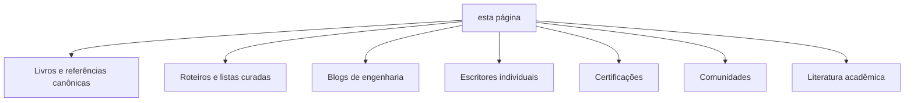
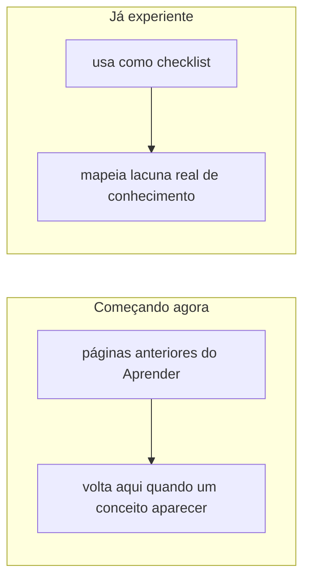

# Referências pra continuar aprendendo

Todo projeto de infraestrutura acaba escolhendo um conjunto específico de ferramentas, proporcional ao seu tamanho e contexto. Não existe uma única abordagem válida, nem uma que seja necessariamente a melhor pra qualquer contexto. Esta página é um ponto de partida pra continuar aprendendo além do que está documentado nesta seção, seja porque você está começando agora e quer um mapa do que existe, seja porque você já sabe bastante e quer confirmar se conhece as alternativas e o histórico por trás de escolhas comuns na área.

Alguns links abaixo podem mudar de endereço com o tempo. Se algum estiver quebrado, busque pelo nome, a maioria desses recursos é fácil de achar de novo.

## Livros e referências canônicas, gratuitas

- **Site Reliability Engineering** e **The Site Reliability Workbook**, do Google, em [sre.google/books](https://sre.google/books): a referência mais citada da indústria pra confiabilidade tratada como engenharia.
- **The Twelve-Factor App**, em [12factor.net](https://12factor.net): doze princípios pra construir aplicações que rodam bem em ambientes de nuvem/cloud native, curto e denso.
- **OpenGitOps**, da CNCF, em [opengitops.dev](https://opengitops.dev): definição formal e vendor-neutra dos princípios de GitOps.
- **Pro Git**, em [git-scm.com/book](https://git-scm.com/book): o livro oficial do Git, completo, gratuito.
- **Team Topologies**, de Matthew Skelton e Manuel Pais, em [teamtopologies.com](https://teamtopologies.com): como organizar times de engenharia (incluindo times de plataforma) pra minimizar carga cognitiva e dependência entre equipes.
- **CNCF Cloud Native Landscape**, em [landscape.cncf.io](https://landscape.cncf.io): mapa (literal, visual) de praticamente todo o ecossistema de ferramentas cloud native, organizado por categoria.

## Roteiros e listas curadas, organizadas por categoria

Diferente de um livro ou um blog, esses recursos não se leem do início ao fim, servem pra navegar: você entra sabendo o nome de uma categoria (ou nem isso) e sai com uma lista de ferramentas reais pra comparar.

- [roadmap.sh](https://roadmap.sh) tem roteiros visuais, gratuitos, mantidos pela comunidade, pros papéis discutidos em [Papéis](papeis.md) (DevOps, DevSecOps, Cyber Security) e pras ferramentas mais citadas nesta seção (Kubernetes, Docker, Terraform, Linux, AWS, Git and GitHub). Cada roteiro é literalmente um mapa, nó por nó, do que aprender e em que ordem.
- [awesome-devops](https://github.com/wmariuss/awesome-devops), de wmariuss, e o site espelho [awesome-devops.xyz](https://awesome-devops.xyz/list/): uma lista curada enorme, organizada por categoria (plataformas cloud, orquestração de container, CI/CD, observability, service mesh, chaos engineering, gestão de segredo, e mais). Bom ponto de partida quando você sabe o problema mas não sabe o nome da categoria de ferramenta que resolve ele.
- [awesome-cloud-native](https://github.com/rootsongjc/awesome-cloud-native), de rootsongjc: o equivalente focado só no ecossistema Kubernetes/cloud native, com categorias bem mais finas (operators, service mesh, storage, tracing, edge computing) do que a lista genérica de DevOps acima.
- [awesome-gitops](https://github.com/weaveworks/awesome-gitops), da Weaveworks (quem cunhou o termo GitOps): além do Argo CD e do Flux já citados em [Argo CD](argocd.md), lista ferramentas de segredo GitOps-nativas como Sealed Secrets e SOPS, que resolvem "como versionar segredo cifrado direto no Git" de um jeito diferente do que o Infisical propõe (ver [Infisical](infisical.md)).
- [awesome-devsecops](https://github.com/devsecops/awesome-devsecops): curadoria focada na intersecção de segurança com DevOps discutida em [Papéis](papeis.md), com ferramenta de scanning, threat modeling, e gestão de segredo sob a ótica de segurança, não só de operação.
- [awesome-iac](https://github.com/brandonhimpfen/awesome-iac): cobre a camada de provisionamento de infraestrutura (Terraform, Pulumi, Crossplane, CloudFormation, ver [IaC e provisionamento](iac-provisionamento.md)), incluindo ferramentas de teste (Terratest, Checkov) e policy as code (Open Policy Agent, Sentinel, ver [Policy as code](policy-as-code.md)).
- [awesome-go, categoria devops-tools](https://awesome-go.com/devops-tools/): útil especificamente porque boa parte do ecossistema cloud native (Kubernetes, Terraform, o próprio `kubectl`) é escrito em Go, então essa lista cruza com as anteriores por um ângulo de linguagem, não de categoria de problema.
- [awesome-devops-br](https://github.com/devops-br/awesome-devops-br): a versão em português da mesma ideia, com livros, blogs técnicos e comunidade de língua portuguesa, incluindo comparações como Puppet vs. Ansible escritas por quem trabalha com isso no Brasil.
- [awesome-sysadmin](https://github.com/kahun/awesome-sysadmin), de kahun, a lista original que deu origem ao formato: mais de 40 categorias de ferramenta open source de administração de sistema (backup, virtualização, banco de dados, monitoramento, segurança), mais próxima do dia a dia de operação de servidor do que do vocabulário mais recente de "cloud native" das listas acima. O fork [awesome-foss/awesome-sysadmin](https://github.com/awesome-foss/awesome-sysadmin) é hoje o mais ativo e o mais estrelado dos dois, com licença de cada ferramenta identificada (SPDX), aviso de dependência não-livre, e uma versão HTML navegável com filtro, útil quando a lista Markdown cru fica grande demais pra ler linear.

## Blogs de engenharia de empresas grandes

Cada um documenta decisões reais, com escala e contexto que raramente aparecem em tutorial. Vale ler pelo raciocínio por trás da decisão, não pra copiar a ferramenta específica que a empresa usou.

- Netflix Tech Blog: [netflixtechblog.com](https://netflixtechblog.com)
- Cloudflare Blog: [blog.cloudflare.com](https://blog.cloudflare.com)
- Shopify Engineering: [shopify.engineering](https://shopify.engineering)
- Meta Engineering: [engineering.fb.com](https://engineering.fb.com)
- Google Cloud Blog: [cloud.google.com/blog](https://cloud.google.com/blog)
- Uber Engineering: [eng.uber.com](https://eng.uber.com)
- HashiCorp Blog: [hashicorp.com/blog](https://www.hashicorp.com/blog)
- GitHub Engineering Blog: [github.blog/category/engineering](https://github.blog/category/engineering)

## Escritores individuais respeitados na área

- **Martin Fowler**, em [martinfowler.com](https://martinfowler.com): arquitetura de software, práticas de engenharia, muito do vocabulário comum da indústria (incluindo boa parte da literatura sobre CI/CD) passou pelo site dele.
- **ThoughtWorks Technology Radar**, em [thoughtworks.com/radar](https://www.thoughtworks.com/radar): publicação semestral avaliando ferramentas e técnicas como "adotar", "testar", "avaliar" ou "evitar", com o raciocínio por trás de cada posição.

## Certificações reconhecidas na indústria

Não são pré-requisito pra trabalhar com infraestrutura, mas são um jeito estruturado de validar e preencher lacuna de conhecimento, com um roteiro de estudo pronto por trás.

- **LFCS** (Linux Foundation Certified System Administrator) e **LFCA** (nível introdutório): administração de sistemas Linux em geral, base pra praticamente toda a área.
- **CKA** (Certified Kubernetes Administrator), **CKAD** (Certified Kubernetes Application Developer) e **CKS** (Certified Kubernetes Security Specialist), da Linux Foundation/CNCF: as três certificações de Kubernetes mais reconhecidas, cada uma com foco diferente (operar o cluster, desenvolver pra ele, segurança). **KCNA** (Kubernetes and Cloud Native Associate) é a entrada, sem pré-requisito.
- **HashiCorp Certified: Terraform Associate**: fundamentos de infrastructure as code com Terraform, os conceitos (state, plan/apply, provider) atravessam a categoria inteira de ferramentas, mesmo quem usa uma ferramenta diferente.
- **AWS Certified Solutions Architect – Associate**, e os equivalentes de Google Cloud e Azure: o caminho mais comum pra quem quer migrar de "administra um node só" pra "administra infraestrutura em escala".

## Comunidades e discussão contínua

- **CNCF** (Cloud Native Computing Foundation): organização que hospeda Kubernetes, Argo (incluindo o Argo CD, ver [Argo CD](argocd.md)), Helm, e boa parte do ecossistema cloud native. Vale acompanhar os projetos em incubação, é onde a próxima geração de ferramentas geralmente aparece primeiro.
- Listas de discussão, fóruns e Slack/Discord de cada projeto específico ([Ansible](ansible.md), [Kubernetes](https://kubernetes.io/docs), [Argo CD](argocd.md)) costumam ter mais profundidade técnica que buscadores genéricos pra dúvida específica de versão.

## Literatura acadêmica

Infraestrutura e operação não são só prática de indústria, também têm produção acadêmica séria por trás. [arXiv.org](https://arxiv.org) é um repositório gratuito de pré-prints (artigos antes ou depois da revisão por pares formal), mantido pela Cornell University, com uma categoria de Software Engineering (`cs.SE`) e Distributed Computing (`cs.DC`) relevantes aqui. Dois exemplos concretos, achados buscando por "chaos engineering" (a prática de injetar falha deliberadamente pra validar resiliência, ver [Chaos engineering](chaos-engineering.md)): o artigo original [Chaos Engineering (2017)](https://arxiv.org/abs/1702.05843), da equipe que criou a prática na Netflix, e uma revisão sistemática mais recente, [Chaos Engineering: A Multi-Vocal Literature Review (2024)](https://arxiv.org/abs/2412.01416), que também cobre a literatura "cinzenta" (blog posts, talks), não só papers formais.

## Wikipédia como ponto de partida, não de chegada

Artigos da Wikipédia sobre conceitos técnicos ([DevOps](https://en.wikipedia.org/wiki/DevOps), [Infraestrutura como código](https://en.wikipedia.org/wiki/Infrastructure_as_code), [Kubernetes](https://en.wikipedia.org/wiki/Kubernetes), [SSH](https://en.wikipedia.org/wiki/Secure_Shell), entre outros linkados ao longo desta seção Aprender) costumam ter uma seção de referências e "ver também" no fim, que abre caminho pra outros artigos relacionados. É um jeito eficiente de mapear um conceito novo rapidamente antes de ir atrás de uma fonte mais funda (livro, RFC, paper, documentação oficial do projeto).

## Como usar esta página

Se você está começando, não tente ler tudo isso de uma vez. Comece pelas páginas anteriores desta seção Aprender, volte aqui quando um conceito específico aparecer e você quiser ir mais fundo. Se você já é experiente, use como checklist: o que você já conhece bem, o que é familiar só de nome, e o que nunca ouviu falar é um jeito rápido de mapear lacuna real.

