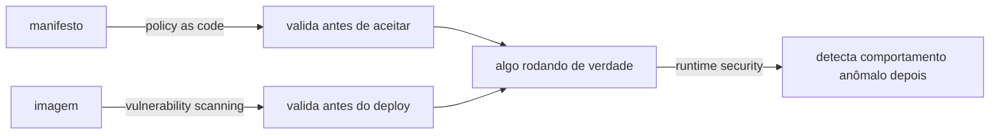
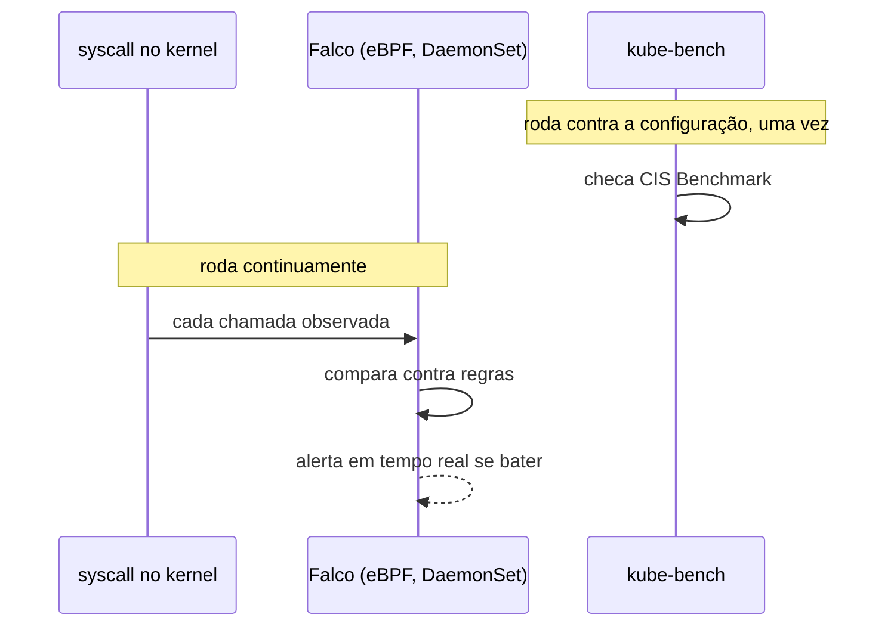

# Runtime security

Todas as camadas de segurança já citadas neste site checam antes de algo rodar: [policy as code](policy-as-code.md) valida um manifesto antes de aceitar, [vulnerability scanning](vulnerability-scanning.md) valida uma imagem antes de fazer deploy. Runtime security cobre a lacuna que sobra: o que acontece depois que algo já está rodando, e se comporta de um jeito que nenhuma validação prévia previu, um processo inesperado dentro de um container, uma tentativa de escalar privilégio, um arquivo sensível sendo lido fora do padrão normal daquela aplicação.

## Como funciona na prática

Falco, hoje o padrão de fato pra isso em Kubernetes (graduado pela CNCF), roda como um DaemonSet, um pod em cada node, e usa eBPF pra observar syscall no nível do kernel, comparando cada chamada contra um conjunto de regras (processo inesperado rodando dentro de um container, escrita num diretório sensível do sistema, shell aberto dentro de um container em produção) e disparando alerta em tempo real quando algo bate com uma regra. kube-bench é complementar, não sobreposto: automatiza a checagem contra o CIS Benchmark do Kubernetes (um checklist de configuração segura, não comportamento em runtime), então times costumam usar os dois juntos, kube-bench pra configuração, Falco pra comportamento. Boa parte das regras do Falco mapeia direto pra uma técnica catalogada no [MITRE ATT&CK](mitre-attack.md), o que ajuda a responder não só "algo estranho aconteceu" mas "que fase de ataque isso corresponde".

## Quando compensa adotar

Sem nenhuma das duas ferramentas, detecção de comportamento anômalo depende inteiramente de alguém notar manualmente (via `kubectl logs`/`kubectl top`, ver [Observabilidade](observabilidade.md)), o que não escala e não é tempo real. Isso costuma ser uma escolha proporcional ao estágio do projeto, não uma falha: runtime security formal compensa mais a partir do momento em que múltiplas aplicações de terceiros/times diferentes rodam no mesmo cluster, o risco de "uma aplicação comprometida afeta outra" cresce com o número de inquilinos.

## Pra ir além

A antítese de runtime security é confiar inteiramente nas camadas anteriores (scanning de imagem, policy as code) e assumir que nada passa por elas incorretamente. É uma aposta razoável em ambiente pequeno e controlado, mas nenhuma camada de validação prévia captura 100% dos casos, principalmente ataque que explora uma vulnerabilidade desconhecida no momento do deploy (zero-day), que só se manifesta como comportamento anômalo depois.

Onde aprofundar: a [documentação oficial do Falco](https://falco.org/docs) tem uma seção de regras padrão que serve como um catálogo real do tipo de comportamento que essa camada de segurança cobre, mais concreto que qualquer explicação teórica.
