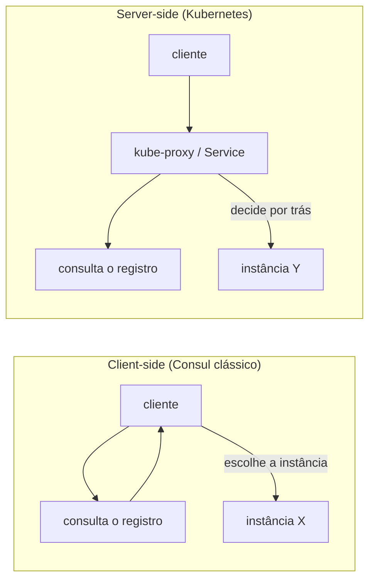
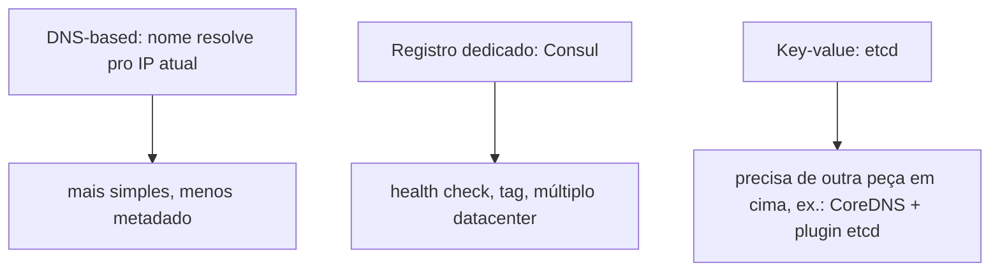

# Service discovery

**TLDR**: como um serviço acha o endereço de outro que muda o tempo todo, sem endereço fixo hardcoded; server-side (Kubernetes, via kube-proxy) esconde a escolha do cliente; client-side (Consul clássico) deixa o cliente escolher a instância direto.

Service discovery é o mecanismo que permite um serviço achar o endereço de rede de outro sem esse endereço estar fixado em configuração, importante porque instância de serviço nasce, morre e muda de IP o tempo todo num ambiente dinâmico (autoscaling, deploy, crash e reinício). Existem dois padrões distintos de onde a decisão de "qual instância específica" acontece.

## Client-side vs. server-side

No padrão **client-side**, quem chama consulta um registro de serviço diretamente, recebe a lista de instâncias saudáveis, e decide sozinho qual usar (round-robin, latência mais baixa, o que for); Consul no seu modo clássico funciona assim. No padrão **server-side**, quem chama nem sabe que múltiplas instâncias existem: a requisição vai pra um balanceador ou proxy, que consulta o registro e decide por trás, de forma transparente. O `kube-proxy` do Kubernetes é o exemplo mais citado desse segundo padrão: mantém regra de `iptables`/IPVS que redireciona o tráfego pro pod certo, sem o cliente nunca precisar de biblioteca de descoberta nenhuma.

## As três formas mais citadas de implementar

**DNS-based**, o mais simples: consultar um nome resolve pra um IP atual, o mesmo mecanismo do [CoreDNS](rede-interna-do-cluster.md) dentro de um cluster Kubernetes, sem nenhuma biblioteca especial do lado do cliente, só resolução de nome comum. **Registro dedicado com API**, o modelo do Consul: um serviço se registra ativamente (ou é registrado por um agente) com metadado rico (tag, health check, datacenter), consultável por DNS ou por API HTTP, mais expressivo que DNS puro. **Key-value store genérico**, o caminho do etcd: não é uma solução de service discovery pronta, é o armazenamento distribuído de chave-valor por trás de uma (CoreDNS com o plugin `etcd`, por exemplo), então precisa de outra peça em cima pra virar descoberta de serviço de fato.

## Pra ir além

A antítese de service discovery dinâmico é endereço fixo em configuração: um IP ou hostname hardcoded, que funciona enquanto nada muda, mas quebra silenciosamente assim que uma instância é substituída por outra com IP diferente, e exige atualização manual em todo lugar que referenciava o endereço antigo. É viável só em ambiente pequeno e estático o bastante pra IP nunca mudar de propósito.

Service discovery é frequentemente confundido com [service mesh](service-mesh.md), mas resolve um problema mais estreito: descoberta é só "qual é o endereço", service mesh empacota descoberta junto com mTLS, retry e observabilidade de rede, uma camada bem mais ampla por cima.

Onde aprofundar: a [documentação do Consul sobre service discovery](https://developer.hashicorp.com/consul/docs/concepts/service-discovery) descreve o modelo completo, incluindo health check e múltiplo datacenter, o caso de uso mais citado além de Kubernetes puro.
