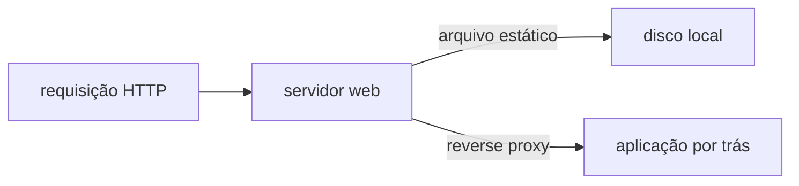
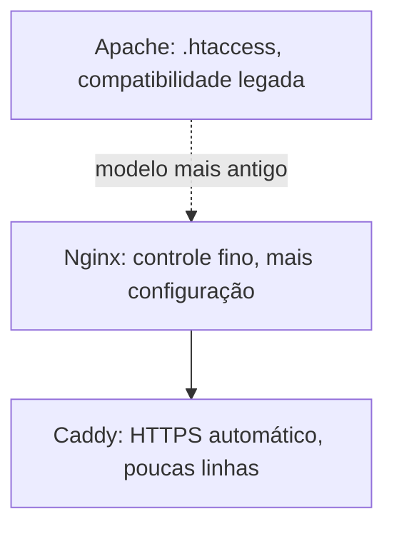

# Servidores web

**TLDR**: um servidor web responde requisição HTTP, servindo arquivo estático ou repassando (reverse proxy) pra uma aplicação por trás. Nginx é o controle fino, Apache é a compatibilidade legada, Caddy é o HTTPS automático de fábrica.

Um servidor web é o processo que escuta numa porta (80/443) e responde requisição HTTP, de dois jeitos possíveis: servindo um arquivo estático direto do disco (HTML, CSS, imagem), ou funcionando como **reverse proxy**, repassando a requisição pra outra aplicação rodando por trás (um processo Node.js, um container) e devolvendo a resposta dela pro cliente como se fosse própria. A maioria dos setups reais faz as duas coisas ao mesmo tempo, estático direto, dinâmico repassado.

## Nginx, Apache, Caddy: três filosofias diferentes

**Nginx** prioriza controle fino e eficiência: arquitetura orientada a evento (poucos processos, muitas conexões simultâneas cada), configuração explícita e verbosa, o "teto mais alto" pra reverse proxy, load balancing e tuning de tráfego sob carga pesada. **Apache** (Apache HTTP Server, `httpd`) prioriza compatibilidade: modelo mais antigo, orientado a processo/thread por conexão, com `.htaccess` (configuração por diretório, sobrescrita sem reiniciar o servidor) e um ecossistema de módulo legado que muita aplicação PHP mais antiga ainda espera encontrar. **Caddy** prioriza simplicidade operacional: HTTPS automático via ACME (ver [TLS automático](tls-automatico.md)) ligado por padrão, configuração de poucas linhas pra um reverse proxy funcional, e suporte nativo a HTTP/3, ao custo de menos ecossistema de módulo que o Nginx acumulou ao longo de décadas.

## Pra ir além

Dentro de um cluster Kubernetes, o papel de servidor web/reverse proxy geralmente é assumido por um [Ingress Controller](api-gateway.md) (Traefik, o próprio Nginx via `ingress-nginx`), a mesma ideia de reverse proxy, só que reconfigurado automaticamente a partir de recurso do Kubernetes em vez de arquivo de configuração editado à mão.

A antítese de um servidor web dedicado é a própria aplicação escutar a porta HTTP diretamente, sem nenhuma camada na frente (comum em desenvolvimento local, ou em linguagem/framework cujo servidor embutido já é robusto o bastante pra produção). Funciona pra tráfego pequeno, mas perde recursos que um servidor web dedicado dá de graça: servir arquivo estático de forma mais eficiente que a maioria dos frameworks de aplicação, terminação de TLS centralizada, e um ponto único pra aplicar limite de taxa ou cabeçalho de segurança antes da requisição chegar na aplicação.

Onde aprofundar: a [comparação independente entre Nginx, Apache e Caddy](https://www.digitalocean.com/community/tutorials/apache-vs-nginx-practical-considerations) cobre o histórico e o modelo de concorrência de cada um com mais profundidade técnica do que cabe aqui.

Um reverse proxy também pode ser um serviço terceiro inteiro, não um processo que se administra: ver [Cloudflare](cloudflare.md), que faz esse papel (mais CDN e WAF) na frente do domínio público deste cluster, antes até do Traefik interno entrar em cena.
