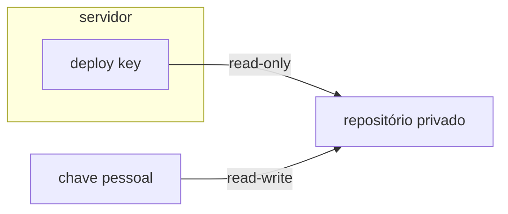

# SSH

SSH (Secure Shell) é o protocolo usado tanto pra administrar um servidor remoto (uma sessão de terminal remota) quanto pra um servidor clonar repositórios Git privados (`git@github.com:...`). São duas finalidades diferentes, e é comum usar duas chaves diferentes pra cada uma, importante não confundir as duas.

## Chave pessoal vs. deploy key

Uma chave SSH pessoal (a que fica em `~/.ssh/` numa máquina de desenvolvedor, associada a uma conta do GitHub) autentica **uma pessoa**. Ela tem acesso a tudo que a conta tem acesso, e normalmente permite escrever, não só ler.

Uma **deploy key** é diferente: é um par de chaves gerado especificamente pra um repositório, registrado só naquele repositório (não numa conta de usuário), e normalmente configurado como **read-only**. Se a chave privada de uma deploy key vazasse, o dano máximo é alguém conseguir ler aquele repositório específico, não comprometer uma conta pessoal nem escrever código malicioso de volta.



É por isso que gerar uma deploy key nova sempre invalida a antiga: a metade pública precisa ser registrada de novo no GitHub, e até isso acontecer, a metade privada nova não abre porta nenhuma.

## `~/.ssh/config` e alias

Em vez de digitar `ssh -i chave -p porta usuario@ip` toda vez, um alias no `~/.ssh/config` da própria máquina resolve isso:

```
Host <alias>
  HostName <endereço real>
  Port <porta real>
  User <usuário>
```

Esse arquivo costuma ficar só na máquina de quem administra, fora de qualquer repositório: endereço e porta de um servidor de produção não devem ficar públicos, e mudam menos quando isolados da lógica de deploy.

## `known_hosts` e por que fixar a chave do host remoto

Toda primeira conexão SSH pergunta "confia nessa máquina?" (TOFU, trust-on-first-use). Deixar isso acontecer sem checar é um risco real de man-in-the-middle. Uma prática mais segura é fixar de antemão a chave pública oficial do host remoto (por exemplo via `ansible.builtin.known_hosts`, antes de qualquer clone automatizado) em vez de aceitar cegamente (`accept_hostkey: true`).

## `IdentitiesOnly=yes`

Rodar `git clone`/`git pull` com `GIT_SSH_COMMAND="ssh -i <chave> -o IdentitiesOnly=yes"` evita um problema comum: sem essa opção, o cliente SSH tenta todas as chaves disponíveis no agente antes da que foi especificada, o que pode causar falha de autenticação silenciosa ou usar a chave errada por engano quando várias deploy keys convivem na mesma máquina.

## Tunelamento SSH

Além de abrir um shell remoto, uma conexão SSH pode encapsular outro tráfego dentro dela, um túnel cifrado que não precisa de VPN nenhuma pra existir. Existem quatro formas:

**Local forwarding** (`-L`): abre uma porta na máquina local que encaminha, através do túnel, pra um destino visível a partir do servidor SSH (que pode ser o próprio servidor ou outra máquina que só ele enxerga). Usado pra acessar um serviço que só existe atrás daquele servidor, como se estivesse rodando localmente.

**Remote forwarding** (`-R`): o inverso, abre uma porta no servidor SSH remoto que encaminha de volta pra um destino visível a partir da máquina local. Usado pra expor algo que só a máquina local enxerga, pro lado do servidor.

**Dynamic forwarding** (`-D`): em vez de encaminhar pra um destino fixo, transforma o túnel num proxy **SOCKS** genérico na máquina local; qualquer aplicação configurada pra usar esse proxy (um navegador, por exemplo) tem todo seu tráfego roteado através do túnel, destino escolhido dinamicamente por aplicação, não fixado antecipadamente como nos dois anteriores.

**Jump host / `ProxyJump`** (`-J`): encadeia a conexão através de um host intermediário pra alcançar um destino final que não é acessível diretamente, o mecanismo por trás do padrão de [bastion host](https://en.wikipedia.org/wiki/Bastion_host) citado abaixo.

## VPN: ponto-a-site vs. malha

Pra acesso administrativo (não git), outro padrão comum em infraestrutura maior é o [bastion host](https://en.wikipedia.org/wiki/Bastion_host) / jump host: em vez de expor SSH de cada máquina pra internet, só um host intermediário é exposto, e todo acesso passa por ele (`ProxyJump` no `~/.ssh/config`, ver a seção de tunelamento acima). Uma VPN resolve um problema adjacente por outro mecanismo, [rede privada](https://en.wikipedia.org/wiki/Virtual_private_network) não exposta publicamente, em vez de um host único exposto.

Duas categorias diferentes de VPN valem distinguir. **Ponto-a-site** é o modelo clássico: um cliente conecta a um servidor VPN central, todo tráfego passa por esse servidor, mesmo entre dois clientes que estão ambos conectados nele. OpenVPN é o mais antigo e mais amplamente suportado nessa categoria. **Malha (mesh)** é diferente: qualquer par de dispositivos na malha tenta conversar direto entre si quando possível, sem depender de um servidor central retransmitindo todo tráfego, um modelo mais próximo do que o SSH já faz ponto-a-ponto. ZeroTier e Tailscale são os nomes mais citados nessa categoria, esse último construído em cima do WireGuard.

WireGuard, separadamente, não é bem uma categoria própria: é um protocolo, bem mais novo e mais simples que o do OpenVPN, e hoje é a base de boa parte das ferramentas mais recentes da categoria (incluindo Tailscale), usado tanto em VPN ponto-a-site quanto como camada de transporte dentro de uma malha.

Uma malha VPN costuma vir com resolução de nome própria pros dispositivos dentro dela, split DNS (ver [DNS e DHCP](dns-e-dhcp.md)): nome interno da malha resolve só através do servidor DNS dela, enquanto o resto do tráfego DNS segue pro resolvedor público normal.

## Pra ir além

SSH é um protocolo de acesso remoto seguro entre vários que já existiram: antecedeu ferramentas como `telnet`/`rsh`, que trafegavam tudo (inclusive senha) em texto puro, e continua sendo o padrão de fato pra Linux/Unix hoje. No mundo Windows, o equivalente histórico é RDP (Remote Desktop Protocol), um protocolo bem diferente, gráfico em vez de texto, embora o Windows moderno também suporte SSH nativamente. Mosh (mobile shell) é um parente direto do SSH, pensado pra conexão instável (Wi-Fi ruim, roaming entre redes), usa SSH só pra autenticar e depois assume a sessão por UDP.

Deploy keys estáticas têm uma desvantagem real: se vazam, valem pra sempre até alguém revogar manualmente. A antítese disso é acesso de curta duração: certificados SSH emitidos por uma CA interna, via ferramentas como o SSH secrets engine do HashiCorp Vault ou o Teleport, que expiram sozinhos em minutos ou horas em vez de ficarem válidos indefinidamente.

Documentação de referência: `man ssh_config` e `man sshd_config` cobrem todas as opções mencionadas aqui em detalhe.
