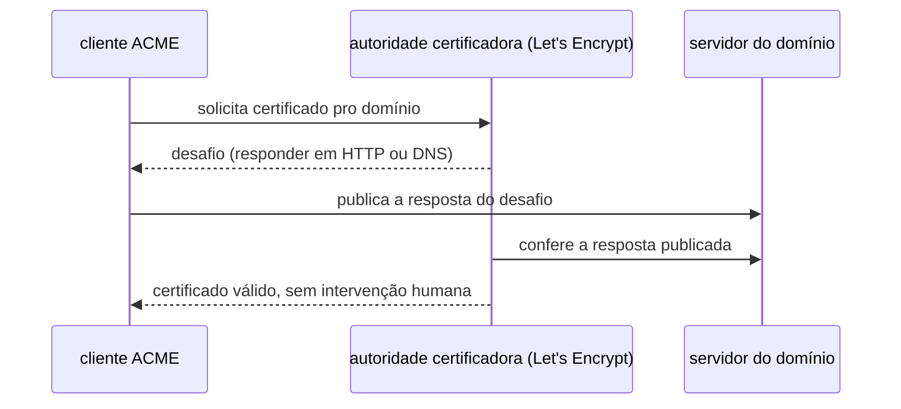
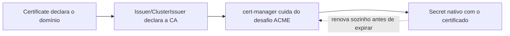

# TLS automático

Antes de certificado automático existir, HTTPS exigia comprar um certificado, renovar manualmente antes de expirar (e esquecer disso derrubava o site), e configurar cada servidor um por um. O protocolo ACME (Automatic Certificate Management Environment, RFC 8555) resolveu isso: um cliente automatizado prova pra uma autoridade certificadora que controla um domínio (normalmente respondendo um desafio HTTP ou DNS específico), e recebe um certificado válido de volta, sem intervenção humana. Let's Encrypt é a autoridade certificadora gratuita que popularizou ACME; hoje é o motivo pelo qual a maioria da internet tem HTTPS sem pagar nada por isso.

## Como funciona dentro de um cluster Kubernetes

cert-manager é o Operator (ver [Operators](kubernetes-operators.md)) mais citado pra automatizar esse fluxo inteiro dentro do Kubernetes: um `Certificate` declara que domínio precisa de HTTPS, um `Issuer`/`ClusterIssuer` declara qual autoridade certificadora emite, e o cert-manager cuida do desafio ACME, guarda o certificado resultante como um `Secret` nativo do Kubernetes, e renova sozinho antes de expirar.

## OpenSSL: o canivete-suíço manual

OpenSSL é a ferramenta por trás de boa parte do trabalho manual de TLS, e continua útil mesmo com ACME automatizando o resto do fluxo: gerar uma CSR (`openssl req`), inspecionar um certificado já emitido pra conferir validade e cadeia (`openssl x509 -text`), ou testar uma conexão TLS de fora pra ver exatamente qual certificado um servidor está servindo (`openssl s_client -connect host:443`). Ferramentas mais recentes cobrem o mesmo terreno com interface mais simples: mkcert gera certificado confiável só localmente, pensado pra desenvolvimento; step-cli e cfssl (da Cloudflare) automatizam emissão em massa quando a linha de comando do OpenSSL fica repetitiva demais pra operar em escala.

## Pra ir além

`Issuer` é por namespace, `ClusterIssuer` é o mesmo conceito mas disponível pra qualquer namespace do cluster, a escolha entre os dois é sobre limitar ou compartilhar quem pode emitir certificado a partir daquela configuração. A antítese de certificado automático é o modelo antigo: comprar de uma autoridade certificadora comercial, gerar a CSR manualmente (com OpenSSL, ver acima), colar o certificado em cada servidor, e repetir isso a cada renovação, ainda comum em ambiente corporativo com requisito de certificado de validação estendida (EV), que ACME não oferece.

Onde aprofundar: a documentação oficial em [cert-manager.io/docs](https://cert-manager.io/docs) tem um tutorial completo de ponta a ponta com Let's Encrypt.
