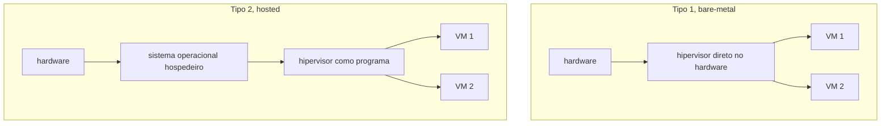
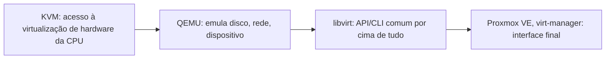

# Virtualização

**TLDR**: um hipervisor roda várias máquinas virtuais isoladas numa máquina física só, cada VM com seu próprio kernel; container compartilha o kernel do host e isola só o processo, mais leve, menos isolado.

Virtualização é fazer uma máquina física rodar várias máquinas lógicas independentes, cada uma com sua própria cópia (real ou simulada) de CPU, memória, disco e rede, gerenciadas por um **hipervisor**. Existem dois tipos: **Tipo 1** (bare-metal), o hipervisor roda direto sobre o hardware, sem sistema operacional hospedeiro no meio (Xen, ESXi); **Tipo 2** (hosted), o hipervisor roda como um programa dentro de um sistema operacional já existente (VirtualBox, o QEMU sozinho). KVM ocupa uma posição híbrida: transforma o próprio kernel Linux num hipervisor tipo 1, mas normalmente trabalha em conjunto com o QEMU pra emulação de hardware.

## KVM, QEMU, libvirt: quem faz o quê

Esses três nomes aparecem sempre juntos, mas cada um resolve uma parte diferente do problema. **KVM** (Kernel-based Virtual Machine) é o módulo do kernel Linux que dá acesso às extensões de virtualização de hardware da CPU (Intel VT-x, AMD-V), a parte que faz a VM rodar em velocidade próxima da nativa. **QEMU**, sozinho, é um emulador de sistema completo, capaz de simular hardware inteiro em software (mais lento); usado junto com KVM, QEMU cuida da emulação de dispositivo (disco virtual, placa de rede virtual) enquanto o KVM cuida da execução da CPU. **libvirt** é a camada de gestão por cima dos dois: uma API e um conjunto de ferramentas (`virsh`) que abstraem KVM, QEMU, Xen e outros hipervisores atrás de uma interface só, o que permite gerenciar VM de hipervisores diferentes sem aprender o comando nativo de cada um.

## Xen: a alternativa com isolamento mais forte

Xen é outro hipervisor tipo 1, mas com arquitetura diferente do KVM: em vez de transformar o kernel do host num hipervisor, Xen roda como camada própria, abaixo de tudo, com um domínio privilegiado (Dom0) responsável por administrar os domínios de convidado (DomU). Essa separação mais estrita é o motivo pelo qual Xen é historicamente preferido em ambiente que prioriza isolamento de segurança forte entre VMs, ao custo de uma arquitetura mais complexa de operar que o KVM.

## Pra ir além

A antítese de virtualização de máquina completa é [container](k3s.md), que isola só o processo, compartilhando o kernel do host em vez de rodar um kernel próprio por VM: mais leve, inicia em milissegundos em vez de segundos/minutos, mas com superfície de isolamento menor, um exploit de kernel afeta todos os containers do mesmo host, o que não acontece entre VMs. Muitos setups combinam os dois: VM pra isolamento forte entre inquilinos diferentes, container dentro de cada VM pra empacotar aplicação.

Proxmox VE é a distribuição mais citada que empacota KVM/QEMU/libvirt numa interface web pronta pra uso, o caminho mais direto pra quem quer virtualização self-hosted sem montar cada peça manualmente.

Onde aprofundar: a [documentação do libvirt](https://libvirt.org/docs.html) explica o modelo de gestão comum a múltiplos hipervisores, útil antes de decidir entre KVM, Xen ou outro backend específico.
