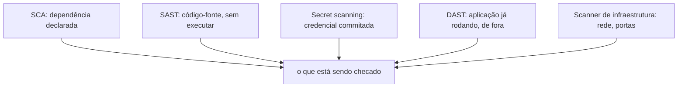
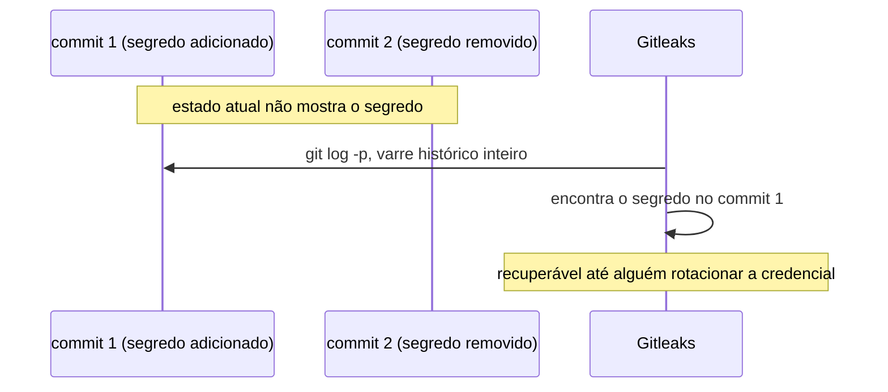

# Vulnerability scanning

**TLDR**: cinco categorias diferentes, todas chamadas "scanner de segurança": SCA (dependência), SAST (código-fonte), secret scanning (credencial vazada), DAST (aplicação rodando) e scanner de infraestrutura (rede).

| Categoria | Vá pra |
|---|---|
| Dependência declarada | [SCA](#as-categorias-que-nao-sao-a-mesma-coisa) |
| Código-fonte, sem executar | [SAST](#as-categorias-que-nao-sao-a-mesma-coisa) |
| Credencial vazada no histórico | [Secret scanning](#as-categorias-que-nao-sao-a-mesma-coisa) |
| Aplicação já rodando | [DAST](#as-categorias-que-nao-sao-a-mesma-coisa) |

Vulnerability scanning é checar algo (código, dependência, imagem, sistema já rodando) contra uma base de vulnerabilidade conhecida, automaticamente, em vez de esperar alguém descobrir manualmente. Existem várias categorias diferentes, frequentemente confundidas entre si porque todas se chamam "scanner de segurança":

## As categorias que não são a mesma coisa

**SCA** (Software Composition Analysis), o que Trivy, OSV-Scanner e Snyk fazem: escaneia dependência declarada (um `package.json`, uma imagem de container) contra base de CVE conhecida. Trivy é open source, um binário só, cobre pacote de SO, dependência de linguagem, manifesto Kubernetes e Terraform ao mesmo tempo. OSV-Scanner, do Google, consome especificamente a base OSV.dev, um banco de vulnerabilidade agregado de fontes autoritativas (GitHub Security Advisories, RustSec, avisos do Ubuntu, entre outras), e cobre mais de dez ecossistemas de linguagem diferentes. Snyk é uma plataforma comercial, mais integrada ao fluxo de desenvolvimento (abre PR de correção automaticamente, plugin de IDE), com recursos que as opções gratuitas não têm, ao custo de ser pago a partir de certo uso.

**SAST** (Static Application Security Testing): analisa o código-fonte em si, procurando padrão perigoso (SQL injection, uso inseguro de criptografia) sem executar nada. Semgrep é o mais citado open source hoje, com uma proposta central: regra escrita parecida com o próprio código que ela procura, em vez de expressão regular ou árvore sintática abstrata explícita, o que reduz bastante a barreira pra escrever regra própria específica de um time.

**Secret scanning**: categoria separada, focada em achar credencial commitada por engano, senha, chave de API, token, direto no código ou (mais perigoso ainda) no histórico do Git. Gitleaks é o mais citado, varre o histórico inteiro de commit (`git log -p`), não só o estado atual, porque um segredo removido num commit posterior continua recuperável no histórico até alguém reescrever ou rotacionar a credencial de verdade.

**DAST** (Dynamic Application Security Testing): testa a aplicação já rodando, de fora, como um atacante faria. OWASP ZAP (já citado em [Papéis](papeis.md)) é o mais citado nessa categoria, mantido pela própria [OWASP](owasp.md), que também organiza boa parte do vocabulário de risco de aplicação web que essas ferramentas checam.

**Scanner de infraestrutura**: Nessus (comercial, padrão de indústria) e OpenVAS (open source) escaneiam sistema já rodando na rede, portas abertas, serviço desatualizado, configuração insegura, uma categoria mais próxima de pentest do que de CI/CD.

**Orquestrador de qualidade**, categoria adjacente, não estritamente de segurança: qlty roda dezenas de linter e formatter diferentes (mais de sessenta plugins, cobrindo mais de quarenta linguagens) atrás de uma configuração só, em vez de cada projeto configurar cada ferramenta separadamente.

## Pra ir além

A antítese de scanning automatizado é depender só de revisão manual (ver [Threat modeling](threat-modeling.md)) e de quem escreve o código estar em dia com vulnerabilidade conhecida, o que não escala além de um punhado de dependências.

## Cheatsheet

| Ferramenta | Categoria |
|---|---|
| Trivy, OSV-Scanner, Snyk | SCA |
| Semgrep | SAST |
| Gitleaks | Secret scanning |
| OWASP ZAP | DAST |
| Nessus, OpenVAS | Scanner de infraestrutura |

Onde aprofundar: a [documentação do Trivy](https://trivy.dev/latest/docs/) é um bom ponto de partida prático, já que cobre as quatro coisas mais comuns de escanear (dependência, imagem, manifesto Kubernetes, Terraform) numa ferramenta só. Pra secret scanning especificamente, o [guia completo do Gitleaks](https://gitleaks.org/gitleaks-complete-guide-secrets-scanning-detection-and-protection-in-git-repositories/) explica a diferença entre escanear o estado atual e escanear o histórico inteiro, uma distinção que muita gente não percebe até vazar algo de verdade.
