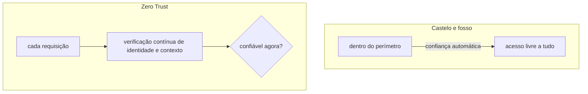
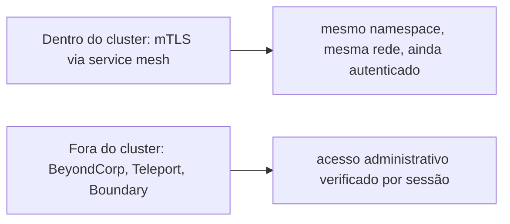

# Zero Trust

Zero Trust é um princípio de segurança que elimina confiança implícita baseada em localização de rede: estar "dentro" da rede corporativa, ou dentro de uma VPN, deixa de significar automaticamente "confiável". Em vez disso, todo acesso é verificado continuamente, com base em identidade e contexto, não em qual segmento de rede a requisição veio. A definição oficial vem do NIST SP 800-207, publicado em 2020: "elimina a confiança implícita em qualquer elemento, componente ou serviço, e em vez disso exige verificação contínua". O modelo antigo (perímetro de rede, tudo dentro do firewall é confiável) é chamado retroativamente de "castelo e fosso", contra o qual o Zero Trust é definido em oposição direta.

## Um paralelo mais simples

Um firewall que nega por padrão e libera só o declarado (ver [firewalld](firewalld.md)) segue um princípio adjacente, mas ainda baseado em zona de rede: uma vez dentro de uma origem confiável, a origem inteira é confiável. Não é Zero Trust de verdade, que exigiria verificar identidade a cada chamada, independente de que rede a chamada veio, mas caminha na mesma direção geral (menos confiança implícita, mais verificação explícita) num nível bem mais simples.

## Pra ir além

Service mesh com mTLS (ver [Service mesh](service-mesh.md)) é a implementação mais comum de Zero Trust dentro de um cluster Kubernetes: cada chamada entre serviços é autenticada e criptografada, mesmo entre dois pods no mesmo namespace, mesma rede. Fora do cluster, ferramentas como BeyondCorp (o modelo original do Google, que inspirou boa parte do NIST 800-207) e produtos como Teleport ou Boundary aplicam o mesmo princípio pra acesso administrativo, substituindo VPN tradicional por verificação de identidade por sessão.

A antítese de Zero Trust é justamente o modelo de perímetro: uma vez dentro da rede confiável (VPN, firewall corporativo), pouca ou nenhuma verificação adicional acontece. Mais simples de montar, mas uma única credencial vazada ou um único ponto de entrada comprometido dá acesso a tudo que está "dentro", exatamente o cenário que a tática **Lateral Movement** do [MITRE ATT&CK](mitre-attack.md) descreve, um atacante já dentro do perímetro se movendo livremente entre sistemas.

Onde aprofundar: o próprio [NIST SP 800-207](https://nvlpubs.nist.gov/nistpubs/specialpublications/NIST.SP.800-207.pdf), gratuito, é a fonte primária, mais denso que um resumo de blog mas sem a distorção de marketing que o termo "Zero Trust" acumulou depois de virar palavra de venda de produto.
