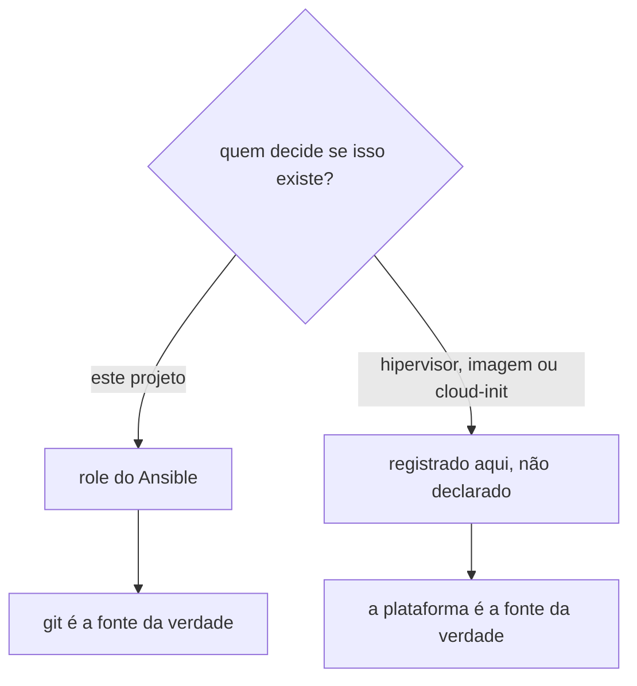

# Ambiente do node

Nem tudo que existe no node é decisão deste projeto. Uma parte vem do hipervisor, outra do cloud image, outra do cloud-init, e o Ansible não declara nenhuma delas. Esta página registra o que são, de onde vieram, e por que ficam de fora, pra que "não está no git" não signifique "ninguém sabe que existe".

É a contraparte de [Estado fora do git](../operacao/estado-fora-do-git.md), que trata de segredo e de acesso. Aqui o assunto é configuração e software que existem no node sem terem sido escolhidos aqui.

## Por que não declarar

Declarar um recurso da plataforma no Ansible cria dois problemas. O primeiro é que o repositório passa a afirmar posse sobre algo que não controla, e a documentação vira mentira no dia em que a plataforma mudar. O segundo é que o Ansible passa a disputar o arquivo com quem realmente o gerencia, e o resultado é reconciliação em loop, cada lado desfazendo o outro.

O caso mais direto é o `qemu-guest-agent`: quem decide se ele existe é quem administra o hipervisor. Um role que o declarasse estaria afirmando posse sobre uma escolha de plataforma, e a documentação viraria mentira no dia em que o host mudasse de ideia.

## O que vem do hipervisor

| Item | Observação |
|---|---|
| `qemu-guest-agent` | agente de integração com o hipervisor. Foi instalado à mão no primeiro dia da VM, mas quem decide se ele deve existir é quem administra o hipervisor, não este repositório |
| Endereçamento de rede, gateway e DNS | os valores são da rede que hospeda a VM, não escolha deste projeto. Ver a ressalva sobre `cloud-init` abaixo, porque quem escreveu esses arquivos não existe mais no node |

## O que vem do cloud image

| Item | Observação |
|---|---|
| `cloud-guest-utils`, `cloud-initramfs-growroot` | inicialização da instância |
| `grub-cloud-amd64`, `linux-image-cloud-amd64` e `/etc/default/grub.d/10_cloud.cfg` | kernel e boot da variante cloud |
| `systemd-resolved`, `systemd-timesyncd` | rede e tempo, na configuração padrão do Debian |
| `/etc/apt/mirrors/*.list` e `/etc/apt/sources.list.d/debian.sources` | espelhos escolhidos pela imagem |
| Conta `apalrd`, uid 1000 | usuário padrão da imagem base, ver abaixo |
| Cerca de 60 pacotes de biblioteca e essenciais | aparecem em `apt-mark showmanual` por serem imagem mínima, e é o motivo de [`pacotes-base`](roles/pacotes-base.md) não usar essa lista como fonte |

A conta `apalrd` é o único item desta seção com ação recomendada. Ela vem da imagem, tem sudo sem senha, e o `authorized_keys` dela está vazio, ou seja, é um acesso privilegiado que ninguém consegue usar e ninguém pediu. Não declarar não é o mesmo que aceitar.

## `cloud-init` foi removido, e o que ele escreveu ficou órfão

O pacote `cloud-init` está no node em estado `rc`, ou seja, foi removido e só os arquivos de configuração dele sobraram. O binário não existe e o serviço aparece como `not-found`.

Isso muda a leitura de três arquivos que parecem ser dele:

- `/etc/netplan/50-cloud-init.yaml` é estático, não é regenerado em boot nenhum. Quem lê esse arquivo hoje é o gerador do netplan, que entrega a configuração pro `systemd-networkd`.
- `/etc/hosts` traz um cabeçalho avisando que `manage_etc_hosts` está ligado e que edições serão perdidas. É lápide, nada vai sobrescrever.
- `/etc/cloud/**` inteiro é resquício, incluindo o template de `/etc/hosts` que o aviso menciona.

A consequência prática é que esses arquivos não têm dono nenhum hoje, e por isso são candidatos legítimos a virar Ansible, ao contrário do que a regra desta página sugeriria à primeira vista. Registrado em [Pendências](../operacao/pendencias.md).

## Performance Co-Pilot

Os quatro daemons do Performance Co-Pilot (`pmcd`, `pmie`, `pmlogger` e `pmproxy`) estão habilitados e ativos no node. Nenhum `apt install pcp` aparece no `history.log`, então vieram com a imagem.

Ficam exatamente como estão, por decisão registrada em 2026-08-21. O Ansible não declara, não desabilita e não remove.

Dois fatos justificam revisitar essa decisão mais pra frente, e por isso ficam anotados em vez de só na cabeça de alguém. O primeiro é que o `pmlogger` escreve arquivo de métrica continuamente em `/var/log/pcp`, o que participa do consumo de disco que o role [`sistema`](roles/sistema.md) passou a limitar do lado do journal. O segundo está registrado no inventário privado apontado por [Estado fora do git](../operacao/estado-fora-do-git.md).

O ponto de decisão é este: hoje o Performance Co-Pilot é o único coletor de métrica do node, num cluster que ainda faz [observabilidade](../aprender/observabilidade.md) por inspeção manual. Adotar de verdade ou remover são as duas saídas coerentes. Continuar de pé por acidente é a única que não é.

## A regra pra manter esta página útil

Toda vez que alguém encontrar no node algo que este repositório não declara, a pergunta é uma só: quem decide se isso existe. Se a resposta for este projeto, vira role. Se for a plataforma, vira uma linha aqui.
