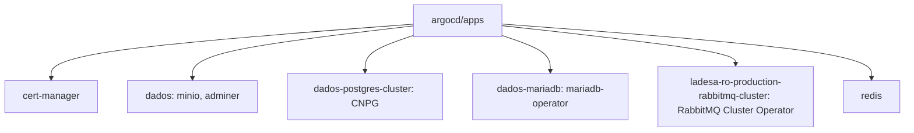
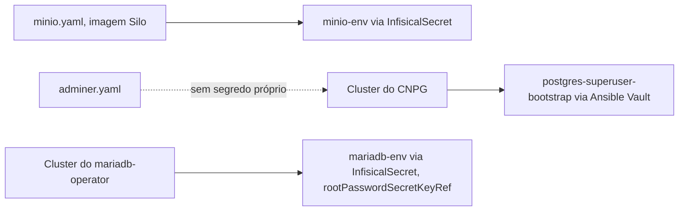

# Foundation

Manifests dos core services em `argocd/apps`, trazidos como já rodam hoje no cluster, sem trocar tecnologia nenhuma. Organizado por categoria desde 2026-08-21 (`operators/`, `data/`, `messaging/`, `platform/`, `argocd/applications/` segue o mesmo esquema), inspirado no padrão já validado em `Abrl/infrastructure/workloads/*/gitops/`. Renomeado de `argocd/apps`/`argocd/foundation` pra `argocd/applications`/`argocd/apps` em 2026-08-21, batendo com o nome exato do Abrl (`gitops/applications/`+`gitops/apps/`). Os dois CRs com dado real (`data/dados-postgres-cluster/`, `messaging/rabbitmq-cluster/`) viram chart Helm local (`Chart.yaml`+`templates/`+`values.yaml`); o resto continua manifesto cru, decisão deliberada, não wholesale, ver [Pendências](../operacao/pendencias.md#debito-tecnico-organizacao-de-pastas-e-arquivos-em-argocd) pro raciocínio completo.

[`cert-manager`](../aprender/tls-automatico.md): migrado pro chart oficial `jetstack/cert-manager` (v1.21.1) em 2026-08-21, plano próprio com dead man switch (ver [Pendências](../operacao/pendencias.md)). Deixou de ser manifesto vendorizado (`kubectl apply -f`, sem Helm). `argocd/applications/operators/cert-manager.yaml` aponta `source.repoURL: https://charts.jetstack.io`, `chart: cert-manager`, `releaseName: cert-manager` fixado explicitamente (pra bater com o `app.kubernetes.io/instance` que já existia nos recursos ao vivo desde a instalação original). `values` inline mínimo (`crds.enabled: true`, pra manter as 6 CRDs na mesma Application/sync-wave de antes; `startupapicheck.enabled: false`, pra não introduzir um Job novo que o manifesto anterior nunca teve). Verificado antes do sync com `helm template` comparado documento a documento contra o manifesto antigo: só diferença real foi labels `helm.sh/chart`/`app.kubernetes.io/managed-by` aditivas, e o `Namespace`, que o chart não renderiza (não é removido porque `cert-manager` continua sem `automated`/prune). Depois do sync: `uid`/`creationTimestamp` idênticos nos 3 `Deployment` e nas 6 CRD (zero recriação), provado com um `Certificate` de teste descartável contra o `ClusterIssuer` real que o webhook (validação) e o issuer (emissão) continuam funcionando de ponta a ponta, não só que os pods sobem. O histórico anterior (upgrade de v1.16.2 pra v1.21.1 do manifesto vendorizado, mesmo dia) permanece válido como registro de como a versão chegou até aqui antes da troca de mecanismo.

`dados`: `minio.yaml` e `adminer.yaml` foram copiados como estão de `/root/dados/k8s/stacks/` no node, sem segredo nenhum, só referenciam Secrets por nome (ver [Dados no cluster](../aprender/dados-no-cluster.md) sobre esse trade-off). `minio-env` chega via [`InfisicalSecret`](../aprender/infisical.md) (projeto `foundation-minio-z-hvh`). A imagem de `minio.yaml` foi trocada em 2026-08-21 de `docker.io/minio/minio` (Community Edition descontinuada, release binário parou de ser mantido) pro [Silo](https://github.com/pgsty/silo), fork comunitário mantido pelo projeto Pigsty, drop-in (mesmo CLI, mesmas env vars, mesmo formato de dado): investigação achou zero bucket e nenhum consumidor real no cluster, então a troca foi direta, sem migração de dado nem downtime relevante. Estes dois serviços declaram `NodePort`, mas **não há NAT nenhum expondo essas portas de fora** (achado corrigido em 2026-08-21, ver [Pendências](../operacao/pendencias.md#revisao-de-seguranca-portas-ingress-e-service-expostos): testado ao vivo, `firewalld` bloqueia de verdade, só 22/80/443 respondem da internet real). O acesso a `adminer.ladesa.com.br`/o console do MinIO acontece pelo `Ingress` (porta 80/443 via Traefik), não por essas portas NodePort diretamente. Nenhum desses serviços tem [backup](../aprender/backup-e-disaster-recovery.md) automatizado hoje; se o disco do node morresse, o dado ali seria perdido sem recuperação possível.

O Postgres é diferente: era um `postgres.yaml` do mesmo tipo (Deployment simples, `docker.io/postgres:18`, `hostPath`, com `NodePort`), **migrado pro [CloudNativePG](https://cloudnative-pg.io) em 2026-08-21** (`argocd/apps/data/dados-postgres-cluster/`, chart Helm local desde a reorganização de pastas, `Application` própria `foundation-dados-postgres-cluster`). Motivo prático, não só preferência: `docker.io/postgres` não roda sob o CNPG (o operador exige UID fixo que a imagem genérica não define), então não existe adoção in-place, foi migração de dado de verdade via `bootstrap.initdb.import` (`type: monolith`), lendo a instância antiga ainda rodando (só leitura, `pg_dump`, nunca escreveu na origem). Os 4 roles existentes (`ladesa`, `infisical`, `api-dev`, `sso-production`) e os 5 databases com dado real (`postgres`/`ladesa` ficaram de fora, conferidos ao vivo sem nenhuma tabela) foram preservados; 3 dos 4 roles mantiveram a senha original (testado com login de verdade contra cada um), só `ladesa` teve senha nova gerada (não tinha nenhum consumidor real, ver `managed.roles` no CR pro porquê). O `Service` novo reaproveita o nome exato `db-postgres`, nenhuma aplicação precisou editar connection string. Não tem mais NodePort público, só `ClusterIP` interno (decisão desta mesma migração: banco de dados exposto direto na internet era risco desnecessário).

O cutover em si teve um incidente real, documentado em [Aprender: Argo CD](../aprender/argocd.md#duas-applications-o-mesmo-recurso-por-que-nao-da-erro): sincronizar as duas `Applications` (a antiga e a nova) ao mesmo tempo fez o Argo CD sobrescrever o seletor da `Service` existente silenciosamente (mesmo field manager `argocd-controller` nas duas), ~10 minutos de indisponibilidade real até a correção manual. O cutover final foi refeito fora do Argo CD, num comando deliberado, com dead man switch armado, e verificação de cada aplicação (Keycloak, Infisical, management-service) respondendo de verdade antes de confirmar.

O MariaDB seguiu o mesmo caminho, também em 2026-08-21, `argocd/apps/data/dados-mariadb/` via [mariadb-operator](https://github.com/mariadb-operator/mariadb-operator) (Helm, `foundation-mariadb-operator-crds` + `foundation-mariadb-operator`, mesmo padrão de chart externo já usado pro Infisical). Diferença real do Postgres: o `mariadb-operator` não tem um mecanismo de import de instância externa ao vivo (o caminho oficial é dump manual + `bootstrapFrom` um backup), mas isso não importou aqui porque a investigação ao vivo achou que este MariaDB nunca teve banco de aplicação nenhum, só os schemas de sistema (`mysql`, `information_schema`, `performance_schema`, `sys`) e usuários padrão da imagem. A senha do `root` foi preservada mesmo assim, via `rootPasswordSecretKeyRef` apontando pro `mariadb-env` já existente (testado com login de verdade contra o `Service` nova). Cutover da `Service db-mariadb` feito com a mesma disciplina aprendida no incidente do Postgres (fora do sync automático do Argo CD), mesmo o risco sendo bem menor aqui por não haver consumidor real.

O RabbitMQ seguiu o mesmo caminho do Postgres/MariaDB, também em 2026-08-21, migrado do `deployment.yaml` simples (uma réplica, sem HA) pro [RabbitMQ Cluster Operator](https://www.rabbitmq.com/kubernetes/operator/operator-overview) oficial (mantido pela Broadcom/VMware): release manifest vendorizado (`argocd/apps/operators/rabbitmq-operator/cluster-operator-v2.22.4.yml`, `kubectl apply` sem Helm, mesmo padrão do cert-manager/CNPG antes de migrarem pro chart oficial) e um `RabbitmqCluster` novo (`argocd/apps/messaging/rabbitmq-cluster/`, chart Helm local desde a reorganização de pastas). Motivo prático que disparou a migração: a imagem `docker.io/bitnami/rabbitmq:3.12` foi apagada do Docker Hub em 2025 (catálogo Bitnami descontinuado), mitigado primeiro trocando pra `docker.io/bitnamilegacy/rabbitmq:3.12` (congelado, sem mais patch), depois substituído de vez pelo operador. Diferente do MariaDB, o RabbitMQ tem mecanismo nativo de import: `rabbitmqctl export_definitions` (usuários, vhosts, filas, exchanges, bindings, senhas só como `password_hash`, nunca em texto puro) carregado no cluster novo via `load_definitions`, segredo cifrado em `infrastructure-vault`. Achado não documentado em lugar nenhum na internet no momento da migração: o startup probe padrão do operador (`/api/health/checks/reached-target-cluster-size`) só existe a partir do RabbitMQ 4.2.4, causa 404 permanente em qualquer versão anterior (confirmado com uma chamada HTTP direta de dentro do pod, não só suposição); resolvido com a annotation `rabbitmq.com/legacy-startup-probe: "true"`, sem precisar pular pro RabbitMQ 4.x sem vetar antes. O cutover das Services (`rabbitmq-amqp`, ainda `LoadBalancer` na 5672; `rabbitmq-web`, ainda `NodePort` na porta do painel) foi feito fora do Argo CD (mesma disciplina do Postgres), e como conexões AMQP existentes não caem sozinhas só por trocar o selector da Service, os consumidores reais (`managements-service`, `timetable-generator-dev`) só migraram de fato depois de um `rabbitmqctl close_all_connections` deliberado no broker antigo, verificado com `rabbitmqctl list_connections` antes e depois. O Deployment/PVC antigos continuam no repositório, de propósito: como o próprio RabbitMQ será desligado quando o `management-service` migrar de mensageria, a remoção do legado fica pra quando fizer sentido, não é urgente (ver [Pendências](../operacao/pendencias.md)). A configuração de definitions vai por Ansible Vault (diferente do `infisicalsecret-rabbitmq-config.yaml` antigo), porque o import depende de estar disponível no bootstrap do pod, não só depois que o cluster já subiu.

`redis`: o manifesto originalmente aplicado no cluster, visível na annotation `kubectl.kubernetes.io/last-applied-configuration`, declarava o Service `redis-server` como `LoadBalancer`. O que está rodando hoje é `ClusterIP`, um drift real entre o que foi aplicado uma vez e o estado atual. `service.yaml` congela o estado atual, `ClusterIP`, pra não mudar comportamento ao adotar. Se o [`LoadBalancer`](../aprender/rede-interna-do-cluster.md) for necessário, é uma mudança deliberada, feita à parte. `redis-secret` vai pelo Ansible Vault, mesmo motivo do `pg-env`.

## Débito técnico conhecido: `securityContext` ausente

O gate `misconfig` do workflow `security.yml` (trivy) achou, na primeira varredura real contra o repositório inteiro (2026-08-21), que nenhuma das Deployments trazidas como estão de `dados` (`postgres`, `mariadb`, `minio`, `adminer`), `rabbitmq` e `redis-server` declara `securityContext`: rodam com o usuário default da imagem (`KSV-0118`, quase sempre root) e sem `readOnlyRootFilesystem` (`KSV-0014`). Achado real, não falso positivo, mas corrigir direito exige conferir o UID/GID correto de cada imagem individualmente (`postgres`, `mariadb`, `minio`, `bitnami/redis`, `rabbitmq` não necessariamente usam o mesmo usuário, e declarar o UID errado quebra o container em vez de só travar o CI), então foi deliberadamente adiado em vez de corrigido às pressas: o job ficou `continue-on-error: true` até essa varredura acontecer. Faz parte da modernização de cada Application/Deployment planejada para depois da migração do Postgres pro CloudNativePG (que já resolve esse ponto especificamente pra `postgres`, o CNPG roda com usuário fixo não-root por padrão; documentação própria do CR chega junto com o cutover).

A `ClusterRole` do CNPG (`KSV-0041`/`KSV-0056`/`KSV-0114`/`KSV-0053`, acesso amplo a `secrets`/webhooks/`pods/exec`) é diferente: faz parte do manifesto oficial vendorizado sem modificação (ver acima e [Lições do bootstrap](licoes-do-bootstrap.md)), exigido pelo próprio operador pra funcionar. Não é um débito a corrigir, continua excluída do scan (`skip-dirs` em `security.yml`), mesmo tratamento que `jscpd`/`yamllint` já dão a esse diretório. `cert-manager` tinha o mesmo tratamento até migrar pro chart oficial em 2026-08-21 (ver acima); a partir daí saiu de todas essas exclusões, inclusive do trivy. O chart oficial já define `securityContext` (`runAsNonRoot`, `seccompProfile`, `allowPrivilegeEscalation: false`) por padrão, então essa `ClusterRole` específica hoje é escaneada normalmente, sem achado novo.
