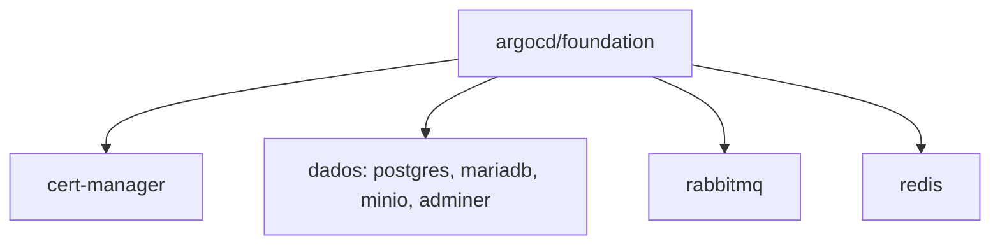
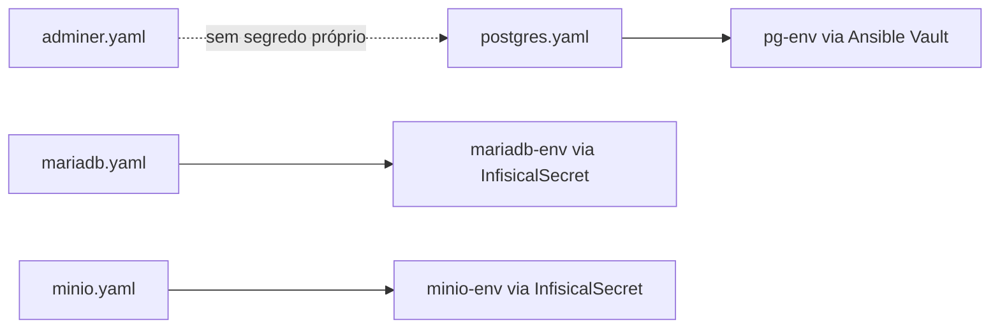

# Foundation

Manifests dos core services em `argocd/foundation`, trazidos como já rodam hoje no cluster, sem trocar tecnologia nenhuma.

[`cert-manager`](../aprender/tls-automatico.md): `cert-manager-v1.16.2.yaml` é o manifesto oficial vendorizado, não algo gerado a partir de `kubectl get -o yaml`. O cert-manager no cluster hoje foi instalado via `kubectl apply -f` do release manifest oficial da Jetstack, não via Helm. A representação mais fiel disso em GitOps é o próprio arquivo que foi aplicado, não uma reconstrução a partir do estado ao vivo, que perderia CRDs e RBAC e ganharia ruído de runtime. Foi baixado de `https://github.com/cert-manager/cert-manager/releases/download/v1.16.2/cert-manager.yaml`, e a versão da imagem foi conferida contra o Deployment ao vivo antes de commitar. Pra atualizar a versão: baixar o novo release manifest, substituir o arquivo, e validar com `kubectl diff` antes de deixar o Argo CD sincronizar.

`dados`: `postgres.yaml`, `mariadb.yaml`, `minio.yaml` e `adminer.yaml` foram copiados como estão de `/root/dados/k8s/stacks/` no node, sem segredo nenhum, só referenciam Secrets por nome (ver [Dados no cluster](../aprender/dados-no-cluster.md) sobre esse trade-off). `mariadb-env` e `minio-env` chegam via [`InfisicalSecret`](../aprender/infisical.md) (projetos `foundation-mariadb-6s-ji` e `foundation-minio-z-hvh`). `pg-env` vai pelo [Ansible Vault](../aprender/ansible.md#ansible-vault), pelo motivo já explicado em [Segredos](segredos.md). Estes serviços têm mapeamento de porta externo, provavelmente NAT de algum roteador ou proxy fora do cluster: Postgres na 30989, MinIO S3 na 30900, MinIO console na 30901, MariaDB na 30996, Adminer na 30001. Esse mapeamento não está documentado neste repositório; confirmar com quem administra a rede antes de mudar qualquer uma dessas portas. Nenhum desses serviços tem [backup](../aprender/backup-e-disaster-recovery.md) automatizado hoje; se o disco do node morresse, o dado ali seria perdido sem recuperação possível.

`rabbitmq`: `deployment.yaml`, `pvc.yaml` e `service.yaml`, copiados como já rodam no namespace `ladesa-ro-production`. O Service `rabbitmq-amqp` (porta 5672, protocolo AMQP, ver [Mensageria e streaming](../aprender/mensageria.md)) é [`LoadBalancer`](../aprender/rede-interna-do-cluster.md), exposto de fora; `rabbitmq-web` (porta 80, o painel de administração) é `NodePort`. A configuração vai por [`InfisicalSecret`](../aprender/infisical.md) (`infisicalsecret-rabbitmq-config.yaml`), não por Ansible Vault, diferente de `pg-env`/`redis-secret`, porque não tem dependência circular envolvida aqui.

`redis`: o manifesto originalmente aplicado no cluster, visível na annotation `kubectl.kubernetes.io/last-applied-configuration`, declarava o Service `redis-server` como `LoadBalancer`. O que está rodando hoje é `ClusterIP`, um drift real entre o que foi aplicado uma vez e o estado atual. `service.yaml` congela o estado atual, `ClusterIP`, pra não mudar comportamento ao adotar. Se o [`LoadBalancer`](../aprender/rede-interna-do-cluster.md) for necessário, é uma mudança deliberada, feita à parte. `redis-secret` vai pelo Ansible Vault, mesmo motivo do `pg-env`.

## Débito técnico conhecido: `securityContext` ausente

O gate `misconfig` do workflow `security.yml` (trivy) achou, na primeira varredura real contra o repositório inteiro (2026-08-21), que nenhuma das Deployments trazidas como estão de `dados` (`postgres`, `mariadb`, `minio`, `adminer`), `rabbitmq` e `redis-server` declara `securityContext`: rodam com o usuário default da imagem (`KSV-0118`, quase sempre root) e sem `readOnlyRootFilesystem` (`KSV-0014`). Achado real, não falso positivo, mas corrigir direito exige conferir o UID/GID correto de cada imagem individualmente (`postgres`, `mariadb`, `minio`, `bitnami/redis`, `rabbitmq` não necessariamente usam o mesmo usuário, e declarar o UID errado quebra o container em vez de só travar o CI), então foi deliberadamente adiado em vez de corrigido às pressas: o job ficou `continue-on-error: true` até essa varredura acontecer. Faz parte da modernização de cada Application/Deployment planejada para depois da migração do Postgres pro CloudNativePG (que já resolve esse ponto especificamente pra `postgres`, o CNPG roda com usuário fixo não-root por padrão; documentação própria do CR chega junto com o cutover).

As `ClusterRole` do `cert-manager` e do CNPG (`KSV-0041`/`KSV-0056`/`KSV-0114`/`KSV-0053`, acesso amplo a `secrets`/webhooks/`pods/exec`) são diferentes: fazem parte do manifesto oficial vendorizado sem modificação (ver acima e [Lições do bootstrap](licoes-do-bootstrap.md)), exigido pelo próprio operador pra funcionar. Não são um débito a corrigir, foram excluídas do scan (`skip-dirs` em `security.yml`), mesmo tratamento que `jscpd`/`yamllint` já dão a esses diretórios.
