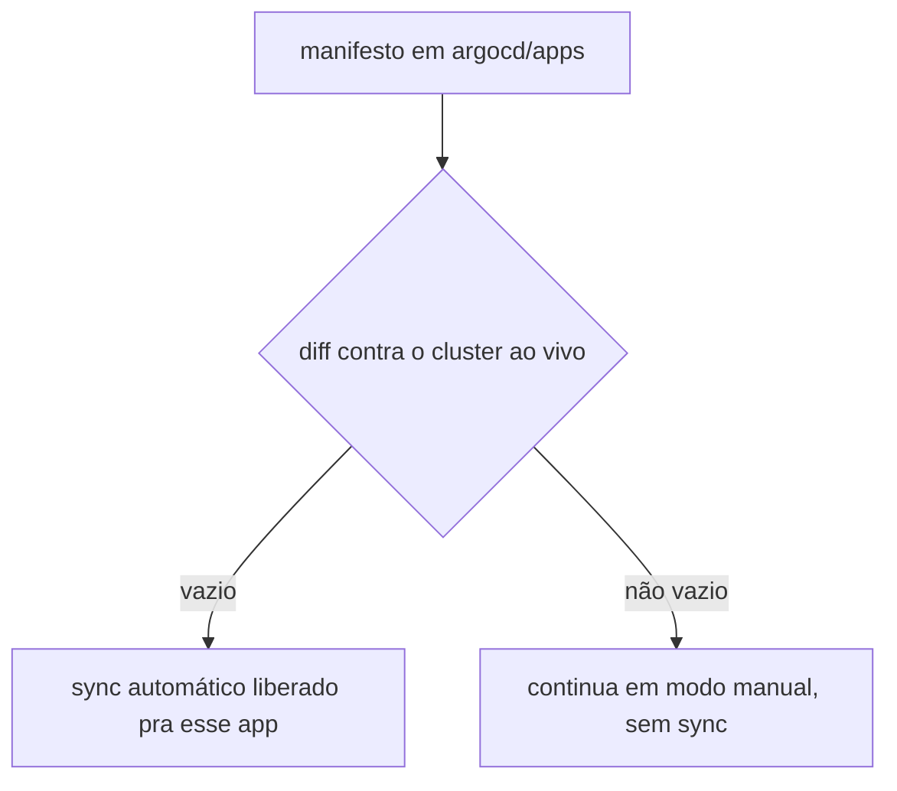
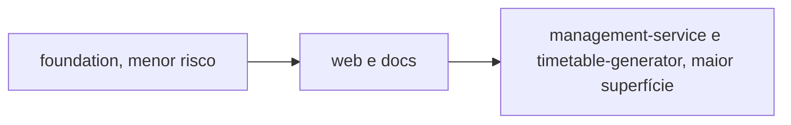

# Gate de drift zero

Este cluster já tem dado real de produção. Nada sincroniza automaticamente, nem pelo [Ansible](../aprender/ansible.md) nem pelo [Argo CD](../aprender/argocd.md), até que todo manifesto em `argocd/apps` mostre diff vazio contra o cluster ao vivo, conferido app por app com o Argo CD ainda em [modo manual](../aprender/argocd.md#sync-manual-vs-automatico). Isso vale pra esta adoção inicial e pra qualquer mudança futura nesses manifests.

Depois que os diffs baterem limpos, `foundation` entra primeiro por ser menor risco. Depois `web` e `docs`. `management-service` e `timetable-generator` por último, por terem a maior superfície.

