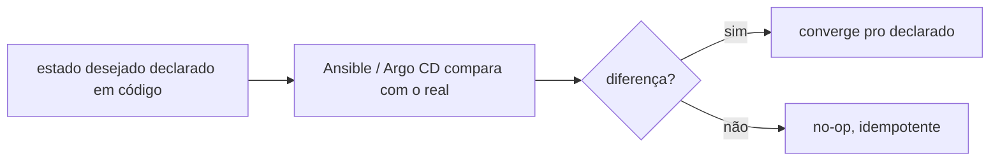
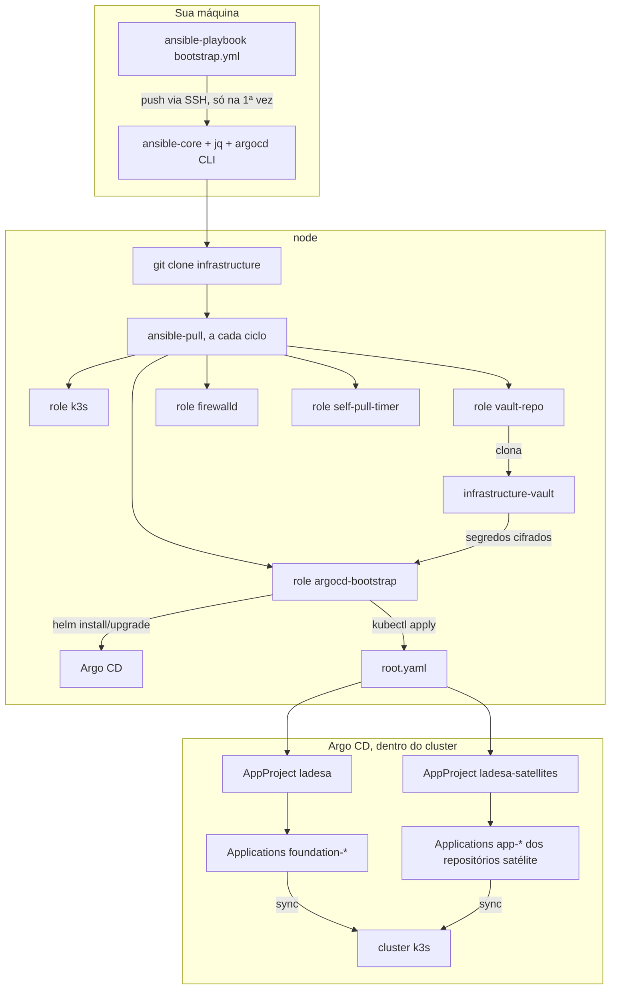
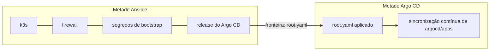

# Arquitetura

Esta seção é **referência**, no sentido de [Diátaxis](../aprender/diataxis.md): fato sobre este cluster específico, organizado pra consulta, com o porquê de cada decisão ao lado, não uma lição guiada nem um passo a passo. O desenho é como as peças descritas em [Aprender](../aprender/index.md) se encaixam aqui, e por que cada decisão foi tomada. Se você quer só executar o bootstrap, vá direto pra [Operação](../operacao/checklist.md); volte aqui quando precisar entender o porquê por trás de um passo.

O objetivo deste repositório é ser a fonte da verdade de como a VM é configurada. Nada de "esqueci como configurei isso": todo estado que importa está declarado em código, versionado, e reaplicável do zero. Duas propriedades tornam isso possível, ambas explicadas em detalhe em [Ansible](../aprender/ansible.md):

**Declarativo**: você descreve o estado desejado (esta versão do k3s, essas portas abertas, esses Applications no Argo CD), não os passos pra chegar lá. Quem interpreta a diferença entre o que está declarado e o que existe de verdade, e decide o que fazer, é a ferramenta (Ansible, Argo CD), não você.

**Idempotente**: rodar duas vezes produz o mesmo resultado que rodar uma vez. Isso é o que permite rodar tudo de novo, periodicamente, sem supervisão (o `ansible-pull` a cada ciclo, o Argo CD continuamente) sem medo de quebrar algo que já está funcionando.

## O fluxo de ponta a ponta

Duas metades bem diferentes: a esquerda (Ansible) cuida só do que precisa existir antes de qualquer coisa em Kubernetes existir, o próprio k3s, o firewall, os segredos de bootstrap, e o release do Argo CD. A partir do momento em que o `root.yaml` é aplicado, a direita (Argo CD) assume: tudo em `argocd/apps` é sincronizado continuamente, sem depender do Ansible rodar de novo. A fronteira entre as duas metades está detalhada em [`argocd-bootstrap`](roles/argocd-bootstrap.md).

## Por onde ir a partir daqui

| Se você precisa entender | Vá pra |
|---|---|
| Onde cada coisa mora no repositório | [Estrutura](estrutura.md) |
| O que cada role do Ansible faz e por quê | [Roles do Ansible](roles/k3s.md) |
| Como e por que os segredos ficam fora deste repositório | [Segredos](segredos.md) |
| O que já roda no cluster hoje, trazido como está | [Foundation](foundation.md) |
| Por que nada sincroniza automaticamente ainda | [Gate de drift zero](gate-de-drift-zero.md) |

Pra executar o bootstrap de verdade, veja [Operação](../operacao/checklist.md).
