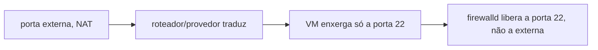
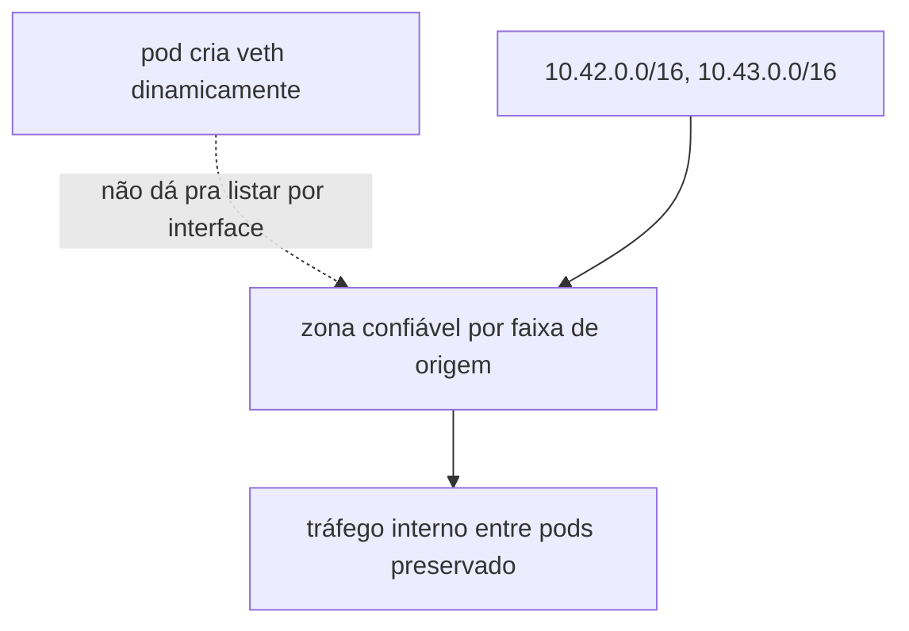

# firewalld

Liga um [firewall](../../aprender/firewalld.md) pela primeira vez num node de produção que hoje não tem nenhum. Confirmei isso direto no node: `firewalld` não está instalado nem ativo. É a mudança de maior risco de todo o bootstrap, uma regra errada pode cortar o próprio SSH ou quebrar o tráfego entre pods.

Por isso este role fica na [tag](../../aprender/ansible.md#tags) `firewalld`, pulada por padrão pelo timer do [`ansible-pull`](../../aprender/ansible.md#ansible-pull-vs-push). Só roda manualmente, com [`--check`](../../aprender/ansible.md#modo-check) primeiro, com alguém acompanhando. Depois da primeira execução supervisionada, o role é idempotente e pode voltar pro caminho automático.

As tasks usam `firewall-cmd` direto via `ansible.builtin.command`, com um `--query-*` antes de cada mudança pra decidir se aplica ou não, em vez do módulo `ansible.posix.firewalld`. Essa collection não vem com `ansible-core` (o pacote que instalamos, de propósito, é o mínimo, não o meta-pacote `ansible` que traz collections junto), e não faz sentido instalar uma collection nova só pra este role quando dá pra ficar só com o que já está no node.

`firewalld_portas_publicas` é só o que precisa estar aberto pra qualquer origem: a porta do SSH e o Traefik do k3s. `firewalld_porta_ssh` tem default `22`, comitado normalmente: não é segredo, é a porta padrão de qualquer instalação SSH, diferente da porta externa usada pra administrar o node (essa sim fica de fora do git, é NAT feito antes de chegar na VM, provavelmente no provedor ou roteador).

Atenção a essa pegadinha, conferida de verdade no node: o `sshd` da própria VM escuta na porta 22 padrão (`ss -tlnp` confirma, `0.0.0.0:22`), sem nenhum `Port` customizado no `sshd_config`, mesmo quem administra acessando por uma porta diferente de fora. O firewalld roda depois que o NAT já traduziu a porta, então a regra tem que liberar a porta que a VM enxerga, 22, não a porta externa usada em `~/.ssh/config`. Usar a porta externa aqui bloquearia o próprio SSH ao ligar o firewalld.

`firewalld_interface_admin` é a interface da [malha ZeroTier](../../aprender/ssh.md#vpn-ponto-a-site-vs-malha) já em uso neste node. O nome real foi conferido com `ip -o link show`; como o ZeroTier nomeia por rede, vale reconferir se o node for reprovisionado ou entrar em outra network. Administração, API do k3s e afins, fica restrita a essa interface, nunca exposta na interface pública.

`firewalld_redes_k3s` são as duas faixas internas do [CNI](../../aprender/rede-interna-do-cluster.md) do k3s, pods em 10.42.0.0/16 e services em 10.43.0.0/16, conferidas de verdade no cluster com `kubectl get nodes -o jsonpath='{.items[0].spec.podCIDR}'` e o clusterIP do Service `kubernetes`. Elas vão pra zona confiável por origem, não por nome de interface, porque cada pod cria sua própria interface `veth*` dinamicamente e não daria pra manter uma lista fixa. Sem isso, o firewalld aplicaria a política padrão da zona pública também ao tráfego interno entre pods, derrubando a rede do cluster inteiro. Esse era o risco real por trás do aviso genérico de que a mudança "pode quebrar o tráfego entre pods".

