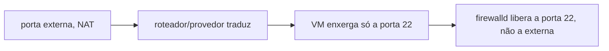
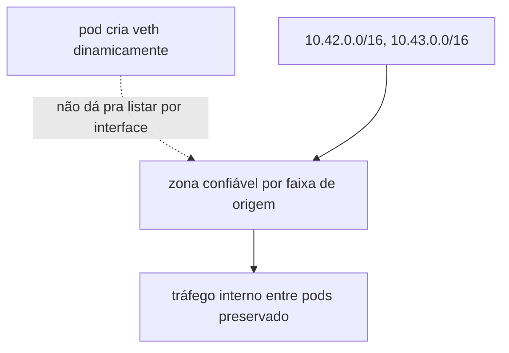

# firewalld

Liga um [firewall](../../aprender/firewalld.md) pela primeira vez num node de produção que antes não tinha nenhum. O role foi executado de verdade em produção em 2026-08-21, com supervisão direta (ver [passo 8 do bootstrap](../../operacao/bootstrap.md#8-ligar-o-firewalld)): `firewalld` ficou ativo, a zona pública restrita a SSH/HTTP/HTTPS, a interface ZeroTier e as redes internas do k3s na zona confiável, e uma segunda execução real confirmou idempotência (`changed=0`). É a mudança de maior risco de todo o bootstrap, uma regra errada podia cortar o próprio SSH ou quebrar o tráfego entre pods.

Por isso este role fica na [tag](../../aprender/ansible.md#tags) `firewalld`, pulada por padrão pelo timer do [`ansible-pull`](../../aprender/ansible.md#ansible-pull-vs-push) (ver [self-pull-timer](self-pull-timer.md)). Só roda manualmente, com [`--check`](../../aprender/ansible.md#modo-check) primeiro, com alguém acompanhando. Depois da primeira execução supervisionada, o role é idempotente e o node volta pro caminho automático sem nunca reativar este role sozinho.

As tasks usam `firewall-cmd` direto via `ansible.builtin.command`, com um `--query-*` antes de cada mudança pra decidir se aplica ou não, em vez do módulo `ansible.posix.firewalld`. Essa collection não vem com `ansible-core` (o pacote que instalamos, de propósito, é o mínimo, não o meta-pacote `ansible` que traz collections junto), e não faz sentido instalar uma collection nova só pra este role quando dá pra ficar só com o que já está no node.

`firewalld_portas_publicas` é só o que precisa estar aberto pra qualquer origem: a porta do SSH e o Traefik do k3s. `firewalld_porta_ssh` tem default `22`, comitado normalmente: não é segredo, é a porta padrão de qualquer instalação SSH, diferente da porta externa usada pra administrar o node (essa sim fica de fora do git, é NAT feito antes de chegar na VM, provavelmente no provedor ou roteador).

Atenção a essa pegadinha, conferida de verdade no node: o `sshd` da própria VM escuta na porta 22 padrão (`ss -tlnp` confirma, `0.0.0.0:22`), sem nenhum `Port` customizado no `sshd_config`, mesmo quem administra acessando por uma porta diferente de fora. O firewalld roda depois que o NAT já traduziu a porta, então a regra tem que liberar a porta que a VM enxerga, 22, não a porta externa usada em `~/.ssh/config`. Usar a porta externa aqui bloquearia o próprio SSH ao ligar o firewalld.

`firewalld_interface_admin` é a interface da [malha ZeroTier](../../aprender/ssh.md#vpn-ponto-a-site-vs-malha) já em uso neste node. O nome real foi conferido com `ip -o link show`; como o ZeroTier nomeia por rede, vale reconferir se o node for reprovisionado ou entrar em outra network. Administração, API do k3s e afins, fica restrita a essa interface, nunca exposta na interface pública.

`firewalld_redes_k3s` são as duas faixas internas do [CNI](../../aprender/rede-interna-do-cluster.md) do k3s, pods em 10.42.0.0/16 e services em 10.43.0.0/16, conferidas de verdade no cluster com `kubectl get nodes -o jsonpath='{.items[0].spec.podCIDR}'` e o clusterIP do Service `kubernetes`. Elas vão pra zona confiável por origem, não por nome de interface, porque cada pod cria sua própria interface `veth*` dinamicamente e não daria pra manter uma lista fixa. Sem isso, o firewalld aplicaria a política padrão da zona pública também ao tráfego interno entre pods, derrubando a rede do cluster inteiro. Esse era o risco real por trás do aviso genérico de que a mudança "pode quebrar o tráfego entre pods".

## Por que o role reinicia o k3s depois do reload

O node já roda k3s há muito tempo sem firewalld nenhum ativo. O [issue #7542 do próprio projeto k3s](https://github.com/k3s-io/k3s/issues/7542) documenta exatamente esse cenário: `firewall-cmd --reload` rodado contra um k3s já ativo há muito tempo (não uma instalação nova) flusha as regras de iptables que o k3s e o Traefik já tinham inserido. A recuperação automática do k3s depois disso é só parcial, algumas regras voltam sozinhas depois de ~30 segundos, nem todas; alguns relatos só conseguiram normalizar de vez com reboot completo do servidor.

Em vez de confiar nessa recuperação parcial, o role reinicia o `k3s` explicitamente logo depois do `--reload`, forçando ele reconstruir as próprias regras de iptables do zero, de forma limpa. Esse restart só acontece quando algo de fato mudou (ativação do firewalld pela primeira vez, ou uma regra nova de zona/porta/interface/rede), não em toda re-execução idempotente: uma task `set_fact` reúne o resultado de cada query já feita nas tasks anteriores (zona padrão, serviços de fábrica, portas, interface, redes) numa única condição, e tanto o `--reload` quanto o restart do k3s ficam condicionados a ela.

## Por que este role não tem um scenario Molecule

Diferente de um role que só copia arquivo ou garante pacote instalado, testar este role de verdade (ver [Molecule](../../aprender/ansible.md#molecule)) significaria rodar `firewall-cmd` contra um `firewalld` real, gerenciado por systemd, dentro de um container privilegiado. Isso foi tentado: um scenario Molecule com Docker (imagem `geerlingguy/docker-debian12-ansible`, systemd como PID 1) chegou a convergir o role inteiro com sucesso, incluindo a decisão de mudança real e o `--reload`. Mas antes disso funcionar, o teste expôs uma race de verdade que valeu a pena corrigir: `firewall-cmd` trava aguardando uma resposta de D-Bus até o `polkit.service` conseguir se registrar como `org.freedesktop.PolicyKit1`, e a task original só conferia `systemd: state=started` do firewalld, sem esperar essa autorização ficar pronta de fato. O role agora tem uma task dedicada (`Conferir se o firewalld está de fato ativo`, com `retries`/`until` em `firewall-cmd --state`) que absorve essa janela antes de qualquer comando real ser disparado, tanto no node de produção quanto em qualquer ambiente de teste.

Mesmo com essa correção, a fragilidade do polkit dentro de um container aninhado (documentada tanto pelo [próprio Ansible](https://github.com/ansible/ansible/issues/36483) quanto pelo [systemd](https://github.com/systemd/systemd/issues/13955), ver [Molecule](../../aprender/ansible.md#molecule)) tornou o tempo de execução do teste inconsistente, de segundos a minutos, dependendo de quantas vezes o polkit precisou tentar se registrar. Pra este role específico, esse ruído não compensa: a mudança de maior risco do bootstrap já depende de supervisão direta no node real (ver [passo 8 do bootstrap](../../operacao/bootstrap.md#8-ligar-o-firewalld)), com `--check` primeiro e um plano de contingência armado, então um scenario Molecule só duplicaria essa garantia de um jeito mais lento e menos confiável do que a verificação manual que já existe. A correção da race de D-Bus foi mantida no role porque é uma robustez real, válida também em produção; o scenario de teste em si foi descartado.

## O bug de `--check` que só apareceu contra o node real

O primeiro `--check --tags firewalld` de verdade contra o node (antes disso só tinha sido testado via Molecule, ver seção anterior) falhou de um jeito que nenhum teste anterior tinha exposto: as tasks `Garantir que o firewalld está habilitado no boot` e `Garantir que o firewalld está ativo` (módulo `ansible.builtin.systemd`) dão erro fatal, "Could not find the requested service firewalld: host", em vez de simular graciosamente. A causa é o mesmo padrão descrito em [Modo `--check`](../../aprender/ansible.md#modo-check): a task anterior (`ansible.builtin.package`) só simula a instalação sob `--check`, o pacote não é instalado de verdade, então o módulo `systemd` das duas tasks seguintes consulta o systemd real em busca de uma unit que genuinamente não existe ainda, e não tem como simular esse resultado, só falhar.

Diferente do `copy` com `remote_src: true` (já documentado em Aprender), aqui não dava pra usar o gate `firewalld_configurar_gate`, porque ele só protege o bloco de zonas/regras, que vem depois dessas duas tasks. A correção foi `ignore_errors: "{{ ansible_check_mode }}"` nas duas: sob `--check`, a falha vira só um `ignored` na saída; numa execução real, continua falhando duro se algo der errado de verdade. O mesmo bug e a mesma correção apareceram de novo no role [self-pull-timer](self-pull-timer.md), o que sugere que qualquer role que instala um pacote/arquivo e na sequência gerencia a unit systemd dele está sujeito a isso na primeira execução contra um host limpo.
