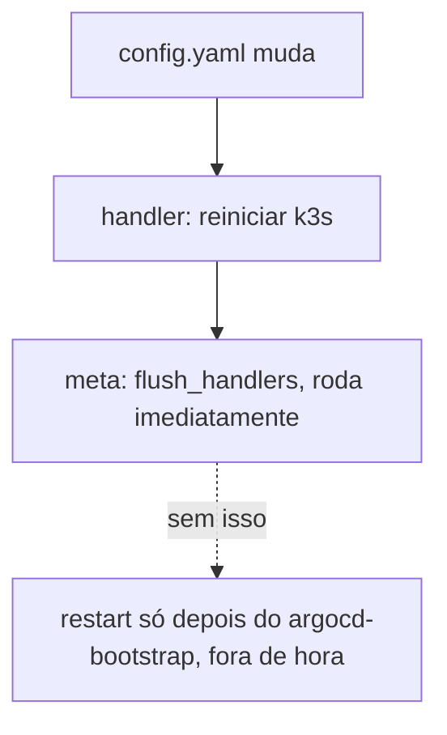
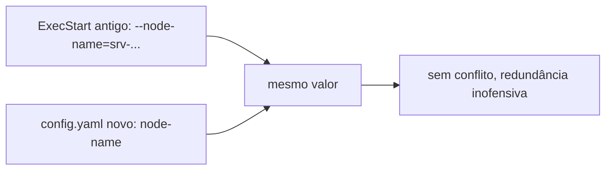

# k3s

Instala e mantém o [k3s](../../aprender/k3s.md) fixado por versão e checksum. Só reinstala se a versão instalada divergir de `k3s_versao`.

Este cluster roda num único node, sem alta disponibilidade de control plane nem failover automático se o node cair. Escolha consciente pro tamanho e criticidade atual do projeto, não uma limitação técnica do k3s, que suporta múltiplos nodes e control plane em HA se algum dia isso for necessário (ver [k3s](../../aprender/k3s.md)).

A configuração do servidor, hoje só `node-name`, vai em `/etc/rancher/k3s/config.yaml`, o mecanismo declarativo nativo do k3s, em vez de flag solta no `ExecStart`. É o jeito de escalar isso pra qualquer config futura (`disable`, `tls-san`, etc.) virar uma linha no template em vez de mais uma variável de ambiente espalhada. Toda mudança nesse arquivo reinicia o k3s, via handler, e o role força esse handler a rodar imediatamente (`meta: flush_handlers`) em vez de deixar pro fim da play. Sem isso, o restart só aconteceria depois do [`argocd-bootstrap`](argocd-bootstrap.md) já ter instalado o [Argo CD](../../aprender/argocd.md) e aplicado o `root.yaml`, um reinício de controle-plane fora de hora e sem relação com o que causou ele.

Na primeira vez que este role rodar contra um node que ainda não tem `/etc/rancher/k3s/config.yaml` (é o caso do node de produção hoje, mesmo sem trocar nenhum valor), o arquivo é criado do zero, o que conta como mudança, e o k3s reinicia. Esperado, coberto pelo `meta: flush_handlers` acima, mas é um reinício de controle-plane de verdade, vale saber antes de rodar.

`k3s_node_name` existe porque o node já rodava com `--node-name=srv-1692732206` antes deste repositório existir, um nome escolhido manualmente, não o que o instalador geraria sozinho a partir do hostname. Conferido direto no node antes de migrar pra cá. O `ExecStart` antigo, gerado da vez em que o k3s foi instalado sem este role, ainda carrega essa flag; como o valor bate com o que `config.yaml` declara agora, não há conflito, só uma redundância inofensiva que só some numa próxima instalação do zero.

