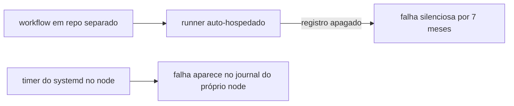

# manutencao

Declara a política de atualização automática do sistema e a coleta de lixo periódica do node. Substitui o repositório `arquivado-cluster-maintenance`, que fazia isso por [GitHub Actions](../../aprender/ci-cd.md) até parar de funcionar sem ninguém notar.

## O que motivou o role

A manutenção do node era feita por dois workflows num repositório separado, executados por um runner auto-hospedado. O runner ficou inativo, o registro dele foi apagado pelo próprio GitHub, e os workflows passaram a falhar. Entre a primeira falha e a descoberta se passaram sete meses.

Nesse intervalo o cache de imagens do containerd cresceu sem limite e o disco do node chegou a 81% de uso. Nenhum alarme disparou, porque o único sinal era um workflow vermelho num repositório que ninguém abria.

A lição que o role incorpora: manutenção do node não deveria depender de uma peça externa ao node. Um timer do systemd falha no mesmo lugar em que a máquina já registra tudo, e o [`ansible-pull`](../../aprender/ansible.md#ansible-pull-vs-push) o reinstala sozinho se alguém apagar.

## Por que o `topgrade` foi aposentado, e não portado

O workflow de atualização rodava `topgrade --yes --allow-root`, que atualiza tudo que encontra no sistema. Isso entra em conflito direto com o contrato deste repositório: `k3s_versao`, `helm_versao` e `argocd_chart_versao` são fixados com checksum em `host_vars`, e [Pendências](../../operacao/pendencias.md) registra que atualizar essas versões é decisão deliberada, nunca automática.

Um atualizador genérico e um repositório que fixa versão por checksum não podem coexistir sem que um dos dois esteja mentindo. O role remove a configuração do `topgrade` do node.

Atualização de pacote do sistema continua acontecendo, pelo `unattended-upgrades`, que é escopado por origem: só o que vem do Debian e do Debian-Security. Isso pega correção de segurança sem tocar no que este repositório fixa.

## As decisões da política de atualização

| Opção | Valor | Por quê |
|---|---|---|
| `Automatic-Reboot` | `false` | node único, reiniciar sozinho derrubaria o cluster inteiro sem ninguém acompanhando |
| `Remove-Unused-Kernel-Packages` | `true` | o node acumulou quatorze versões antigas de kernel, e esse é o mecanismo próprio do apt pra isso |
| `Remove-Unused-Dependencies` | `false` | remoção automática de dependência é o tipo de mudança que deve passar por decisão humana neste cluster |

O arquivo passa a ser template deste repositório. Antes ele era o padrão do pacote, com as opções efetivas espalhadas entre centenas de linhas comentadas, o que torna impossível ver o que de fato está valendo.

## A coleta de lixo

Um script instalado em `/usr/local/sbin`, disparado por timer diário com atraso aleatório, fazendo duas coisas portadas do repositório antigo: apagar `ReplicaSet` com zero réplicas nos namespaces de projeto, e podar imagem de container sem uso.

O script imprime contagem antes e depois e a ocupação do disco, pra que a execução tenha resultado legível no journal em vez de sumir em silêncio. É a diferença entre um trabalho que roda e um trabalho que alguém consegue verificar que rodou.

Imagem de container é cache, não histórico: podar só custa um download na próxima vez que a imagem for necessária. Por isso a poda roda por padrão, diferente do journal, cujo teto o role [`sistema`](sistema.md) declara sem apagar nada.
