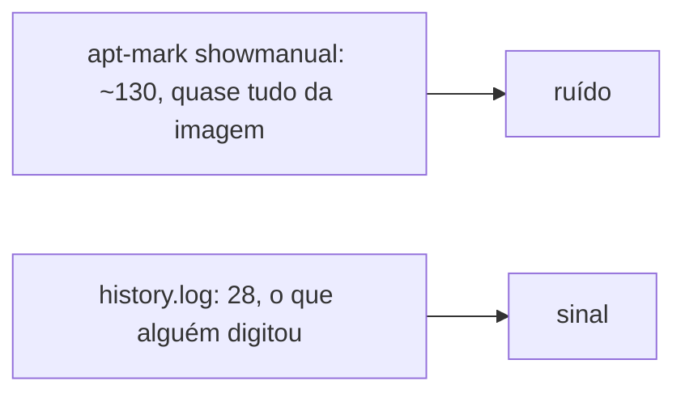
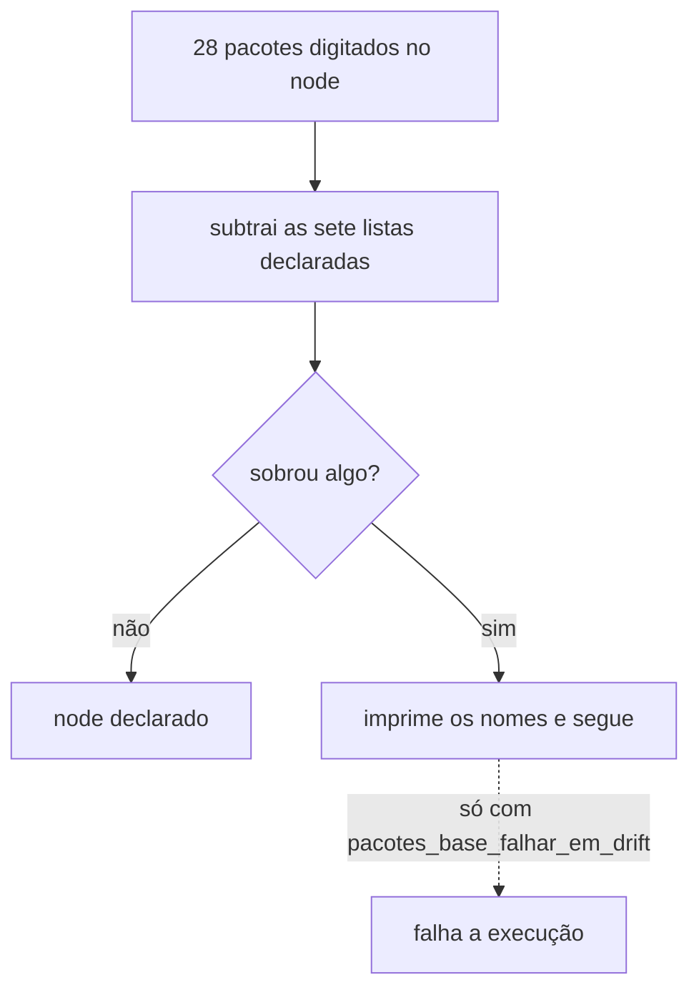

# pacotes-base

Declara os pacotes `apt` que este projeto escolheu instalar no node, e confere se alguém instalou alguma coisa à mão que o repositório não explica. É o primeiro role de `site.yml`, porque instala o que os roles seguintes precisam pra existir.

Fecha a linha de [`ansible-core`, `jq` e o CLI do `argocd`](../../operacao/estado-fora-do-git.md) que até então figurava como pré-requisito impossível de declarar.

## Por que a fonte não é `apt-mark showmanual`

Num cloud image mínimo, `apt-mark showmanual` devolve cerca de 130 pacotes no node `ldsa`, e a maior parte é biblioteca e pacote essencial que a imagem já traz marcado. Usar essa lista como fonte encheria o repositório de ruído e ainda daria a impressão falsa de que este projeto escolheu `libpam0g` ou `base-files`.

A fonte usada é `/var/log/apt/history.log`, que registra o campo `Commandline` de toda execução do `apt`. Filtrar as linhas que contêm `install` devolve exatamente o que uma pessoa digitou naquele node desde a criação da VM, hoje 28 pacotes. É um conjunto pequeno o bastante pra ser classificado item por item, e é o único que responde à pergunta que importa: alguém instalou algo aqui que não está no git.

## As listas e o que cada uma significa

Cada pacote digitado no node cai em exatamente uma lista de `defaults/main.yml`. As três primeiras são instaladas, as quatro últimas existem só pra classificar.

| Lista | Significado |
|---|---|
| `pacotes_base_prerequisitos` | sem isso o [`ansible-pull`](../../aprender/ansible.md#ansible-pull-vs-push) ou o clone do vault não funcionam |
| `pacotes_base_operacao` | tem função permanente no node, como o `smartmontools`, cujo serviço fica habilitado monitorando o disco |
| `pacotes_base_conveniencia` | conveniência de quem administra, não dependência de nada. Está separado justamente pra deixar óbvio que remover essa lista não quebra o cluster |
| `pacotes_base_de_outros_roles` | outro role é o dono, e declarar de novo aqui criaria duas fontes pro mesmo pacote |
| `pacotes_base_do_ambiente` | foi digitado, mas quem decide se existe é a plataforma, não este repositório. Ver [Ambiente do node](../ambiente-do-node.md) |
| `pacotes_base_a_remover` | decisão pontual do passado que hoje não tem consumidor. A remoção acontece supervisionada, fora deste role |
| `pacotes_base_ja_removidos` | já saiu do node, mas continua no `history.log` pra sempre, porque o log é append-only |

As duas últimas precisam existir permanentemente. O `history.log` nunca esquece um `apt install`, então um pacote removido voltaria a aparecer como não classificado em toda execução se não tivesse uma linha explicando que a decisão já foi tomada.

## Por que o role não remove nada

O role instala, mas nunca remove. Remover pacote é irreversível dentro de uma execução que roda sozinha a cada 30 minutos, e o [`ansible-pull`](../../aprender/ansible.md#ansible-pull-vs-push) roda sem supervisão. Um erro de classificação viraria um `apt remove` num node de produção sem ninguém olhando.

`pacotes_base_a_remover` é, então, uma declaração de intenção, não uma ação. A remoção correspondente é feita à mão, com alguém acompanhando.

## Como o gate de drift se comporta

O role compara o que foi digitado no node com a união das sete listas. Quando sobra algo, ele imprime os nomes e segue. Só falha quando `pacotes_base_falhar_em_drift` é ligado explicitamente, que hoje é `false`.

Isso segue a mesma regra dos [checks de CI](../../operacao/desenvolvimento.md): um gate novo nasce informativo, e só vira bloqueante depois que o baseline foi revisado. Aqui o baseline já está limpo, os 28 pacotes estão todos classificados, então ligar o modo bloqueante é uma decisão de quando, não de se.

