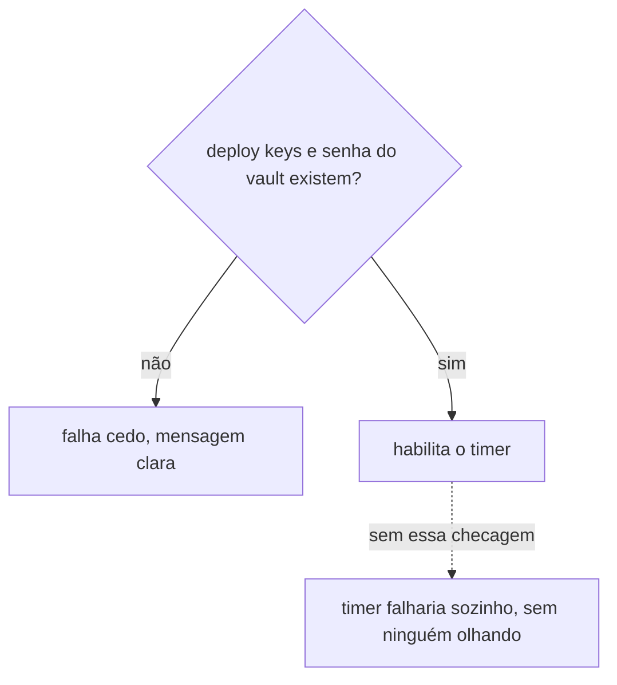
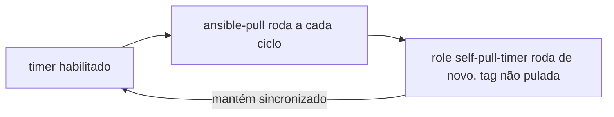

# self-pull-timer

Instala e habilita o timer do systemd que faz o node reconciliar este repositório sozinho, sem depender de ninguém rodando `ansible-playbook` na mão depois disso, o mecanismo de [`ansible-pull`](../../aprender/ansible.md#ansible-pull-vs-push) descrito em Aprender.

Falha cedo, com mensagem clara, se a [deploy key SSH](../../aprender/ssh.md#chave-pessoal-vs-deploy-key) do `infrastructure`, a deploy key do `infrastructure-vault` ou a senha do vault ainda não existirem no node, em vez de habilitar um timer que ia falhar sozinho na primeira execução automática.

Fica na [tag](../../aprender/ansible.md#tags) `self-pull-timer`, fora tanto da primeira passada quanto da ativação do [firewalld](firewalld.md). É a última etapa do bootstrap, roda só depois que o [gate de drift zero](../gate-de-drift-zero.md) confirmou que tudo mais está limpo, com sua própria invocação.

Uma vez habilitado, o próprio `ansible-pull` volta a rodar este role a cada execução periódica (a tag não é pulada nele), o que mantém o unit e o timer sincronizados com o que este repositório declarar no futuro.

