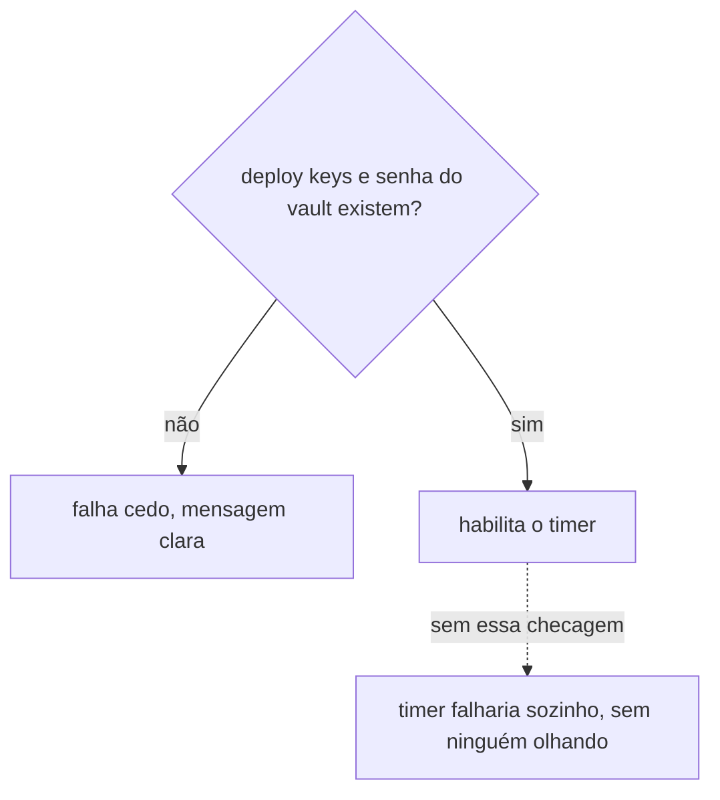
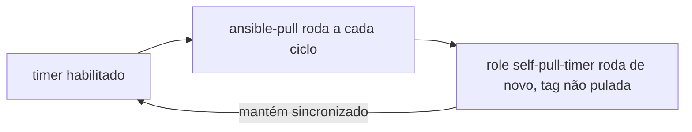

# self-pull-timer

Instala e habilita o timer do systemd que faz o node reconciliar este repositório sozinho, sem depender de ninguém rodando `ansible-playbook` na mão depois disso, o mecanismo de [`ansible-pull`](../../aprender/ansible.md#ansible-pull-vs-push) descrito em Aprender.

Falha cedo, com mensagem clara, se a [deploy key SSH](../../aprender/ssh.md#chave-pessoal-vs-deploy-key) do `infrastructure`, a deploy key do `infrastructure-vault` ou a senha do vault ainda não existirem no node, em vez de habilitar um timer que ia falhar sozinho na primeira execução automática.

Fica na [tag](../../aprender/ansible.md#tags) `self-pull-timer`, fora tanto da primeira passada quanto da ativação do [firewalld](firewalld.md). É a última etapa do bootstrap, roda só depois que o [gate de drift zero](../gate-de-drift-zero.md) confirmou que tudo mais está limpo, com sua própria invocação.

Uma vez habilitado, o próprio `ansible-pull` volta a rodar este role a cada execução periódica (a tag não é pulada nele), o que mantém o unit e o timer sincronizados com o que este repositório declarar no futuro.

Executado de verdade em produção em 2026-08-21, como [passo 9 do bootstrap](../../operacao/bootstrap.md#9-ligar-a-reconciliação-automática): `ansible-pull.timer` ficou `active (waiting)`, `enabled`, com o primeiro disparo em até 5 minutos e depois a cada 30 minutos (± 5 de jitter). Uma segunda execução real confirmou idempotência (`changed=0`). A partir daqui o node reconcilia este repositório sozinho, sem depender de ninguém rodando `ansible-playbook` na mão.

## O mesmo bug de `--check` do role firewalld

A task final, `Habilitar e iniciar o timer` (módulo `ansible.builtin.systemd`), tinha o mesmo problema descrito em [por que o firewalld não tem scenario Molecule](firewalld.md#o-bug-de-check-que-só-apareceu-contra-o-node-real): sob `--check`, as duas tasks `ansible.builtin.copy` anteriores (unit e timer) só simulam a escrita, não criam os arquivos de verdade, então o módulo `systemd` falha com "Could not find the requested service ansible-pull.timer: host" ao tentar consultar uma unit que ainda não existe no disco. Corrigido do mesmo jeito, `ignore_errors: "{{ ansible_check_mode }}"` só na task final, sem afetar o comportamento da execução real.
