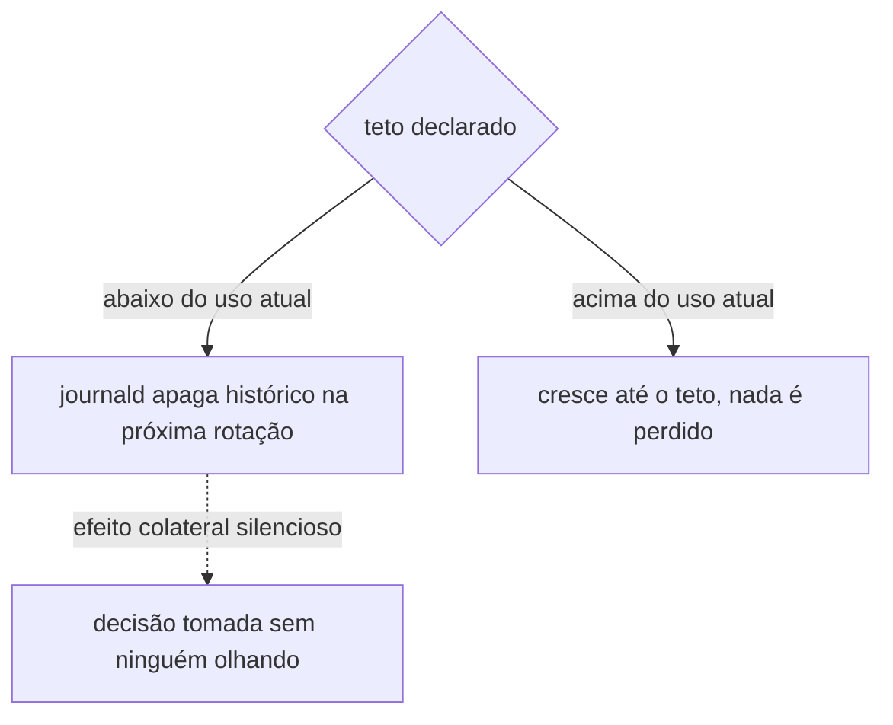
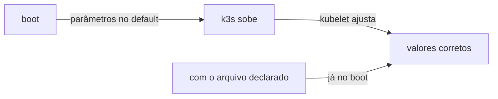

# sistema

Declara dois arquivos de configuração de sistema que o node não tinha: o teto de disco do journal e os parâmetros de kernel que o kubelet quer. Nenhum dos dois muda comportamento de serviço, e nenhum dos dois apaga nada. Os dois existem pra impedir falha por esgotamento de recurso.

## Teto do journal

O node acumulava mais de 4G de journal num disco de 99G que já estava em 79% de uso. O `journald.conf` do Debian vem sem `SystemMaxUse`, então vale o padrão de 10% do sistema de arquivos, quase 10G neste disco, e nada aparava o crescimento porque a rotina de manutenção que deveria fazer isso [parou de rodar](../../operacao/pendencias.md) sem ninguém notar.

O role escreve um drop-in em `/etc/systemd/journald.conf.d/10-ladesa.conf` em vez de editar `journald.conf`. O arquivo principal pertence ao pacote `systemd`, e sobrescrever arquivo de pacote cria conflito em toda atualização. O drop-in é o mecanismo que o systemd oferece pra isso.

### Por que o teto declarado é maior que o uso atual

`SystemMaxUse` não é só um limite de crescimento. O journald apaga arquivo arquivado antigo, do mais velho pro mais novo, pra caber no teto na próxima rotação. Um teto abaixo do uso atual, então, não é uma configuração inofensiva, é uma exclusão de histórico agendada pra acontecer sozinha dentro de poucos dias.

O teto declarado fica deliberadamente acima do uso de hoje. O crescimento passa a ser limitado, que é o problema real, e nenhum log é perdido no caminho. Baixar o teto pro alvo final e recuperar o espaço é uma decisão separada, [registrada como pendência](../../operacao/pendencias.md), pra ser tomada por alguém olhando, não como efeito colateral de declarar um arquivo.

Pela mesma razão o role não declara `MaxRetentionSec`. Retenção por tempo apaga tudo que for mais velho que a janela, e o journal deste node alcança mais de 11 meses. Limitar disco e definir por quanto tempo guardar log são duas políticas diferentes, e só a primeira é necessária pro problema que motivou este role.

### A redução manual

A tarefa que roda `journalctl --vacuum-size` fica atrás de `sistema_reduzir_journal_agora`, que é `false`. É a única tarefa deste repositório que apaga dado, então não roda sozinha pelo [`ansible-pull`](../../aprender/ansible.md#ansible-pull-vs-push), que executa a cada 30 minutos sem ninguém acompanhando.

Ligada, ela é segura de repetir: apaga só journal já arquivado acima do teto, nunca o arquivo ativo, e relata `freed 0B` quando não há o que apagar, que é como o role decide se houve mudança de verdade.

## Parâmetros de kernel

`/etc/sysctl.d/` estava vazio no node, sem nenhum arquivo além do `README.sysctl` que o pacote traz. Os quatro parâmetros declarados são exatamente os que o [guia de hardening CIS do k3s](https://docs.k3s.io/security/hardening-guide) pede como pré-requisito de `protect-kernel-defaults`.

Os quatro já estão nesses valores no node, e o arquivo não muda nada agora. Quem os aplica hoje é o próprio kubelet: com `protect-kernel-defaults` desligado, ele ajusta esses parâmetros ao subir em vez de recusar-se a iniciar. O ganho de declarar é que eles passam a valer desde o boot, e não só depois que o k3s subiu.

`protect-kernel-defaults` em si ainda não está ligado no [k3s](k3s.md). A ordem importa e é deliberada: com a flag ligada, o kubelet inverte o comportamento e se recusa a subir se os parâmetros não estiverem valendo. Declarar os parâmetros primeiro, conferir que persistem num boot, e só depois ligar a flag, é o que evita transformar um endurecimento de segurança numa indisponibilidade de control plane.
