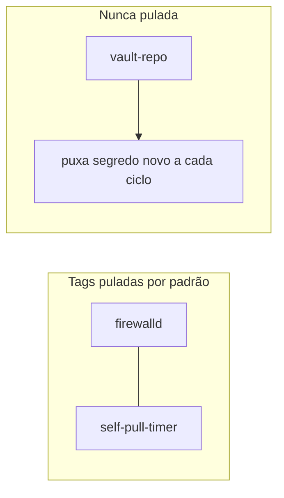

# vault-repo

Clona ou atualiza o [`infrastructure-vault`](https://github.com/ladesa-ro/infrastructure-vault) em `/opt/infrastructure-vault`, com sua própria [deploy key](../../aprender/ssh.md#chave-pessoal-vs-deploy-key), só leitura. Roda antes do [`argocd-bootstrap`](argocd-bootstrap.md), que consome os arquivos cifrados de lá.

Falha cedo, com mensagem clara, se a deploy key ainda não existir no node, em vez de deixar o `ansible.builtin.git` estourar um erro genérico de permissão SSH.

Tem sua própria [tag](../../aprender/ansible.md#tags), `vault-repo`, mas não é pulado pelo [`ansible-pull`](../../aprender/ansible.md#ansible-pull-vs-push): precisa rodar em toda execução periódica pra puxar segredos novos capturados depois do bootstrap inicial, do mesmo jeito que o próprio `infrastructure` se atualiza sozinho a cada ciclo.

